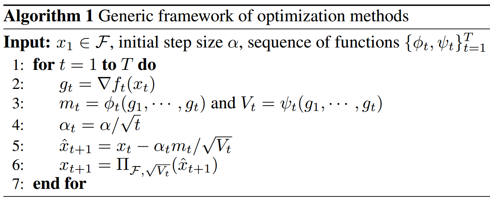
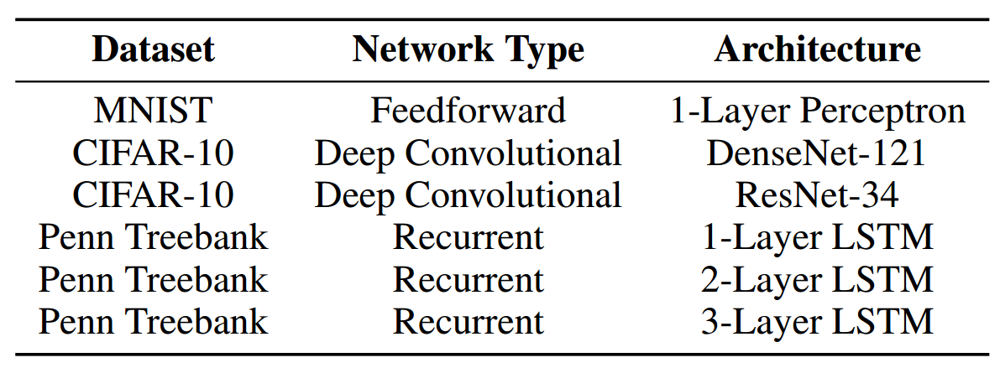
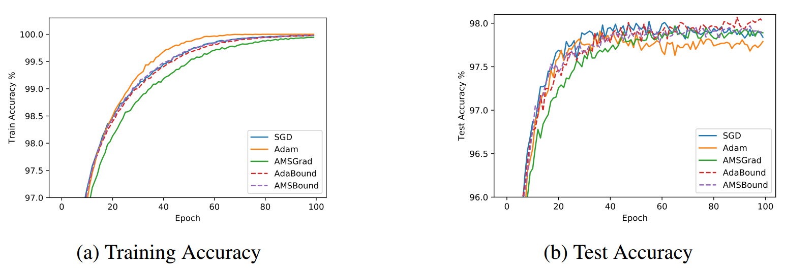
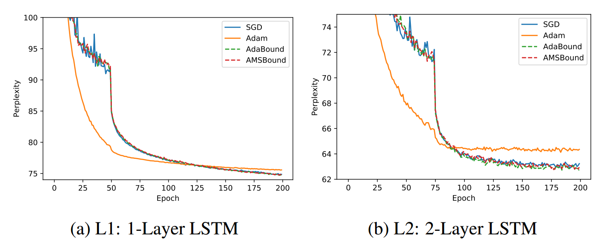
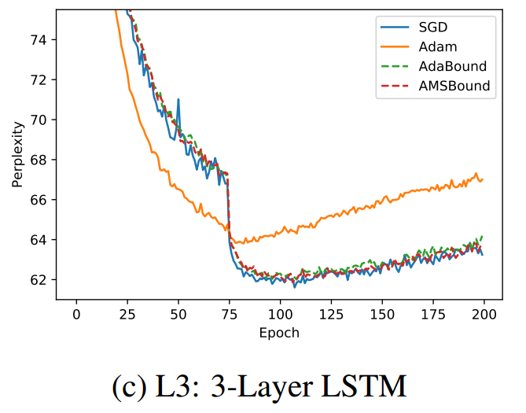
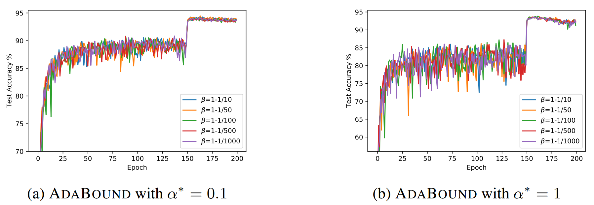

<!-- more -->

<!-- toc -->

 

# AdaBound

Adaptive Gradient Methods with Dynamic Bound of Learning Rate 动态限制学习率的自适应梯度下降方法

[Github](https://github.com/Luolc/AdaBound)

[论文](https://openreview.net/pdf?id=Bkg3g2R9FX)

[slides](https://www.luolc.com/assets/research/adabound/slides-AdaptiveGradientMethodsAndBeyond.pdf)

 

## 背景

**引自[作者知乎专栏](https://zhuanlan.zhihu.com/p/37269222)**

- [The Marginal Value of Adaptive Gradient Methods in Machine Learning](http://link.zhihu.com/?target=http%3A//papers.nips.cc/paper/7003-the-marginal-value-of-adaptive-gradient-methods-in-machine-learning). 作者给出了一个有趣的二分类问题构造，证明了在此构造下 SGD 可以收敛至最优解而 Adaptive 方法会收敛至一个泛化能力很差的结果（模型对所有输入都会始终预测为true）；并在若干个经典任务上实验证实 SGD 方法都达到了最低的test error。**推测Adaptive方法泛化能力不强的原因是各个参数的更新步长不同所致。**
- [On the Convergence of Adam and Beyond](http://link.zhihu.com/?target=https%3A//openreview.net/forum%3Fid%3DryQu7f-RZ). ICLR 2018 best paper。文章包含了大量理论推导，证明了在特定初始条件下 Adam 存在收敛问题，并将问题归因于更新步长不是单调下降的；作者给出了一个修正方案保证了单调性，声称可以达到更低的 training loss。主要攻击的是Adam有可能无法收敛至全局最优解。虽然本文荣获 ICLR 2018 best paper，但AdaBound作者认为这篇 paper 的**意义十分有限，同时有很大误导性**。
	1. 作者通过构造一个非常极端的例子证明 Adam 可能不收敛，但该构造是极其极端且不应该在实际情况中出现的：拥有少量频次非常低的、梯度却非常大的数据点的数据 —— 在实际应用中，这些点难道不就是 outlier 么？如果按作者的构造，一百份数据中才有一组这样的数据，而如果这本身不是由于数据的 bias 造成的，那模型理应去拟合数量多的数据以达到更好的泛化能力。同时，在作者的构造下，如果去除这些罕见数据点，那么 Adam 会与不去除一样收敛到相同位置；而 AMSGrad (作者提出的新方法) 则会因为罕见数据点是否存在的不同而收敛到完全不同的结果。个人认为**这个构造反而是证明了 Adam 比 AMSGrad 更能应对 outlier 值**，极端构造下的收敛性，并不意味着什么。
	2. 作者的实验中用修正方法 AMSGrad 和原始 Adam 进行比较，证明修正方案可以获得比 Adam 更低的 training loss。然而，**training loss 的意义对于一个模型是十分有限的**。模型的 test loss 和 test performance (通常用与 loss function 不同的评价指标反映，例如分类问题中使用 accuracy 而不是 cross entropy) 远比 training loss 重要。事实上，**Adam 很多时候都能在训练集上获得比 SGD 更低的 loss 却在测试集上表现更差**。 追求低的 training loss 很有可能是本末倒置的。有同样质疑的人也对文章进行了复现，博客 [Experiments with AMSGrad](http://link.zhihu.com/?target=https%3A//fdlm.github.io/post/amsgrad/) 也通过实验打脸作者 claim 的 「AMSGrad training loss 低也带来 test loss 低」的说法是错误的。
	3. 最后说作者的修正方案，是通过手动维护二阶动量单调增从而使得更新步长单调减。而这与我的实验直觉是相悖的：Adam 最后的步长往往不是过大而是过小了。事实上，[3] 中的实验也证明了 Adam 训练末期过小的步长是导致泛化性能差的重要原因。
	4. 相对于收敛性，泛化能力，也即模型在未知数据（狭义的讲，即测试集）上的performance对模型而言才是更加重要的性质。
- [Improving Generalization Performance by Switching from Adam to SGD](http://link.zhihu.com/?target=https%3A//arxiv.org/abs/1712.07628). 该文章指出了 Adam 最终的 test error 往往小于 SGD 的现象，给出一个先用 Adam 在初期进行训练加速收敛，并在合适时机切换为 SGD，追求更好的最终泛化能力的训练策略。**实验表明训练后期更新步长过小也是原因之一。**
- 综上而言，**在训练后期通过限制更新步长下界并且想办法使得各个参数更新步长相近，是修正 Adam 的大的方向**。先用 Adam 后切 SGD 固然是可行的，但仍然显得不够优雅，如果能用一个统一的迭代算法兼顾Adam的快速收敛能力和SGD的好的泛化能力那就很棒了。

---

 

## ABSTRACT 摘要

  已经提出了很多自适应优化方法，例如ADAGRAD，RMSPROP和ADAM，以实现具有对学习率逐元缩放的快速训练过程。尽管盛行，但人们观察到它们有时难以与SGD相比，甚至由于不稳定和极端学习率而未能收敛。最近有人提出了一些算法，如AMSGRAD(2018)，但他们未能比现有方法取得相当大的进步。在我们的论文中，我们证明极端学习率确实可能导致表现不佳。我们提供ADAM和AMSGRAD的新变种，称为分别使用ADABOUND和AMSBOUND，它们采用动态限制学习率实现从自适应方法逐步平稳过渡到SGD，并给出了收敛的理论证明。实验结果表明，新变种可以消除在自适应方法和SGD之间的泛化差距，并在早期保持较高的学习速度同时训练。而且，它们可以显着地改善各自原型，尤其是复杂的深度网络。

----

 

## 1.介绍

  在用于训练深度神经网络的一阶优化算法方面取得了巨大进步。最主要的算法之一是随机梯度下降（SGD），尽管简单，但在许多应用程序中表现良好。然而，SGD的一个缺点是它在所有方向上均匀地调整梯度。这可能会导致当训练数据稀疏时，表现不佳以及训练速度有限。为解决这个问题，最近提出了各种自适应方法来缩放梯度，包括ADAM，ADAGRAD和RMSPROP。特别是ADAM，由于其快速的训练速度，已经成为默认算法。

  然而，这些自适应方法的泛化能力可能比非适应性方法更差。自适应方法通常在训练的初始部分显得更快，但在测试集不佳。实际上，最近在自然语言处理和计算机视觉方面的一些最先进的作品中，优化器大多被选为SGD。其中这些实例SGD确实表现得比自适应方法更好。Reddi（2018）提出了一种名为AMSGRAD的ADAM变体，希望能解决这个问题。作者提供了收敛的理论保证，但仅限于说明其在训练数据方面的更好表现。然而，发现AMSGRAD对测试集数据的泛化能力与ADAM相似，和SGD仍存在相当大的性能差距。

  在本文中，首先对ADAM进行了实证研究，说明两者在训练结束时存在极端（极大和极小）的学习率。结果与2017年Wilson的paper中的“自适应方法泛化性能差可能是源于不稳定和极端的学习率”一致。实际上，2018年AMSGrad的paper中，关键点就是引入非增长学习率，这可能有助于减轻巨大学习率的影响，忽略小的可能影响。我们进一步提供了一个简单凸优化问题的例子，以阐明自适应方法的微小学习率如何导致不收敛。在这样的设置中，RMSPROP和ADAM可证明不会收敛到最优
解。此外，无论初始步长α是多大，ADAM都无法改变规格下降的情况。

  基于以上分析，我们提出了ADAM和AMSGRAD的新变种，命名为ADABOUND和AMSBOUND，它们不会受到极端学习的负面影响。我们采用学习率的动态界限，其中最低和最高界限分别初始化为零和无穷大，它们都平滑地收敛到一个恒定的最终步长。新变种在开始时可被视为自适应方法训练，随着时间增加，逐渐平稳地转变为SGD。在这个框架中，我们可以享受快速的初始训练过程以及良好的泛化能力。我们为凸面设置中的新变体提供收敛分析。

  最后，转向对计算机视觉和自然语言处理中的流行任务和模型进行实证研究，结果证明训练早期有较高学习速度，同时与几种自适应和非自适应方法相比，保证了强大的泛化性能。而且，他们可以在原型上带来了相当大的改进，特别是在复杂的深层网络上。

---

 

## 2.符号和前提设定

### 符号

* $\theta\in R^d$：向量
* $\theta_i$：向量第$i$位
* $\theta ^k$：逐元素指数运算
* $||\theta||$：L2范数
* $\theta_t$：迭代后向量 
* $\theta_{t,i}$：迭代后向量的第$i$位
* $\langle v,w\rangle$：向量内积
* $v \bigodot w$：逐元素相乘
* $v/w$：逐元素相除
* $max(v,w)$：逐元素取最大
* $S^d_+$：所有$d\times d$的正定矩阵
* 向量$a\in R^d$，正定矩阵$M\in R^{d\times d}$，$a/M$：$M^{-1}a$
* 投影操作$\prod_{F,M}(y)$，$M\in S^d_+$：$argmin_{x\in F}||\sqrt M(x-y)||$，$y\in R^d$，意为将不在$F$中的向量$y$投影为一个与$y$最近且在$F$中的向量
* $||a||_\infty=max(|a_1|,|a_2|,\cdots ,|a_n|)$：向量无穷范数
* $D_\infty=max_{1\leq i\leq n}\sum^n_{j=1}|a_{ij}|$，矩阵无穷范数，行模，行绝对值和的最大值
* $F\subset R^d$：凸可行集
* F凸集：$\lambda\in [0,1]，a,b\in F$，有$\lambda a+(1-\lambda)b\in F$
* 满足约束条件的点称为可行点，全体可行点组成的集合称为可行集
* $x,y\in F$,如果$||x-y||_\infty\leq D_\infty$ ，则称$F$限制了直径$D_\infty$ 
* diag(A)是提取出矩阵A的主对角线元素，得到的是一维的向量，diag（diag（A））是一个对角矩阵
* 设A是n阶方阵，如果对任何非零向量X，都有X'A*X≥0*，其中*X‘'*表示X的转置，就称A为**半正定矩阵**/＞0，正定

 

### 在线凸优化

#### 在线学习

* 机器学习中的一种模型训练方法
* 比喻：有一老师和一学生，每天老师让学生回答一个问题，然后老师告诉学生正确答案，学生则比较正确答案来更新自己的知识。就这样学生终成大师（博弈论里的重复游戏）
* 认为数据的分布是可以任意的；而寻常算法中，认为数据独立同分布；目的是正确预测数据的类别，并且在每次预测后，该结果用来更新修正预测模型，用于对以后数据进行更好的预测
* 主要限制是当前只能看到当前的和过去的数据，因此，对在线学习而言，它追求的是知道所有数据时所能设计的最优策略。同这个最优策略的差异称之为遗憾（regret）：遗憾没能一开始就选对最优策略。我们的希望是，时间一久，数据一多，这个差异就会变得很小。我们追求的是，没有后悔（no-regret）
* 如果与统计学习一样对数据做独立同分布假设，那么在线学习里的最优策略就是在得知所有数据的离线学习所能得到最优解。因此在线学习可以看成是一种优化方法：随着对数据的不断访问来逐步逼近这个离线最优解
* 过程：$t$时刻，模型收到样本$x_t$；然后从策略集中选出一个策略$w_t$，并对样本做出判断$w_t(x_t)$；收到正确答案$y_t$。用损失函数$l(w_t(x_t),y_t)$衡量在$t$时刻做出不正确判断所受损失，简记为$l_t(w_t)$，故$T$轮总损失为$\sum^T_{t=1}l_t(w_t)$。遗憾值记为$R_T=\sum^T_{t=1}l_t（w_t）-min_{w\in F}\sum^T_{t=1}l_t(w)$，即总损失减去使用最佳策略的损失和。但是存在小概率事件：每次选择的策略恰能很好适应当前样本，最终使遗憾值小于零。故我们关心平均遗憾是不是随着步骤增加而减小，即$lim_{T\rarr\infty}\frac{R(T)}{T}\rarr0$

 

#### 在线凸优化

* 挑选$w_t$的策略集$F$是凸的，且损失函数$l_t(w_t)$关于$w_t$是凸的，则称此问题为在线凸优化

 

#### 在线梯度下降

* $t$时做两步：

1. 利用当前得到数据对$w_t$进行一次梯度下降得到$w_{t+1}$
2. 若新$w_{t+1}$不在策略集中，使用投影公式投影进来

* 优势：N个数据，每次一个，N步找到最优策略，即总共只计算N个数据

	在本文中，我们假设可行集$F$具有有界直径并且$||\nabla f_t(x)||_\infty$是对于所有$t\in [T]，x\in F$都有界限。我们希望算法的遗憾值很小。我们的目标是设计一种确保$R_T=o(T)$的算法，这意味着平均来说，模型的性能收敛到最佳。已经指出，具有平均后悔为0的在线优化算法产生相应的随机优化算法（Cesa-Bianchi等，2002）。因此，跟随Reddi等人（2018），我们同样使用在线梯度下降和随机梯度下降。

 

### 优化方法概述

  我们遵循Reddi等人的观点（2018），提供算法1中的通用优化方法框架，封装了许多流行的自适应和非自适应方法。 这对于理解不同优化的属性很有用。

  注意，因为函数$\phi_t:F^t\rarr R^d,\psi:F^d\rarr S^d_+$还未确定，所以算法仍是抽象的。本文中，我们将$a$称为初始步长，将$a_t/\sqrt {V_t}$称为算法的学习率。注意，我们采用$a_t=a/\sqrt t$减小步长。然而这种鲁莽的的衰退步骤通常表现较差，而简单的恒定步长$α_t =
α$通常在实践中很有效。本文其余部分的理论分析和常量方案的实证研究中，我们将使用递减方案。

AdaGrad和RMSProp可看作Adam特例，着重研究Adam。

---

 

## 3.极端学习率导致的非收敛性

  在本节中，初步实验和严格的证明，详细阐述了当前已有自适应方法的主要缺陷。如上所述，观察到诸如ADAM的自适应方法表现比SGD差。 Reddi等（2018）提出AMSGRAD来解决这个问题，但最近的工作指出AMSGRAD并没有显示出对ADAM的明显改善（Keskar＆Socher，2017年; Chen等，2018）。作者声称AMSGRAD与ADAM相比具有较小的学习率，作者仅将大的极端学习率视为ADAM性能不佳的原因。然而，小的也可能是个陷阱。因此，我们推测两个极端值都是ADAM的学习率是其泛化能力不足的原因。

  为了证实我们的推测，我们对在CIFAR-10上使用ADAM的ResNet-34网络的几个权重Weight和偏差bias的学习率进行了抽样。具体来说，我们随机选择来自不同层的9个3×3卷积核和最后一个线性层中的偏差bias。通常作为同一层的参数具有相似6的属性，这里我们只展示在训练结束时九个卷积核中的九个权重的学习率和最后一层的bias，内核分别和最后一层的偏差，如图1所示。我们可以发现当模型接近收敛时，学习率有小于0.01的的以及大于1000的大小的。

图1 采样参数的学习率。每个单元都是学习率的对数。

  上述分析和观察表明在训练过程的最后阶段确实存在过大或过大的学习率太小。 AMSGRAD可能有助于减轻巨大的学习率的影响，但它忽略了过小的学习率。就此而言，我们仍然有以下两个疑惑。首先，微小的学习率真的会损害ADAM的效果吗？第二，学习率高度依赖于初始步长，我们可以使用相对较大的初始步长α来摆脱后期太小的学习率？

  我们表明ADAM和RMSPROP的不良收敛行为可能是由极小的学习率引起的，此外，在某些情况下无论如何初始步长α，ADAM仍然无法找到正确的路径并收敛。

  考虑以下线性函数序列，$F=[-2,2]，C\in N$，满足$5\beta^{C-2}_2\leq(1-\beta_2)/(4-\beta_2)$。
$$
f_t(x) =
\begin{cases}
-100,  & \text{$x$ < 0} \\
0,     & \text{$x$ > 0} \\
-x,    & \text{0 $\leq$ $x$ $\leq$ 1 && $t$ mod $C$ = 1} \\
2x,    & \text{0 $\leq$ $x$ $\leq$ 1 && $t$ mod $C$ = 2} \\
0,     & \text{else} 
\end{cases}
$$
很容易看出任何x<0的点都有最小的遗憾。 假设$\beta_1=0$，我们表明ADAM收敛于此设置的x≥0的极端非优解。该算法在每C步梯度-1，这使算法向错误的方向移动。然后，在下一步，它观察到梯度2。但是较大的梯度2不能抵消错误方向，因为本步中，学习率将缩小到远小于前一个值。因此随着时间的增加，x变得越来越大。
我们在下面的结果中形式化这种直觉。

**定理1.**总会有一个在线凸优化问题，对任何初始步长$a$，Adam都有非0平均遗憾值。$R_T/T\nrightarrow0$ 当 $T \rarr \infty$。

  我们将所有证明都归入附录中。注意，上述示例也适用于恒定步长。另，SGD不会遇到这个问题。初始步长有多种有效选择，其中SGD的平均遗憾为0，换句话说，收敛到最优解。这个问题在后期会更加明显。当算法陷入某些非优点时。在这种情况下，大多数步骤的梯度接近0并且二阶动量的平均值会各种各样，由于指数移动平均的特性。因此，如果出现频率相对较低的“正确”信号（即上例中每C步骤的梯度2）在一些“错误”信号（即示例中的梯度1）之后到来，即使正确的具有更大的梯度绝对值，也可能无法将算法引导到正确的路径。

  人们可能想知道使用大的$\beta_1$是否有帮助，因为我们通常在实践中使其接近1。然而，以下结果表明，对于具有$β1<\sqrt{\beta_2}$的任何恒定$β_1$和$β_2$，存在ADAM具有非零平均遗憾的示例，而与初始步长α无关。

**定理2.**对任意$\beta_1,\beta_2\in [0,1), \beta1<\sqrt{\beta_2}$，都存在一个在线凸优化问题，无论初始步长如何，ADAM都有非0平均遗憾值。$R_T/T\nrightarrow0$ as $T \rarr \infty$。

**定理3.**对任意$\beta_1,\beta_2\in [0,1), \beta1<\sqrt{\beta_2}$，都有一个随机凸优化问题，无论初始步长如何，ADAM都无法收敛至最优解。

  Kingma＆Lei Ba（2015）中ADAM的分析依赖于随着时间的推移降低β1，而在这里我们使用常数β1。实际上，由于我们的分析中关键参数是β2而不是β1，因此使用β1的递减方案将我们的示例扩展到案例非常容易。

  如Reddi等人所述（2018），条件$\beta1<\sqrt{\beta_2}$是良性的并且通常在实践中使用的参数设置中得到满足。在Kingma＆Lei Ba（2015）的收敛证明中也假设了这种情况。 上述结果说明了极端学习率的潜在不良影响，并且算法在不解决该问题的情况下不可能实现良好的泛化能力。

 

## 4.动态限制的ADAM

  在本节中，我们开发了优化方法的新变体并提供了它们的收敛性分析。我们的目标是制定一种方法，结合自适应方法的好处，即快速的初步进展，以及SGD良好的最终泛化特性。最后，我们想构建一种算法，其在训练早期就像自适应方法一样，最后像SGD一样。

受梯度剪辑的启发，这是一种在实践中用于剪切大于阈值的梯度以避免渐变爆炸的流行技术，我们在ADAM中使用剪切学习速率来在算法2中提出ADABOUND。考虑在ADAM中应用以下操作$Clip(\alpha/\sqrt{V_t},\eta_l,\eta_u)$，对学习率逐元素剪切，使输出约束在$[\eta_l,\eta_u]$内。由此得出，具有$a=a^*$的SGD（M）可以被看作是$η_l=η_u=α^*$的情况。至于ADAM，$η_l= 0$和$η_u= \infty$。现在我们可以通过以下步骤提供新策略：我们使用$η_l$和$η_u$作为t的函数,而不是常数下限和上限，其中$η_l(t)$是一个非递减函数，$t = 0$时值为0，并逐渐收敛到$a^*$；并且$η_u(t)$是非增加函数，$t = 0$时值为$\infty$，并且也渐近地收敛到$a^*$。在此设置中，ADABOUND在开始时表现得像ADAM一样，因为边界对学习速率的影响非常小，并且随着边界收缩而逐渐转换为SGD（M）。我们证明了ADABOUND的以下关键结果。

**定理4.**
$$
\{x_t\},\{v_t\}是由算法2得出。对所有t\in[T]且\beta_1/\sqrt{\beta_2}<1,都有        \beta_1=\beta_{11},\beta_{1t}\leq\beta1。\\
假设当t\rarr \infty 时，\eta_l(t+1)\geq\eta_l(t)\geq0，\eta_u(t+1)\leq\eta_y(t)，\\ \eta_l(t)\rarr a^*，\eta_u(t)\rarr a^*，L_{\infty}=\eta _l(1)且R_\infty=\eta_u(1)。\\
假定对所有x,y\in F，有||x-y||_\infty \leq D_\infty；对所有t\in [T]和x\in F，有||\nabla f_t(x)||\leq G_2。\\
对经AdaBound产生的x_t，在其遗憾值上都有以下界限：
$$

**推论4.1**

假设$\beta_{1t}=\beta_1\lambda^{t-1}$是由定理4得出，则

很容易看出，ADABOUND的遗憾值上限是$O(\sqrt T)$。与Reddi等人类似（2018），人们可以使用更适度的动量衰减$\beta_{1t}=\beta_1/t$，并且仍然确保遗憾值上限是$O(\sqrt T)$。

  最后进行比较。对于将ADAM转换为SGD的想法，Keskar＆Socher（2017）也有类似的工作。作者提出了一种首先使用ADAM的措施，并在某个特定步骤将算法切换到SGD。与他们的方法相比，我们的方法有两个优点。首先，是否存在区分ADAM和SGD的固定转折点是不确定的。因此，我们使用连续转换过程而不是“硬”开关来解决此问题。其次，他们引入了额外的超参数来决定切换时间，这不是很容易微调。至于我们的方法，引入的灵活部分是两个绑定函数。我们对不同类型的约束函数的影响进行了实证研究。结果放在附录G中，我们发现收敛目标$a^*$和收敛速度对最终结果不是很重要。为了清楚起见，我们将在其余部分使用$\eta_l(t)=0.1-\frac{0.1}{(1-\beta_2)t+1}，\eta_u(t)=0.1+\frac{0.1}{(1-\beta_2)t}$。

---

 

## 5.实验结果

  在这一节中，我们将对不同的模型进行实证研究，将新方法与常用的优化方法(包括SGD(M)、ADAGRAD、ADAM和AMSGRAD))进行比较。我们主要关注三个任务：MNIST图像分类任务)、CIFAR-10图像分类任务和Penn Treebank上的语言建模任务。我们之所以选择它们，是因为它们的架构具有广泛的重要性和可再现性。表2详细列出了每个任务的设置。我们使用指定的初始化方法从随机的起点运行每个实验三次。为训练指定了固定的时域数预算，下面将介绍衰减策略。我们选择的设置，实现最低的训练损失在最后。

 

### 5.1 参数设置

 

### 5.2 前馈神经网络

   针对MNIST数据集上的多类分类问题，我们训练了一个具有隐层的简单全连通神经网络。我们运行了100个epochs，省略了这个实验的衰变方案。图2显示了训练和测试集上每种优化方法的学习曲线。我们发现在训练中，所有算法都能达到接近100%的准确率。在测试部分，SGD的性能略优于ADAM和AMSGRAD的自适应方法。我们提出的ADABOUND和AMSBOUND两种方法显示出轻微的改进，但与它们的原型相比，测试精度仍然有明显的提高。

 

### 5.3 卷积神经网络

  利用DenseNet-121和ResNet-34对CIFAR-10标准数据集进行图像分类。在这个实验中，我们使用200个epoch，在150个epoch后将学习率降低10个。

  DenseNet：我们首先在CIFAR-10上运行DenseNet-121模型，结果如图3所示。我们可以看到，ADAGRAD、ADAM和AMSGRAD等自适应方法在早期训练中表现得比非自适应方法更好。但是到了150轮，当学习速率衰减时，SGDM开始优于那些自适应方法。对于我们的方法ADABOUND和AMSBOUND，它们收敛速度和自适应方法一样快，并且在训练结束时的测试集上达到比SGDM稍高的精度。此外，与原型机相比，其性能得到了显著提高，测试精度提高了约2%。

  ResNet：实验结果如图3所示。正如预期的那样，ResNet-34上的每个算法的总体性能与DenseNet-121上的相似。ADABOUND和AMSBOUND甚至超过SGDM 1%。尽管自适应方法的泛化能力相对较差，但我们提出的方法克服了这一缺点，为其学习速率分配了界限，在CIFAR-10上对DenseNet和ResNet的测试集都获得了几乎最佳的准确率。

 

### 5.4 递归神经网络

  我们发现，在所有模型中，ADAM的初始进展最快，但在性能上停滞不前，不如SGD和我们的方法。与以往在图像分类任务实验中出现的现象不同，ADABOUND和AMSBOUND在训练初期的速度并不快，但曲线比SGD平滑。

对比L1、L2和L3，我们可以很容易地发现改善程度的显著差异。在最简单的模型L1中，我们的方法比ADAM的方法略好1.1%，而在最复杂的模型L3中，我们的方法在复杂的方面明显优于2.8%。为模型的复杂性与改进程度之间的关系提供了依据。

 

### 5.5 结果分析

  为了研究我们提出的算法的有效性，我们从计算机视觉和自然语言处理中选择流行的任务。根据上面显示的结果，不难发现ADAM和AMSGRAD的表现通常是相似的，而AMSGRAD在大多数情况下并没有太大的改善。另一方面，它们的变体ADABOUND和AMSBOUND与SGD相比具有较快的收敛速度，同时在训练结束时的测试精度也大大超过了两种原始方法。这一现象正好印证了我们在第3节中提到的观点，学习速率的大小都会影响收敛。
  此外，我们还对不同复杂度的模型进行了实验，包括一个per- ceptron模型、两个深度卷积神经网络模型和一个递归神经网络模型。MNIST上使用的感知器是最简单的，我们的方法比其他方法稍好一些。DenseNet和ResNet的测试精度明显提高。我们把这种不同归因于模型的复杂性。具体来说，对于深度CNN模型，卷积层和全连通层在任务中扮演不同的角色。此外，不同的卷积层可能负责不同的角色(Lee et al.2009)，这可能导致参数梯度的明显变化。换句话说，极端的学习速率(巨大或微小)可能在ResNet等复杂模型中出现得更频繁。由于我们的算法是为了避免这些问题而提出的，因此可以直观地解释在复杂体系结构中性能的提高。LSTM在语言建模任务上的层次越多，改进程度越高，也与上述分析一致。

 

## 6. 限制函数

$\eta_l (t)=(1-\frac{1}{(1-\beta)t+1})\alpha^*$

$\eta_u(t)=(1+\frac{1}{(1-\beta)t})\alpha^*$

* $\beta$：影响算法从自适应变为SGD的转换速度
* $\alpha^*$：转换目标，反映最终SGD的步长

* 图5，定$\alpha^*$变化$\beta$，反映出对于特定的$\alpha^*$，不同的$\beta$的性能几乎相同。表明限制函数的收敛速度在一定程度上不影响最终结果。并且在$[\beta_1,\beta_2]$内的$\beta$通常效果更佳。

* 图6，不同$\alpha^*$对SGD和AdaBound的影响。结果表明SGDM对超参数非常敏感。SGDM步长的最佳值为0.1，且与其他设置相比性能差距很大。相比之下，ADABOUND针对不同的最终步长具有稳定的性能，说明它对收敛目标不敏感。

* 图7，进一步直接比较SGDM和ADABOUND与每个α（或α*）之间的性能。
	结果如图7所示。我们可以看到，ADABOUND在所有步骤中都优于SGDM
	大小。 由于绑定函数的形式对ADABOUND的性能影响很小，因此它是
	即使没有仔细调整超参数，也可能击败SGDM。
* ADABOUND对其超参数不敏感。而且，它即使没有仔细微调，也能获得与SGDM更高或相似的性能。