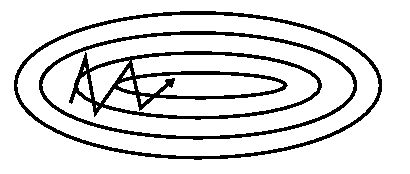
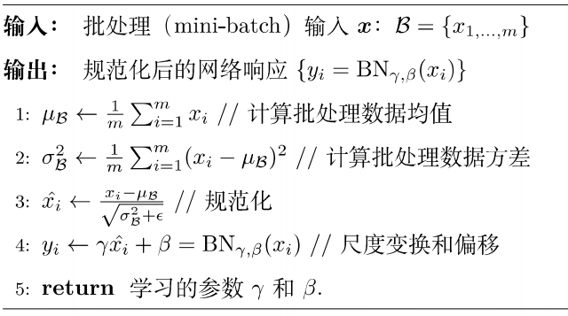

<!--more-->

<!-- toc -->

<br/>

# Project

*   判别式方法 -> 深度学习类
*   [目标跟踪算法综述](https://wenku.baidu.com/view/552db3a780c758f5f61fb7360b4c2e3f56272517.html)
*   
*   为了扩展CNN在目标跟踪领域的能力，需要大量的训练数据，但这在目标跟踪中是很难做到的。MDNet[14]算法提出了一种解决该问题的思路。算法采用VGG-M作为网络初始化模型，后接多个全连接层用作分类器。训练时，每一个跟踪视频对应一个全连接层，学习普遍的特征表示用来跟踪。跟踪时，去掉训练时的全连接层，使用第一帧样本初始化一个全连接层，新的全连接层在跟踪的过程中继续微调，来适应新的目标变化。这种方法使得特征更适合于目标跟踪，效果大大提升。由此可以看出，通过视频训练的网络更适合目标跟踪这一任务
*   速度改进：虽然深度特征具有传统特征无法比拟的抗干扰能力，但是一般提取速度较慢，而且特征中存在大量冗余。当算法精度达到一定标准之后，很多方法开始着力解决算法速度问题。**孪生网络**[19]是其中的一个典型例子，采用两路神经网络分别输入目标模板和搜索图像块，用来进行模板匹配或候选样本分类。其中一路神经网络对于模板信息的保存可以提供跟踪物体先验信息，取代网络在线更新，大大节省了速度。另外，**对深度特征进行降维或自适应选择**也是加速算法的有效途径。由于深度神经网络复杂的计算及模型更新时繁琐的系数，现存大部分深度目标跟踪算法速度都比较慢。很多深度目标跟踪算法采用**小型神经网络（如VGG-M）**来提特征。另外，跟踪中只给定第一帧目标位置，缺少跟踪物体先验信息，这就**要求模型实时更新**来确保跟踪精度，而这在深度目标跟踪算法中往往非常耗时。一些算法采用孪生网络结构来保存先验信息，代替模型在线更新，使得算法速度得以提高。深度特征的高维度也会影响跟踪算法的速度，如果能够提出有效的特征压缩方法，不管对算法速度还是精度都会有所帮助。只有高速且有效地算法才具有实际的应用价值

---


# CS231n

## Data Driven/数据驱动

*   以数据/样本驱动，训练模型，进行预测

```python
def train(images, labels):
    #Machine learning
    return model

def predict(model, test_images):
    #use model to predict labels
    return test_labels
```

*   train_data/训练集：以不同的超参数训练模型
*   validation_data/验证集：选出效果最优的超参数
*   test_data/测试集：仅预测算法在未见新数据上的

---


## Linear Classifier/线性分类

* 将训练数据浓缩于参数W/θ中，但每个类别只能学习一个单独模板

* $f(x,W)=Wx+b$
 * W:$10*3072$ ，有十类时
	* x:$3072*1$ ， 图片为$32*32*3$时
	* b:$10*1$ ， 有十类时
	* 结果得分:$10*1$

---


## Loss Function/损失函数

* 将W输入，输出得分，定量地估计W的好坏
* $f(x, W)=Wx$
* $L=\frac{1}{N}\sum_iL_i(f(x_i,W),y_i)+\lambda R(W)$
 * N：样本数
	* $\lambda R(W)$：正则化项
* Multi-class SVM LOSS：
 * $L_i=\sum_{j\not=y_i}\max(0,s_j-s_{y_i}+margin)$
	* $s=f(x,W)$
	* i：当前对第i个样本的得分计算
	* $s_j$：当前样本对第j类的得分
	* $s_{y_i}$：当前样本对正确分类组的得分
	* margin：适当边距
	* 释义：不正确分类上损失之和，且正确分类得分超出错误分类得分margin以上时损失为0
* Softmax Loss：
 * $P(Y=k\mid X=x_i)=\frac{e^s k}{\sum_j e^s j}$
	* $s=f(x_i;W)$
	* 最小化$L_i=-\log P(Y=y_i\mid X=x_i)$
	* 希望正确分类的概率趋近1

---


## Optimization/优化/梯度下降

梯度下降是指，在给定待优化的模型参数$\theta\in R^d$和目标函数$J(\theta)$，算法通过沿梯度 $\nabla _\theta J(\theta)$的相反方向更新$\theta$来最小化$J(\theta)$。学习率$\eta$决定了每一时刻的更新步长。

流程如下：

1. 计算目标函数关于参数的梯度

	$g_t=\nabla_\theta J(\theta)$

2. 根据历史梯度计算一阶和二阶动量

$m_t=\phi (g_1,g_2,\cdots ,g_t)$

$v_t=\psi(g_1,,g_2,\cdots ,g_t)$

3. 更新模型参数

$\theta_{t+1}=\theta_t-\frac{1}{\sqrt{v_t+\epsilon}}m_t$

* 梯度就是偏导数组成的向量，即多元/多参数、参数为向量时
* 梯度和X的形状一样，元素告诉我们相关方向上函数f的斜率
* 梯度指向函数增加最快的方向，负梯度方向即下降最快方向
* 则位置任意方向斜率=梯度与单位方向向量的点积
* 根据梯度决定下一次更新方向 
* $\nabla_WL=\frac{1}{N}\sum_i\nabla_WL_i(f(x_i,W),y_i)+\lambda \nabla_WR(W)$
* Gradient Descent/梯度下降

```python
while True:
  dw = compute_grad(loss_fun, data, weights)
  weight += - step_size * dw
```

### Stochastic Gradient Descent(SGD)/随机梯度下降

* $m_t=\eta g_t$

* $v_t=I^2$

	$\epsilon=0$

	$\theta_{i+1}=\theta_i-\eta g_t$

* N过大，只取部分data计算，以估计整体梯度

```python
while True:
	data_batch = sample_training_data(data, 256)
  dw = compute_grad(loss_fun, data_batch, weights)
  weight += - step_size * dw
```

* SGD的问题：

	* 当对一个方向敏感，对其他方向迟钝，会形成之字形路径，收敛极其缓慢。下图仅二维两个参数

		

	* 局部最小值和鞍点处，会卡住。维度增加，鞍点会快速增加

		

	* 易受噪声影响

	* 步长恒定，速度慢

### SGD+Momentum/结合动量的SGD

* 引入一阶动量

	$m_t=\gamma m_{t-1}+\eta g_t$

```python
vx = 0
while True:
  dx = compute_grad(x)
  vx = rho * vx + learning_rate * dx
  x -= vx
```




### SGD+Nesterov

* 不同于SGDM的梯度与速度向量之和的方向作为新的步进方向，Nesterov动量，是先从当前点，沿速度方向步进，在新位置求梯度向量，然后返回起始点向梯度方向步进。


* 凸优化问题较好，非凸会有问题
* $v_{t+1}=\rho v_t-\alpha\nabla f(x_t+\rho v_t)$
* $x_{t+1}=x_t+v_{t+1}$

* 以上形式，会导致运算增加。变量代换，便于网络同时求梯度和损失

$y_t=x_t+\rho v_t$

$v_{t+1}=\rho v_t-\alpha\nabla f(y_t)$

$y_{t+1}=y_t-\rho v_t + (1+\rho)v_{t+1}=y_t+v_{t+1}+\rho(v_{t+1}-v_t)$

```python
dx = compute_gradient(x)
old_v = v
v = rho * v - lr * dx
x += -rho * old_v + (1 + rho) * v
```

### AdaGrad  

**SGD、SGD-M均是以相同的学习率去更新$\theta$的各个分量。而深度学习模型中往往涉及大量的参数，不同参数的更新频率往往有所区别。对于更新不频繁的参数，我们希望单次步长更大，多学习一些知识；对于更新频繁的参数，我们则希望步长较小，使得学习到的参数更稳定，不至于被单个样本影响太多。即自适应学习率。**

* 引入二阶动量，加速非敏方向，减慢敏感方向速度

$v_t=diag(\sum^t_{i=1}g^2_{i,1},\sum^t_{i=1}g^2_{i,2},\cdots,\sum^t_{i=1}g^2_{i,d})$

$v_t\in R^{d\times d}$，对角矩阵，元素为参数第$i$维从初始时刻到$t$时的梯度平方和，学习率等效为$\eta/\sqrt{v_t+\epsilon}$，对此前频繁更新的参数，其二阶动量的对应分量较大，学习率就小，反之同理

```python
grad_squared = 0
while True:
  dx = compute_grad(x)
  grad_squared += dx * dx
  x -= learning_rate * dx / (np.sqrt(grad_squared) + 1e-7)
```

* 步长越来越小，凸函数时是好的特性（接近极值时减慢、收敛），非凸时不好（局部极值卡住）

### RMSProp

* 计算二阶动量时只关注最近的下降梯度，其二阶动量采用*指数移动平均公式*计算，这样即可避免二阶动量持续累积的问题。优点保留，但存在平方项持续减少，训练缓慢的隐患

	$v_t=\beta_2 v_{t-1}+(1-\beta_2)\cdot diag(g_t\bigodot g_t)​$

```python
grad_squared = 0
while True:
  dx = compute_grad(x)
  grad_squared = decay_rate * grad_squared + (1 - decay_rate) * dx * dx
  x -= learning_rate * dx / (np.sqrt(grad_squared) + 1e-7)
```

### Adam

* 对一阶动量也用指数移动平均公式

	$m_t=\eta[\beta_1m_{t-1}+(1-\beta_1)g_t]$

	$m_t=\beta_1m_{t-1}+(1-\beta_1)g_t$

	$v_t=\beta_2 v_{t-1}+（1-\beta_2)\cdot diag(g_t\bigodot g_t)$

	$\hat{m_t}=\frac{m_t}{1-\beta^t_1}$

	$\hat{v_t}=\frac{v_t}{1-\beta^t_2}$

	$\theta_{t+1}=\theta_t-\frac{1}{\sqrt{\hat{v_t}+\epsilon}}\hat{m_t}$

* 结合了SGD、动量、AdaGrad/RMSProp

	* 动量momentum：克服鞍点、梯度为0但非极值点等一系列问题
	* AdaGrad/RMSProp：减少敏感方向的权重，增加非敏方向权重
	* 偏置校正：以防初始化不佳时初期除以很小的数导致步长过长

* 实践证明，虽然在训练早期 Adam 拥有出色的收敛速度，使用其训练的模型的最终泛化能力却并不如使用朴素 SGD 训练的好（体现在 Adam 训练的模型最终收敛时的 test error 更大），结果可能不收敛，可能找不到全局最优解。二阶动量是固定时间窗口内的累积，随着时间窗口的变化，遇到的数据可能发生巨变，使得二阶动量可能会时大时小，不是单调变化。这就可能在训练后期引起学习率的震荡，导致模型无法收敛。

```python
first_moment = 0
second_moment = 0
for t in range(num_iterations):
  dx = compute_gradient(x)
  first_moment = rho * first_moment + (1 - rho) * dx	# Momentum
  second_moment = decay_rate * second_moment + (1 - decay_rate) * dx * dx	# AdaGrad/RMSProp
  first_unbias = first_moment / (1 - rho ** t)
  second_unbias = second_moment/ (1 - decay_rate ** t)	# Bias correction
  x -= learning_rate * first_unbias / (np.sqrt(second_unbias) + 1e-7)	# AdaGrad/RMSProp
```

* 典型起始参数设置：

	* beta1 = 0.9
	* beta2 = 0.999
	* learning_rate = 1e-3 or 5e-4

### GIF


不同算法在损失面等高线图中的学习过程，它们均同同一点出发，但沿着不同路径达到最小值点。其中 Adagrad、Adadelta、RMSprop 从最开始就找到了正确的方向并快速收敛；SGD 找到了正确方向但收敛速度很慢；SGD-M 和 NAG 最初都偏离了航道，但也能最终纠正到正确方向，SGD-M 偏离的惯性比 NAG 更大。


不同算法在鞍点处的表现。这里，SGD、SGD-M、NAG 都受到了鞍点的严重影响，尽管后两者最终还是逃离了鞍点；而 Adagrad、RMSprop、Adadelta 都很快找到了正确的方向。

### AdaBound

*Adaptive Gradient Methods with Dynamic Bound of Learning Rate 动态裁剪学习率的自适应梯度下降方法*

#### 背景

* [The Marginal Value of Adaptive Gradient Methods in Machine Learning](http://link.zhihu.com/?target=http%3A//papers.nips.cc/paper/7003-the-marginal-value-of-adaptive-gradient-methods-in-machine-learning). 作者给出了一个有趣的二分类问题构造，证明了在此构造下 SGD 可以收敛至最优解而 Adaptive 方法会收敛至一个泛化能力很差的结果（模型对所有输入都会始终预测为true）；并在若干个经典任务上实验证实 SGD 方法都达到了最低的test error。**推测Adaptive方法泛化能力不强的原因是各个参数的更新步长不同所致。**

* [On the Convergence of Adam and Beyond](http://link.zhihu.com/?target=https%3A//openreview.net/forum%3Fid%3DryQu7f-RZ). ICLR 2018 best paper。文章包含了大量理论推导，证明了在特定初始条件下 Adam 存在收敛问题，并将问题归因于更新步长不是单调下降的；作者给出了一个修正方案保证了单调性，声称可以达到更低的 training loss。

	主要攻击的是 Adam 有可能无法收敛至全局最优解。虽然本文荣获 ICLR 2018 best paper，但个人认为这篇 paper 的**意义十分有限，同时有很大误导性**。

	其一，作者通过构造一个非常极端的例子证明 Adam 可能不收敛，但该构造是极其极端且不应该在实际情况中出现的：拥有少量频次非常低的、梯度却非常大的数据点的数据 —— 在实际应用中，这些点难道不就是 outlier 么？如果按作者的构造，一百份数据中才有一组这样的数据，而如果这本身不是由于数据的 bias 造成的，那模型理应去拟合数量多的数据以达到更好的泛化能力。同时，在作者的构造下，如果去除这些罕见数据点，那么 Adam 会与不去除一样收敛到相同位置；而 AMSGrad (作者提出的新方法) 则会因为罕见数据点是否存在的不同而收敛到完全不同的结果。个人认为**这个构造反而是证明了 Adam 比 AMSGrad 更能应对 outlier 值**，极端构造下的收敛性，并不意味着什么。

	其二，作者的实验中用修正方法 AMSGrad 和原始 Adam 进行比较，证明修正方案可以获得比 Adam 更低的 training loss。然而，**training loss 的意义对于一个模型是十分有限的**。模型的 test loss 和 test performance (通常用与 loss function 不同的评价指标反映，例如分类问题中使用 accuracy 而不是 cross entropy) 远比 training loss 重要。事实上，**Adam 很多时候都能在训练集上获得比 SGD 更低的 loss 却在测试集上表现更差**。 追求低的 training loss 很有可能是本末倒置的。有同样质疑的人也对文章进行了复现，博客 [Experiments with AMSGrad](http://link.zhihu.com/?target=https%3A//fdlm.github.io/post/amsgrad/) 也通过实验打脸作者 claim 的 「AMSGrad training loss 低也带来 test loss 低」的说法是错误的。

	其三，最后说作者的修正方案，是通过手动维护二阶动量单调增从而使得更新步长单调减。而这与我的实验直觉是相悖的：Adam 最后的步长往往不是过大而是过小了。事实上，[3] 中的实验也证明了 Adam 训练末期过小的步长是导致泛化性能差的重要原因。

	相对于收敛性，泛化能力，也即模型在未知数据（狭义的讲，即测试集）上的 performance 对模型而言才是更加重要的性质。

* [Improving Generalization Performance by Switching from Adam to SGD](http://link.zhihu.com/?target=https%3A//arxiv.org/abs/1712.07628). 该文章指出了 Adam 最终的 test error 往往小于 SGD 的现象，给出一个先用 Adam 在初期进行训练加速收敛，并在合适时机切换为 SGD，追求更好的最终泛化能力的训练策略。**实验表明训练后期更新步长过小也是原因之一。**

* 综上而言，**在训练后期通过限制更新步长下界并且想办法使得各个参数更新步长相近，是修正 Adam 的大的方向**。先用 Adam 后切 SGD 固然是可行的，但仍然显得不够优雅，如果能用一个统一的迭代算法兼顾Adam的快速收敛能力和SGD的好的泛化能力那就很棒了。

#### 论文内容

1. 初步试验：

	使用Adam算法，在ResNet-34（残差网络模型，复杂度低）中随机选取了9个卷积核和1个全连接层偏置向量，并从中再各随机取样一个维度的变量，统计其在CIFAR-10上训练末期的学习率。采样参数的学习率，每个单元格包含一个通过对学习率进行对数运算得到的值。颜色越浅的单元格代表越小的学习率。可见在后期确实存在学习率的极端值。

	

2. theorem3 证明极端学习率确实存在潜在的负面影响。

3. 对学习率动态裁剪，将实际学习率限制在下界$\eta_l$ 和上界$\eta_u$之间。

  

  容易发现，SGD 和 Adam 分别是应用梯度裁剪的特殊情况：学习率为$\alpha^{*}$的SGD可视为$\eta_𝑙=\eta_𝑢=𝛼^∗$；Adam可视为 $\eta_𝑙=0$ ,$\eta_𝑢=\infty$。其他取值则介于两者之间。那么，如果用两个关于 t 的函数来取代固定值作为新的上下界，其中$\eta_l(t)$从0逐渐收敛至$\alpha^*$，$\eta_u(t)$从$\infty$也逐渐收敛至$\alpha^*$，那么我们就成功实现了从Adam到SGD的动态过渡。在这一设置下，在训练早期由于上下界对学习率的影响很小，算法更加接近于Adam；而随着时间增长裁减区间越来越收紧，模型的学习率逐渐趋于稳定，在末期更加贴近于SGD。

4. 结果在训练前期可以快速且平滑收敛的情况下，同时在末期得到了优秀的最终性能，可以取得与 SGD 类似甚至更好的结果。

5. 对超参数更低的敏感性，更高的鲁棒性。

---


## Back-propagation/反向传播

* 将复杂函数化为计算图的形式，递归地调用链式法则，计算每个变量的梯度

* 加法门

	* gradient distributor/梯度传递
	* 两下游梯度 = 上游的梯度

* max门

	* gradient router/梯度路由
	* 小的下游梯度为0，大的下游梯度 = 上游的梯度

* 乘法门

	* gradient switcher/梯度转换
	* 获取上游梯度，根据另一下游分支的值对本下游缩放

* 当一个下游节点接两个上游节点时，梯度再次相加

* Jacobian matrix/雅可比矩阵
	$$
	\begin{matrix}
	\frac{\partial y_1}{\partial x_1} & \cdots & \frac{\partial y_1}{\partial x_n}\\\
	\vdots & \ddots & \vdots\\\
	\frac{\partial y_m}{\partial x_1} & \cdots & \frac{\partial y_m}{\partial x_n}\\\
	\end{matrix}
	$$

* 高维情况时，如输入为向量，梯度变为了雅可比矩阵

* $\frac{\partial L}{\partial x}=\frac{\partial f}{\partial x} \frac{\partial L}{\partial f}$，$\frac{\partial f}{\partial x}$即为雅可比矩阵

* $
	q = Wx = 
	\begin{pmatrix}
	W_{1,1}x_1+\cdots+W_{1,n}x_n\\\
	\vdots\\\
	W_{n,1}x_1+\cdots+W_{n,n}x_n\\\
	\end{pmatrix}
	$

* $
	\frac{\partial q_k}{\partial W_{i,j}}=1_{k=j}x_j
	$

* $\frac{\partial q_k}{\partial x_i}=W_{k,i}$

* 向量梯度大小与原向量保持一致，梯度的每个元素代表对最终函数的影响大小

---


## Regularization/正则化

* 减轻模型复杂度，避免过拟合，提高模型效果
* 增加随机噪声
* 通常采用Batch Normalization即可，过拟合时采用以下方法

###  Lp范数惩罚

* $L=... + \lambda R(W)$

* L2 regularization：$R(W)=\sum_k\sum_lW_{k,l}^2$
	* 对W的欧式范数进行惩罚
* L1 regularization：$R(W)=\sum_k\sum_l\mid W_{k,l}\mid$
	* 鼓励W稀疏

### Dropout

* 每次正向传递时，在每一层随机将一部分神经元置0，且每次被置0的神经元不完全相同

```python
def train_step(X)：
	H1 = np.maximum(0, np.dot(W1, X) + b1)
	U1 = np.random.rand(*H1.shape) < p # dropout mask
	H1 *= U1 # drop!
  out = np.dot(W2, H1) + b2
```

* 避免特征相适应，降低过拟合 
* 单一模型集成学习
* 测试时，乘以dropout概率

```python
def predict(X):
  H1 = np.maximum(0, np.dot(W1, X) + b1) * p
  out = np.dot(W2, H1) + b2
```

### Data Augmentation/数据增强

* 使用翻转、裁剪、色彩抖动等方法处理过的图片进行训练


---

## Transfer Learing/迁移学习

- 大模型，小数据训练，易过拟合，此法同样解决过拟合
- 小数据集与大数据集相似时：先在大数据集预训练的模型，要适应小数据集，可先冻结卷积、池化层，仅重新训练全连接层或线性分类器
- 不相似时要重训练大部分层


---


## Neural Network/神经网络


*   包含若干个线性层，层与层之间用非线性函数连接

*   2-layer Neural Network $f=W_2*max(0,W_1 x)$

	*   此处max为非线性函数且有很多可选

*   每个节点接收多个输入，输出为$f(\sum_i w_i x_i +b)$

	*   f为activation function/激活函数

*   将每层看作一个向量，一组神经元的集合，进而利用矩阵乘法计算输出结果

	```python
	h1 = f(np.dot(W1, x) + b1)
	out = np.dot(W2, h1) + b2
	```

*   多个输入x1, x2, x3为样本的多个特征值；多个样本时采用vectorization向量化，把样本压缩为向量/矩阵？同时计算。

*   输入$(N,D)$，隐层$(D,H)$，**隐层神经元个数**$H$，从数学角度来说感觉是每个sample都输入所有神经元。

*   前向传播Forward Propagation：从input，经过一层层的layer，不断计算每一层的结果z和激活值a，最后得到输出y^ 的过程，计算出了y^，就可以根据它和真实值y的差别来计算损失（loss）。

	*   Layer i:
		*    Z[i] = W[i]·A[i-1] + b[i]
		*    A[i] = σ(Z[i]) (sigmoid)
	*   L(loss)：样本损失
	*   J(cost)：样本集的损失，L和的平均
		*   J(W,b) = ΣL()/n

*   反向传播Backward Propagation：根据L(y^,y)、J(W,b)来反方向地计算每一层的z、a、w、b的偏导数（梯度），从而更新参数。

*   深层神经网络中，常采用RelU激活函数（求梯度更快，防止梯度消失），输出层采用sigmoid。

*   参数维度：m个样本，共L层，当前l层，第l层单元数n[l]，

	*   W[l]:(n[l],n[l-1]), 即n[l]行、n[l-1]列
	*   b[l]:(n[l],1)
	*   z[l]:(n[l],1) Z[l]:(n[l],m)
	*   a[l]:(n[l],1) A[l]:(n[l],m)
	*   X:(n[0],m) Y:(1,m)

---


## Convolutional Neural Networks, CNN/卷积神经网络

*   保持空间结构；在传统神经网络中每个神经元都要与图片上每个像素相连接，这样的话就会造成权重的数量巨大造成网络难以训练，而在含有卷积层的的神经网络中每个神经元的权重个数都是卷积核的大小，这样就相当于没有神经元只与对应图片部分的像素相连接。这样就极大的减少了权重的数量。
*   核filter，例如$5*5*3$。参数学习得到。卷积过程中参数不变，**通过一个卷积核的操作提取了原图的不同位置的同样特征。**
*   **每个卷积核，在输入的整个深度上点积。**运算时，实质上也是先化为一维向量做点积。但有多个卷积核，所以输出为output size * output size * output num。
*   卷积输出size：$(N-F)/stride+1$
	*   N：输入size，F：卷积核size，stride：步长
*   也有用0填充输入图片四周，使输出size保持不变。

---


## Pooling/池化

*   对输入的特征图进行压缩，一方面使特征图变小，简化网络计算复杂度；一方面进行特征压缩，提取主要特征
*   深度不变。通常filter不重叠，不填0
*   常用：$2*2$ 步长2，或$3*3$ 步长3

---


## Activation Functions/激活函数

### sigmoid(x)​


* $\sigma(x) = \frac{1}{1+e^{-x}}$
* 元素压缩至$[0,1]$范围
* 问题：
 * 饱和神经元使得梯度为0，无法得到合适的梯度流
	* 输出不以0为中心，x为正时w总为正或负，梯度更新效率低
	* 指数计算代价较大

### tanh(x)​


* 压缩至$[-1,1]$
* 输出以0为中心
* 问题：饱和时梯度为0 

### ReLU(Rectified Linear Unit)


* $f(x)=max(0,x)$
* 正区域不会饱和
* 函数简单，计算快，收敛快
* 生物学上更合理
* 问题
 * 输出不以0为中心
	* 负半轴全饱和
	* 及其导致的Dead ReLU：反向传播中，大的梯度更新，使w变化，输入负数增加，函数关闭，参数w得不到更新，导致永久关闭

### Leaky ReLU


* $f(x)=max(0.01x,x)$
* 不会挂掉

### ELU(Exponential Linear units)


* $f(x)=\begin{cases}x\qquad\qquad if x>0\\\ \alpha(e^x-1)\quad ifx\leq0 \end{cases}$

* 输出均值近0
* 负半轴近似饱和

### Maxout

* $max(w_1^Tx+b_1,w_2^Tx+b_2)$
* 不提前点积
* 泛化ReLU，不饱和，不消亡 
* 问题：参数加倍

### 总结

* 常用ReLU，注意学习率
* 少用sigmoid

---


## Data Preprocessing/数据预处理

* zero-centered data/零中心化

	X -= np.mean(X, axis = 0)

* normalized data/归一化，图像处理不常用

	X /= np.std(X, axis = 0)

* 减去mean image

* 减去单通道均值

* 训练与预测阶段都需进行同样预处理（应用同样的参数、均值）

---


## Weight Initialization/初始化权重

* 输入输出方差相同，Xavier initialization

	W = np.random.randn(fan_in, fan_out) / np.sqrt(fan_in/2)

---


## Batch Normalization/批量归一化

* 背景：深层网络在非线性变化前，激活的输入值的分布逐渐发生偏移变动。当整体分布靠近激活函数上下限端时，反向传播时的梯度消失，最终导致深层网络收敛越来越慢

* 目的：数据转化为单位高斯数据，降低层之间输入数据分布变化，即使数据落入非线性函数的敏感区域，避免梯度消失，提速

* 带来的问题：每层都通过BN，相当于多层线性函数，深度网络失去意义

* 解决：对经过BN的x：$y=scale*x+shift$。对每个神经元增加两个学习参数，相当于使非线性函数的值从线性区往非线性区偏移挪动。变换重构$y^{(k)}=\gamma^{(k)}\hat{x}^{(k)}+\beta^{(k)}$，则$\gamma^{(k)}=\sqrt{Var[x^{(k)}]} \quad \beta^{(k)}=E[x^{(k)}]$时可恢复原始数据，控制饱和程度。**核心思想应该是想找到一个线性和非线性的较好平衡点，既能享受非线性的较强表达能力的好处，又避免太靠非线性区两头使得网络收敛速度太慢**

* 通常在FC、卷积层后插入

* 训练过程：$\hat{x}^{(k)}=\frac{x^{(k)}-E[x^{(k)}]}{\sqrt Var[x^{(k)}]}$

	

	

	预测过程：用从所有训练实例中获得的统计量代表期望和方差


$$
E[x]\leftarrow E_B[\mu_B]	\\
Var[x]\leftarrow\frac{m}{m-1}E_B[\sigma_B^2] \\
y=\frac{\gamma}{\sqrt{Var[x]+\varepsilon}}*x+(\beta-\frac{\gamma*E[x]}{\sqrt{Var[x]+\varepsilon}})
$$


---


## Babysitting the Learning Process/观察学习过程

* 数据预处理
* 选择网络结构
* 初始化网络，前向传播
* 观察损失，和添加正则化项后的损失
* 从小数据集训练，关闭正则化，sgd，观察loss能否为0、accuracy能否为1
* 正式训练，全部数据，开启正则化
* 调整学习率（最重要参数），过小时梯度更新小，loss变化小，$\eta$常为$1e-3$到$1e-5$之间 

---

## Hyper-parameter Optimization/超参数设置

* 交叉验证，训练集训练，验证集验证
* 首先几个epoch粗略观察超参是否合理，确定合理区间
* loss激增时说明方向有误

 


---

## PyTorch

* 定义三个抽象
	* Tensor 张量，类似数组
	* Variable 变量，计算图中节点，储存数据和梯度
	* Module 类/模块，是一个神经网络层，储存状态和参数

### Tensor/张量

```python
# 简单的神经网络示例(使用张量)
import torch

# dtype = torch.FloatTensor
dtype = torch.cuda.FloatTensor	# GPU

N, D_in, H, D_out = 64, 1000, 100, 10
x = torch.randn(N, D_in).type(dtype)
y = torch.randn(N, D_out).type(dtype)
w1 = torch.randn(D_in, H).type(dtype)
w2 = torch.randn(H, D_out).type(dtype)

learning_rate = 1e-6
for t in range(500):
  h = x.mm(w1)
  h_relu = h.clamp(min=0)
  y_pred = h_relu.mm(w2)
  loss = (y_pred - y).pow(2).sum()
  
  grad_y_pred = 2.0 * (y_pred - y)
  grad_w2 = h_relu.t().mm(grad_y_pred)
  grad_h_relu = grad_y_pred.mm(w2.t())
  grad_h = grad_h_relu.clone()
  grad_h[h < 0] = 0
  grad_w1 = x.t().mm(grad_h)
  
  w1 -= learning_rate * grad_w1
  w2 -= learning_rate * grad_w2
```

### Variable/变量

* X.data 张量类型
* X.grad 变量类型，梯度，与data同shape
* X.grad.data 张量类型，梯度的张量
* PyTorch中，张量、变量相同API

```python
import torch
from torch.autograd import Variable

N, D_in, H, D_out = 64, 1000, 100, 10
x = Variable(torch.randn(N, D_in), requires_grad=False)
y = Variable(torch.randn(N, D_out), requires_grad=False)
w1 = Variable(torch.randn(D_in, H), requires_grad=True)
w2 = Variable(torch.randn(H, D_out), requires_grad=True)

learning_rate = 1e-6
for t in range(500):
  y_prred = x.mm(w1).clamp(min=0).mm(w2)
  loss = (y_pred - y).pow(2).sum()
  
  if w1.grad: w1.grad.data.zero_()
  if w2.grad: w2.grad.data.zero_()
  loss.backward()
  
  w1.data -= learning_rate * w1.grad.data
  w2.data -= learning_rate * w2.grad.data
```

### nn/高级封装

```python
import torch
from torch.autograd import Varible

N, D_in, H, D_out = 64, 1000, 100, 10
x = Variable(torch.randn(N, D_in))
y = Variable(torch.randn(N, D_out), requires_grad=False)

# 把模型定义为层的序列
model = torch.nn.Sequential(torch.nn.Linear(D_in, H), torch.nn.ReLU(), torch.nn.Linear(H, D_out))
# nn中定义了一些损失函数
loss_fn = torch.nn.MSELoss(size_average=False)

# 给模型喂数据，得到预测以计算损失
learning_rate = 1e-4
for t in tange(500):
  y_pred = model(x)
  loss = loss_fn(y_pred, y)
  
  # 计算梯度
  model.zero_grad()
  loss.backward()
  
  # 在所有参数上循环，更新参数 
  for param in model.parameters():
    param.data -= learning_rate * param.grad.data
```

### optimizer/优化器

* 将参数更新的流程抽象出来，并执行更新法则

* 以上例为基础：

* 14行后添加如下，意为要对参数采用此法则、此学习率更新

	`optimizer = torch.optim.Adam(model.parameters(), lr=learning_rate)`

* 23~25行的参数更新改为：`optimizer.step()`

### Module/类

* 神经网络层，输入输出为变量类型
* 包含参数或其他模块
* 可以使用autograd定义新Module

```python
import torch
form torch.autograd import Variable

# 这个类把整个模型定义成nn类中的一个新类，
class TwoLayerNet(torch.nn.Module):
  def _init_(self, D_in, H, D_out):
    super(TwoLayerNet, self)._init_()
    self.linear1 = torch.nn.Linear(D_in, H)
    self.linear2 = torch.nn.Linear(H, D_out)
    
  def forward(self, x):
    h_relu = self.linear1(x).clamp(min=0)
    y_pred = self.linear2(h_relu)
    return y_pred
  
N, D_in, H, D_out = 64, 1000, 100, 10

x = Variable(torch.randn(N, D_in))
y = Variable(torch.randn(N, D_out), requires_grad=False)

model = TwoLayerNet(D_in,, H, D_out)

criterion = torch.nn.MSELoss(size_average=False)
optimizer = torch.optim.SGD(model.parameters(), lr=1e-4)
for t in range(500):
  y_pred = model(x)
  loss = criterion(y_pred, y)
  
  optimizer.zero_grad()
  loss.backward()
  optimizer.step()
```

### DataLoader/数据加载

* 可以建立分批处理，也可以执行多线程 

```python
import torch
from torch.autograd import Variable
form torch.utils.data import TensorDataset, DataLoader

N, D_in, H, D_out = 64, 1000, 100, 10

x = torch.randn(N, D_in)
y = torch.randn(N, D_out)

loader = DataLoader(TensorDataset(x, y), batch_size=8)

model = TwoLayerNet(D_in, H, D_out)

ceiterion = torch.nn.MSELoss(size_average=False)
optimizer = torch.optim.SGD(model.parameters(), lr=1e-4)
for epoch in range(10):
  for x_batch, y_batch in loader:
    x_var, y_var = Variable(x), Variable(y)
    y_pred = model(x_var)
    loss = criterion(y_pred, y_var)
    
    optimizer.zero_grad()
    loss.backward()
    optimizer.step()
```

### Pretrained Model/预训练模型

```python
import torch
import torchvision

alexnet = torchvision.models.alexnet(pretrained=True)
```

### else/其他

* visdom 可视化的包
* 可以通过重写前向、反向传播函数定义新的Autograd Function

```python
class ReLU(torch.autograd.Function):
  def forwar(self, x):
    self.save_for_backward(x)
    return x.clamp(min=0)
  
  def backward(self, grad_y):
    x, = self.saved_tensors
    grad_input = grad_y.clone()
    grad_input[x < 0] = 0
    return grad_input
```

