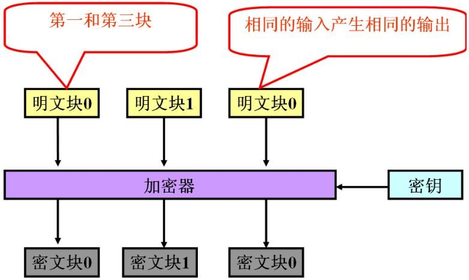

信息安全试验所需。

<!--more-->

[toc]

# DES

## 按表变换

DES涉及多次依据表格进行位置变换。

如此表，第1位的57，表示把原数据的第57位的数字移至第1位。

 

---

 

## 秘钥部分

1. 全长64位，但8的倍数位是奇偶校验，不参与实际加密。

2. PC-1变换：64分8组，按照PC-1表进行变换，此步表中没有8*k位置（此步消去奇偶校验位），得到56位秘钥。

	

3. 拆分：56位秘钥左右均分为$C_0$和$D_0$（各28位）

4. 循环左移：将上述两部分，各自逐次循环左移16次，得到$C_i,D_i \ (i\in[1,16])$

	* i=1,2,9,16时是左移1位**得到**
	* 其余左移2位**得到**

	> $ C_0 = 1111000011001100101010101111
	> \\ C_1 = 1110000110011001010101011111 $

5. 合并：$ C_iD_i $ 

6. PC-2变换：得到子秘钥$ K_i $，此步表中仅48位，即子秘钥仅48位（删除C的第9,18,22,25位以及D的第7,9,15,26比特位）

	

	

总过程：原秘钥（64） -> PC-1（56↓） -> 两侧循环左移（28×2） -> PC-2（48↓） -> 子秘钥$K_i $（48）

 

---

 

## 信息部分

DES基于组块，每块64位。

1. 初始变换IP（Initial permutation）：右上是IP表，右下是IP逆的表。两表互为逆操作。

	

2. 分块：64位均分为左右$L_0、 \ R_0$，各32位

3. 16次迭代：
	$$
	L_i = R_{i-1}
	\\ R_i = L_{i-1} \ XOR \ f(R_{i-1}, \ K_i)
	$$

4. $f(R_{i-1}, \ K_{i})$：输入两个32位，输出一个32位

	.png)

	1. 扩展置换E：$R_{i-1}$ 经下表扩展至48位

		

	2. XOR：扩展所得与子秘钥异或 $E(R_{i-1}) \ XOR \ K_i$ 

	3. S盒替换：将异或得到的48位结果分成八个6位的块，每一块通过对应的一个S盒产生一个4位的输出。

		每个S盒都是4×16的矩阵。例如块1：$x_1x_2x_3x_4x_5x_6$，将$x_1x_6$转为10进制作为S盒1的行号，将$x_2x_3x_4x_5$转为10进制作为S盒1的列号，则确定一个数字，转为4位二进制。

		最终实现每块的6位->4位，整体的32位。

		

	4. P置换：将上述所得进行移位变换，得32位

		

5. 16次后，得到$L_{16}, \ R_{16}$，将其倒置得$R_{16}L_{16}(64)$，进行IP逆置换，得到最终密文。

 

---

 

## 解密

仅将秘钥调换使用顺序（$K_{16},K_{15},...,K_1$），其余与加密相同。

 

 

# 分组密码工作模式

## ECB

电子密码本ECB (electronic codebookmode)

* 最简单的方法：原数据分组后按顺序加密，之后将所得密文按顺序连接即可
* 特点
	* 简单可并行
	* 不能隐藏明文的模式信息
	* 加密消息块相互独立成为被攻击的弱点（可能主动攻击明文）

## CBC

密码分组链接CBC (cipher blockchaining)

* 使加密的各段数据之间有了联系
* 解密时先解密再与初始向量/**密文**异或
* 解密后补位数据要删除
* 特点：
	* 加密无法并行
	* 隐藏明文的模式信息（相同明文块，生成密文不同）
	* 不易对明文主动攻击
	* 密文块损坏导致两明文块损坏
	* 安全性更好，更适合长报文传输

## CFB

密码反馈CFB (cipher feedback)

使用一个与块大小相同的移位寄存器（用IV初始化）。将其加密后，取高n位（K块作用）与明文的n位异或。随后寄存器左移n位，将得到的n位密文补至尾部。解密过程与加密过程相似，以IV开始，对寄存器加密，将结果的高x与密文异或，产生x位平文，再将密文的下面x位移入寄存器。

特点：

* 流密码
* 隐藏明文模式
* 误差传递：一个单元损坏影响多个单元

## OFB

输出反馈OFB (output feedback)

特点：

* 流密码
* 隐藏了明文模式
* 误差传递：一个单元损坏只影响对应单元
* 对明文的主动攻击是可能的,信息块可被替换、重放
* 安全性较CFB差