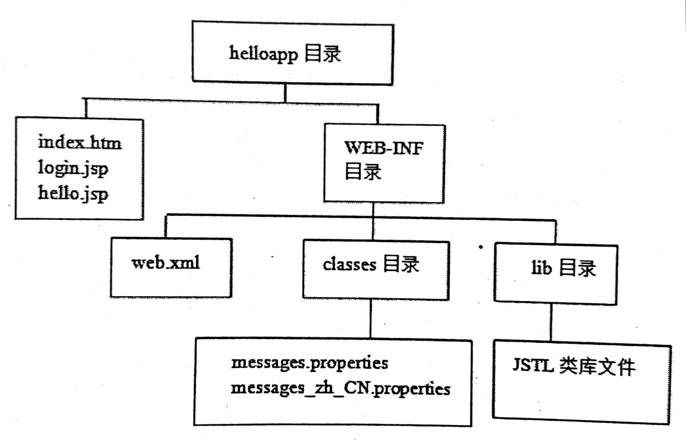

&nbsp;

<!-- more -->

<!-- toc -->

&nbsp;

[toc]

&nbsp;

# JSTL标签库

自定义JSP标签用来替代Java程序片段，有些JSP常要使用的功能，如重定向、include、格式化输出、访问数据库、流程控制等。Oracle公司制定了一组标准标签库 JSTL（JavaServer Pages Standard Tag Library）。

&nbsp;

## 1. 使用第三方标签库步骤

提供标签库的第三方，将所有文件打包为JAR包，包含：标签处理类及相关类的class文件，含有TLD的META-INF目录。

使用方法：把JAR文件复制到`<CATALINA_HOME>/lib`或`webapp/WEB-INF/lib`下，JSP中通过taglib声明标签库，uri属性与TLD中的uri一致。

运行此标签时，容器自动到JAR的META-INF下读取TLD。

&nbsp;

## 2. JSTL标签库简介

1. 包含5个标签库，URI和前缀做了约定：
	1. Core：c `http://java.sun.com/jsp/jstl/core`，核心标签库，包括一般标签、条件标签、迭代标签、URL相关标签
	2. I18N：fmt `http://java.sun.com/jsp/jstl/fmt`，国际化，日期时间数字格式化
	3. Sql：sql `http://java.sun.com/jsp/jstl/sql`，访问关系数据库
	4. Xml：x `http://java.sun.com/jsp/jstl/xml`，对XML文档操作
	5. Functions：fn `http://java.sun.com/jsp/jstl/functions`，通用的EL函数，EL表达式中可以使用这些EL函数
2. 要使用JSTL，需要下载JSTL安装包，包括`taglibs-standard-impl-X.jar`和`taglibs-standard-spec-X.jar`；前者包含Apache开源软件组织用于实现JSTL的class文件，在其META-INF下，包含了5个标签库的TLD；后者包含JSTL规范中定义的接口的类的class文件；下载后把两jar文件复制到`<CATALINA_HOME>/lib`或`webapp/WEB-INF/lib`下
3. IDEA使用：
	1. WEB-INF下新建lib包，放入jstl的jar包 http://archive.apache.org/dist/jakarta/taglibs/standard/binaries/
	2. File-Project Structure-Modules-Add-JARs-选择到lib-勾选-应用
	3. 使用taglib指令导入jar包到jsp页面 `<%@taglib uri="jar包网址" prefix="代用名"%>` 
4. 在JSP中使用库时，要先taglib引入标签库

&nbsp;

## 3. Core

`<%@ taglib uri="http:/java.sun.com/jsp/jstl/core" prefix="c" %>`

### 3.1 一般用途标签

`<c:out>`：把表达式结果打印到网页

`<c:set>`：设定命名变量（存放在特定范围内的属性）的值，JavaBean的属性的值，Map的Key的值

`<c:remove>`：删除一个命名变量

`<c:catch>`：捕获异常，并把异常对象放在页面范围内指定的命名变量中


1. `<c:out value="表达式"/>`

	1. **表达式可以是`<%= %>`的Java表达式，也可以是EL表达式（以下命名变量名字target属性也如此）**

	2. 设置默认值后，表达式为null时输出默认值

		`<c:out value="" default="" />`

		`<c:out value=""> default_content </c:out>`

2. `<c:set>`

	1. 为String类型命名变量设定值（或设定一个新的命名变量）：`<c:set var="命名变量的名字" value="表达式" scope="{page|request|session|application} />"` 或 `<c:set var=“命名变量” scope=""> value </c:set>`范围默认page
	2. 设定JavaBean的属性的值：`<c:set var="JavaBean命名变量" property="JavaBean的属性名" value="表达式" />` 
	3. 设置Map的Key的值：`<c:set target="Map对象命名变量" property="key的名字" value="表达式" />`
	4. 前一种set时，var属性的值直接使用名字即可，后两种target属性的值，是对象的命名变量，要用表达式，如`${bean}`

3. `<c:remove var="命名变量的名字" scope="" />` 如不指定范围，则删除全部范围内的此名属性

4. `<c:catch var="代表异常对象的命名变量的名字"> <% 一段代码 %> </c:catch>` 捕获标签主体内代码的异常，存入页面范围内指定的命名变量中

### 3.2 条件标签

`<c:if>` `<c:choose>` `<c:when>` `<c:otherwise>` 替代Java中的if和if-else。

1. `<c:if>`

	1. `<c:if test="逻辑表达式" var="代表逻辑表达式的值的命名变量的名字" scope="" />` 把逻辑表达式的值存入var的命名变量中，默认page范围
	2. `<c:if test="逻辑表达式">标签主体</c:if>` true时执行标签主体

2. `<c:choose>` `<c:when>` `<c:otherwise>`三标签连用，实现if-else

	```jsp
	<c:choose>
	    <c:when test="${empty param.username}">
	        Unknown user.    
	    </c:when>
	    <c:when test="${param.username=='Tom'}">
	        ${param.username} is type-a.
	    </c:when>
	    <c:otherwise>
	        ${param.username} is type-b.
	    </c:otherwise>
	</c:choose>
	```

	1. when和otherwise必须在choose父标签下
	2. choose中可以多个when
	3. choose中可以没有otherwise
	4. choose中若when和otherwise都有，则otherwise必须在when后

### 3.3 迭代标签

`<c:forEach>` 遍历集合中的对象，能重复执行标签主体

`<c:forTokens>` 遍历字符串中用特定分割符分割的子串，能重复执行标签主体

1. `<c:forEach>`
	1. 基本语法：`<c:forEach var="集合中一个元素的命名变量的名字" items="集合"> 主体 </c:forEach>` 每次取出一个元素，放入NESTED范围（当前标签主体构成的范围）内的命名变量中，仅标签主体中可以访问这个命名变量
	2. varStatus属性：设定一个javax.servlet.jsp.jstl.core.LoopTagStatus类型的命名变量，谓语NESTED范围，包含从集合中取出的当前元素的状态信息：
		1. count：该元素在集合中的序号（1开始）
		2. index：索引（0开始）
		3. first：是否是集合第一个元素
		4. last：是否是集合最后一个元素
	3. begin、end、step属性：循环的起始索引、结束索引、步长，另如未指定集合，用此属性，则是将数字看作集合
	4. 本标签可以访问的集合：集合类、数组、以逗号分割的字符串
2. `<c:forTokens var="代表子串的命名变量的名字" items="被分割的字符串" delims="分割符"> 主体 </c:forTokens>` 本标签也有varStatus、begin、end、step属性

### 3.4 URL相关标签

`<c:import>`：包含其他Web资源

`<c:url>`：按照特定重写规则重构URL

`<c:redirect>`：重定向

1. `<c:import url="资源URL">`
	1. 类似`<jsp:include>`，但本标签还可以包含其他Web应用中的资源，甚至是其他网站的资源
	2. 包含当前Web应用中的资源时，可以是非/开头的相对路径，也可以是/开头的绝对路径（绝对路径以webapp下的文件夹开始，实际上/开头的话，容器会自动前缀应用根路径，故从webapp后开写即可）
	3. 包含其它网站的文件时，url属性以`http://`开头的绝对路径
	4. 包含同一容器中其他Web应用的资源时，首先要在本应用的META-INF/context.xml中，把`<Context>`的corssContext属性设为true，随后在本应用的`<c:import url="/dir/target.jsp" context="/anotherweb" />`中加入context属性
	5. 还可使用var属性，将目标文件的内容，不直接包含到当前文件，而是保存在var属性设定的命名变量中
2. `<c:url value="原始URL" var="存放新URL的命名变量" scope="" />`
	1. 重构/创建URL，把新URL放在var指定的命名变量中，默认page范围
	2. 不以/开头的相对路径，和以/开头的绝对路径（绝对路径时自动前缀根路径，最终的URL是带有根路径的）
	3. 可以包含`<c:param name="username" value="Tom">`子标签，用于设定请求参数，并且此标签能对value中的各种符号正确编码，如> &等，代码正常写即可
3. `<c:redirect url="目标Web资源的URL" />`，重定向，也可使用context属性指向其他Web应用，和`<c:param>`标签指定参数

&nbsp;

## 4. I18N

国际化，时间日期数字格式化

`<%@ taglib prefix="fmt" uri="http://java.sun.com/jsp/jstl/fmt" %>`

### 4.1 国际化

即I18N（Internationalization），指软件设计阶段，就应该使软件具有支持多种语言和地区的功能。如此，添加新语言和国家支持时，不需大量返工，无需修改代码。

应将文本、图片等资源抽离出来，储存在外部，根据用户不同，调用不同资源。

Locale本地，指地理区域。

&nbsp;

### 4.2 Java对I18N的支持

核心库中提供了一些支持国际化的类和接口。JSTL的I18N标签库依赖于这些类。

1. Locale类：

	1. java.util.Locale，实例代表一个特定语言和地区
	2. 若某个类运行时需要依据Locale对象，就称该类是本地敏感的
	3. Locale对象本身不执行和I18N相关的工作，仅负责向本地敏感的类提供本地信息
	4. 创建时要提供语言和国家代码 `var zhLocale = new Locale("zh", "CN")`
		1. 语言代码：两个小写字母，ISO-639规范 [完整语言代码列表](https://www.iso.org/iso-639-language-codes.html)
		2. 国家代码：两个大写字母，ISO-3166规范 [完整国家代码列表](https://www.iso.org/iso-3166-country-codes.html)
	5. 本类提供一些静态常量，代表常用实例对象 `var jp = Locale.JAPAN`
	6. 虚拟机中Locale对象来源：Java虚拟机启动时查询操作系统，为运行环境设置默认Locale，可通过本类静态方法`getLocale()`获得
	7. 容器中的Locale对象：容器默认使用虚拟机中Locale；而Web应用中，HTTP请求头也包含了Locale信息，故可使用HttpServletRequest对象的`getLocale()`或`getLocales()`方法，访问请求头的Accept-Language项，返回用户优先使用的Locale或优先级降序的Enumeration集合对象；若用户未设置，则使用默认Locale

2. ResourceBundle类：

	1. java.util.ResourceBundle，存放和管理Locale相关资源，包括文本、状态信息、图片名、正常消息、错误消息、网页标题等

	2. 实例化工厂方法：`getBundle(String baseName)` `getBundle(String baseName, Locale locale)`  baseName：指定资源文件名字；locale如不指定则默认

	3. 资源文件以“properties”为扩展名，文件名为“resource_zh_CN”类似格式，不加最后4个字母，则为默认资源，实例化本类是baseName指定“resource”即可，使用哪个资源文件，可根据传入Locale判断

	4. 实例化一个ResourceBundle对象，它将resource_zh_CN.properties加载到内存

		```java
		var zhLocale = new Locale("zh", "CN");
		var bundle = ResourceBundle.getBundle("resource", zhLocale);
		```

	5. `getString(String key)` 本方法根据参数key，返回匹配到的消息文本；如资源文件中有`hello=Nice to meet you.`，`bundle.getString("hello")`即可得到Nice to meet you.

3. MessageFormat类：

	如以下资源文件：

	```properties
	error.requiredfield.name = The name is required
	error.requiredfield.phone = The phone is required
	```

	仅部分内容不同，如需要大量类似资源时，十分冗杂，可使用本类功能，把资源文件改为：

	```properties
	error.requiredfield = The {0} is required
	label.phone = phone
	label.name = name
	```

	其中{0}是消息参数，数字可增加。运行时，MessageFormat类的`format()`方法可以把消息参数{0}替换成真正需要的动态文本内容：

	```java
	// 创建bundle，加载资源文件
	var bundle = ResourceBundle.getBundle("resource");
	// 获取消息模板
	String requiredFiledMessage = bundle.getString("error.requiredfield");
	// 创建存放消息参数的数组
	Object[] messageArgs = new Object[1];
	// 读取label.name对应文本
	messageArgs[0] = bundle.getString("label.name");
	//格式化消息
	String formattedNameMessage = MessageFormat.format(requiredFieldMessage, messageArgs);
	// 如此，formattedNameMessage即为最终的动态消息文本
	```

&nbsp;

### 4.3 国际化标签

`<fmt:setLocale>`：设置Locale，保存到特定范围

`<fmt:setBundle>`：设置ResourceBundle，保存到特定范围

`<fmt:bundle>`：设置标签主体使用的ResourceBundle

`<fmt:message>`：根据属性key返回ResourceBundle中匹配的消息文本

`<fmt:param>`：为消息文本中的消息参数设置值

`<fmt:requestEncoding>`：设置HTTP请求正文使用的字符编码

1. `<fmt:setLocale value="locale对象" scope="">` 保存该属性的名字（命名变量名字）是JSTL API中的javax.servlet.jsp.jstl.Config类的一个静态常量FMT_LOCALE + scope，值为“javax.servlet.jsp.jstl.fmt.locale.{page|…}”，

2. `<fmt:setBundle basename="资源文件名字" var="命名变量名字" scope="">`，如不指定var，则命名变量名字为Config.FMT_LOCALIZATION_CONTEXT，即“javax.servlet.jsp.jstl.fmt.localizationContext”，如此，本Bundle即为范围内默认Bundle

3. `<fmt:bundle basename="资源文件名字" prefix="消息key的前缀"> 标签主体 </fmt:bundle>`  设置标签主体所用bundle，当要使用的key有相同前缀时，可把公共部分提至prefix中

4. `<fmt:message key="">` 根据key，返回bundle中匹配的消息文本

5. `<fmt:param value="">` 嵌套在message标签中，用于生成动态消息文本，类似MessageFormat类功能，如资源文件有：`hello.hi=hello {0}, time is {1}.`，标签则

	```jsp
	<fmt:formatDate value="<%=new Date()%>" type="both" var="now" />
	<fmt:message key="hello.hi">
	    <fmt:param value="Tom"/>
	    <fmt:param value="${now}"/>
	</fmt:message>
	```

6. `<fmt:requestEncoding value="">` 设置HTTP请求正文使用的字符编码，等价于`<% request.setCharacterEncoding("")`

&nbsp;

### 4.4 应用结构与中文资源文件



英文资源文件可直接生成，中文则需如下步骤：

1. messages_temp.properties，正常编写资源项，如`hello.title=主页`

2. 利用JDK提供的native2ascii命令进行字符编码转换

	```bash
	native2ascii -encoding gb2312 messages_temp.properties messages_zh_CN.properties
	```

&nbsp;

### 4.5 格式化标签

`<fmt:setTimeZone>`：设置时区，把时区保存到特定范围

`<fmt:timeZone>`：设置标签主体使用的时区

`<fmt:formatNumber>`：格式化数字

`<fmt:parseNumber>`：解析被格式化的字符串类型的数字

`<fmt:formatDate>`：格式化日期和时间

`<fmt:purseDate>`：解析格式化的字符串类型的日期和时间

1. `<fmt:setTimeZone value="时区" var="命名变量的名字" scope="">`
	1. 默认page范围
	2. 如未指定var，则命名变量采用javax.servlet.jsp.jstl.core.Config类的静态字符串常量FMT_TIME_ZONE的值，即“javax.servlet.jsp.jstl.fmt.timeZone”，该标签设置的时区将作为特定范围内的默认时区
2. `<fmt:timeZone value="时区"> 主体 </fmt:timeZone>`设置当前标签主体的时区
3. `<fmt:formatNumber>` 格式化数字，具有多个属性：
	* value：待格式化数字
	* var：指定命名变量的名字，**不指定就直接输出，指定后不输出只存放，其他标签也如此**
	* scope：格式化后数字存放范围，默认page
	* type：数字类型，可选值number、currency、percent，默认number
	* pattern：自定义的格式化样式，详细用法参考java.text.DecimalFormat的文档
	* currencyCode：ISO4271货币代码
	* currencySymbol：货币符号，如\$，如未设置则根据当前Locale自动设置
	* groupingUsed：指定是否使用对数字进行分组显示的分隔符，默认true，如123456输出显示123,456
	* maxIntegerDigits：指定整数部分的最大的数字位数
	* minIntegerDigits：指定整数部分最小的数字位数
	* maxFractionDigits：指定小数部分的最大的数字位数
	* minFractionDigits：指定小数部分的最小的数字位数，此四项类似设置宽度，多余数字四舍五入
4. `<fmt:parseNumber>` 将已格式化后的字符串形式的数字货币百分数转换为数字类型
	* value：待解析的字符串
	* type：按照何种类型解析
	* pattern：自定义格式化样式
	* parseLocale：按照何种Locale习惯解析
	* integerOnly：是否只解析整数部分，默认false
	* var：命名变量名字
	* scope：结果存放范围，默认page
5. `<fmt:formatDate>`：格式化日期和时间
	* value：待格式化的日期或时间
	* type：格式化的是日期还是时间还是都有date、time、both
	* dateStyle：日期的格式化样式，默认default，有default、short、medium、long、full可选，详细用法java.text.DateFormat
	* timeStyle：时间的格式化样式，默认default，详细用法同上
	* pattern：自定义的格式化样式，详细用法java.text.SimpleDateFormat
	* timeZone：指定使用的时区
	* var：命名变量名字
	* scope
6. `<fmt:purseDate>`：解析格式化的字符串类型的日期和时间
	* value：待解析字符串
	* type：按照何种类型解析，date、time、both，默认date
	* dateStyle，默认default
	* timeStyle：默认default
	* pattern：自定义样式
	* parseLocale：按照哪个Locale习惯解析
	* timeZone：使用的时区
	* var：命名变量名字
	* scope

&nbsp;

## 5. SQL

大型Web采用MVC设计模式，访问数据库任务由模型层JavaBean完成。小型Web中访问数据库可以在JSP中执行。JSTL SQL标签用于访问数据库，避免Java代码片段的冗长。

`<%@ taglib prefix="sql" uri="http://java.sun.com/jsp/jstl/sql" %>`

`<sql:setDataSource>`：设置数据源

`<sql:query>`：执行select语句

`<sql:param>`：为SQL语句中用？表示的参数赋值

`<sql:dateParam>`：为SQL语句中用？表示的日期或时间类型的参数赋值

`<sql:update>`：insert、update、delete语句

`<sql:transaction>`：声明数据库事务

&nbsp;

1. `<sql:setDataSource>`

	1. 数据源来源：
		1. 容器提供的数据源：若已配置过数据源，如一个JNDI名字为“jdbc/BookDB”的数据源，则`<sql:setDataSource dateSource="jdbc/BookDB"/>`
		2. 标签自身创建数据源，`<sql:setDataSource url="jdbc:mysql://localhost:3306/BookDB?useUnicode=true&charanterEncoding=GB2312&useSSL=false" driver="com.mysql.jdbc.Driver" user="dbuser" password="1234" />`
	2. 另有var，scope属性，将数据源保存在特定范围的命名变量，默认page
	3. 若没有指定var，则默认使用javax.serlvet.jsp.jstl.core.Config类的静态常量SQL_DATA_SOURCE的值“javax.servlet.jsp.jstl.sql.dataSource”，作为范围内默认数据源

2. `<sql:query>` select查询

	1. 属性如下：

		* sql：select语句，可在标签属性中写出，也可在标签主体写出
		* dataSource：数据源，如不指定，使用由`<sql:setDataSource>`指定的默认源
		* maxRows：从原始查询结果中取出的最大记录数目
		* startRow：从原始查询结果中第几条记录开始取出，索引0开始
		* var：查询结果的命名变量
		* scope：查询结果存放范围

	2. 返回结果：javax.servlet.jsp.jstl.sql.Result类型，该接口有如下方法：

		* String[] getColumnNames()：返回结果中所有列/字段的名字
		* int getRowCount()：所有行/记录的数目
		* SortedMap[] getRows()：所有行/记录，每个SrotedMap对象表示一个记录，以字段名为key，以字段值为value
		* Object\[][] getRowsByIndex()：查询结果，第一维表示结果的记录/行，第二维表示结果的字段/列
		* boolean isLimitedByMaxRows()：结果的记录数目是否收到标签的maxRows属性限制，若原始查询结果记录数大于maxRows，则true

	3. 访问查询结果：Result类型中方法多为getter，故可用

		```jsp
		<c:forEach var="item_name" items="${results.rows}" >
		    ${item_name.ID} 
		</c:forEach>
		```

3. `<sql:param>` 为SQL语句中用？表示的参数赋值

	```jsp
	<sql:query var="books" sql="select * from BOOKS where PRICE>?">
	    <sql:param>35</sql:param>
	</sql:query>
	```

4. `<sql:dateParam>` 为SQL语句中用？表示的日期或时间类型的参数赋值，有属性：

	* value：java.util.Date，设置SQL语句中响应参数的值
	* type：String，指定参数的类型，可选date、time、timestamp，默认timestamp

	```jsp
	<fmt:parseDate value="2007-05-06" type="date" var="publish_date"/>
	<sql:query var="books">
	    select * from BOOKS where PUBLISH_DATE=?
	    <sql:dateParam value="${publish_date}" type="date"/>
	</sql:query>
	```

5. `<sql:update>` insert、update、delete语句，SQL DDL语句，定义表、视图、索引，有属性：

	* sql：待执行语句
	* dataSource：数据源，如不指定使用默认数据源
	* var：执行结果的命名变量，其执行结果是库中受影响记录数
	* scope：执行结果存放范围，默认page

6. `<sql:transaction>` 为其子标签query和update声明数据库事务，位于同一个`<sql:transaction>`中的所有`<sql:query>`和`<sql:update>`均作为一个数据库事务

	1. 属性：

		* dataSource：设置数据源，其子标签的query、update不可再设置数据源
		* isolation：事务隔离级别，隔离级别由低到高可选read_uncommitted读未提交数据、read_committed读已提交数据、repeatable_read可重复读、serializable串行化，如不设置将使用数据源默认隔离级别

	2. 隔离级别能避免的并发问题：

		| 隔离级别        | 是否第一类丢失更新 | 是否脏读 | 是否虚读 | 是否不可重复读 | 是否第二类丢失更新 |
		| --------------- | ------------------ | -------- | -------- | -------------- | ------------------ |
		| serializable    | 否                 | 否       | 否       | 否             | 否                 |
		| repeatable_read | 否                 | 否       | 是       | 否             | 否                 |
		| read_commited   | 否                 | 否       | 是       | 是             | 是                 |
		| read_uncommited | 否                 | 是       | 是       | 是             | 是                 |

		隔离级别逐渐降低，但对并发性能影响也逐渐降低，通常优先考虑read_committed级别。

&nbsp;

## 6. Functions

本标签库中提供了常用的EL函数，主要用于处理字符串。

`<%@ taglib prefix="fn" uri="http://java.sun.com/jsp/jstl/functions" %>`

另，因为是EL函数，参数传递时，若非直接写出，而是用变量名时，要用命名变量，即要先set进Attribute，可用Java片段或`<c:set>`标签

1. `fn:contains(String source, String target)`：返回boolean，主串中是否包含目标串
2. `fn:containIgnoreCases(String source, String target)`：boolean，是否包含子串，忽略大小写
3. `fn:startWith(String source, String target)`：boolean，source串是否以target串开头
4. `fn:endsWith(String source, String target)`：boolean，是否以目标串结束
5. `fn:indexOf(String source, String target)`：int，子串匹配，返回主串中匹配位置首位的索引（0开始），不匹配则-1
6. `fn:replace(String source, String before, String after)`：String，在source主串中，以after串替换掉before串，返回结果串
7. `fn:substring(String source, int beginIndex, int endIndex)`：String，获取主串中的子串，不包含endIndex
8. `fn:substringBefore(String source, String target)`：String，获取主串中指定子串之前的内容
9. `fn:substringAfter(String source, String target)`：String，获取主串中指定子串之后的内容
10. `fn:split(String source, String delimiter)`：String[]，将主串根据delimiter分隔符分割成字符串数组，如不包含delimiter或delimiter为空，则返回数组中仅有原主串
11. `fn:join(String[] source, String separator)`：String，将原字符串数组，和分隔符，连接为一个串
12. `fn:toLowerCase(String source)`：String
13. `fn:toUpperCase(String source)`：String
14. `fn:trim(String source)`：String
15. `fn:escapeXml(String source)`：String，将串中\<，\>，\&等字符串转换为转义字符，转译后即可输出原字符，而非编译后的xml格式
16. `fn:length(source)`：int，字符串中字符个数，或集合和数组中元素个数

&nbsp;

