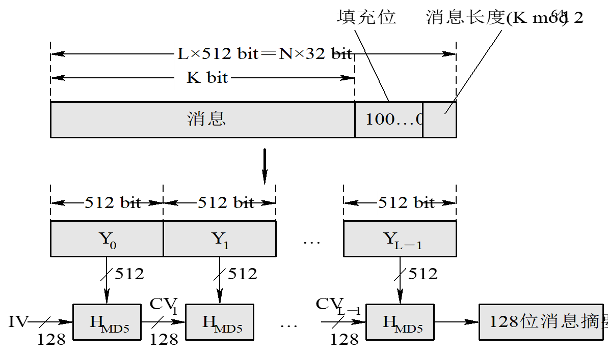
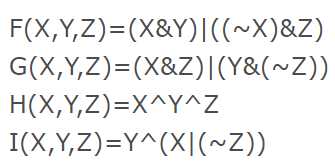
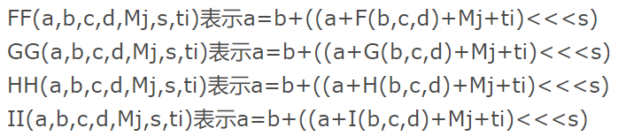

信息安全技术试验

<!--more-->

<!-- toc -->

 

[toc]

 

# MD5

信息摘要算法 Message-Digest Algorithm 5

 

## 功能

1. 任意长度信息生成128位信息。
2. 唯一性
3. 不可逆

 

## 算法过程

以512位分组来处理输入的信息，且每一分组又被划分为16个32位子分组，经过了一系列的处理后，算法的输出由四个32位分组组成，将这四个32位分组级联后将生成一个128位散列值。

1. 填充

	填充结果由原消息（+ 填充）+消息长度构成。

	填充位：100…0，负责将结果填充至512b的倍数；

	消息长度：64b，记录原消息长度。

	另，填充+消息长度之和要大于64，即若原消息448，也要补充512+64。

2. 分组

	2.1 按照512b的长度分为L个大组。

	2.2 将每个大组，分为16个32b的小组。

3. Buffer

	定义四个32b的数，16进制下为：A=a=01234567，B=b=89ABCDEF，C=c=FEDCBA98，D=d=76543210。

4. 定义函数

	定义4种函数FF、GG、HH、II，表示对abcd和某一小组的操作与赋值。

	

	

5. 运算

	进行L次大循环，大循环的输入是上一次大循环的输出与本次大循环所用的大组；输出是ABCD。

	每个大循环（大组）下进行4次小循环。每次小循环用到一种上述函数与一个小组。每个小循环结束后，将ABCD分别加上abcd。

6. 拼接

	最后将ABCD连接即可。

