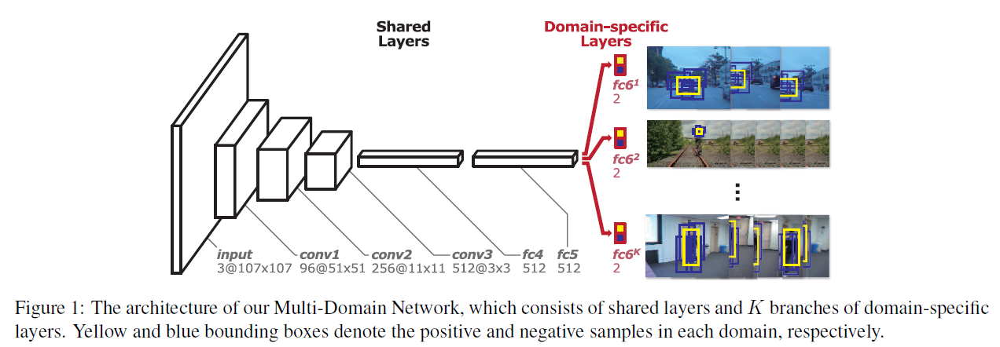
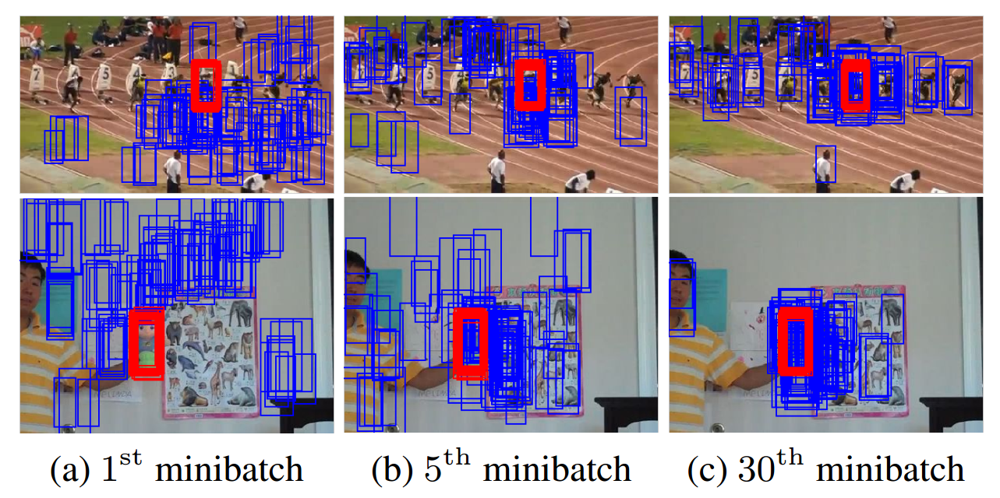
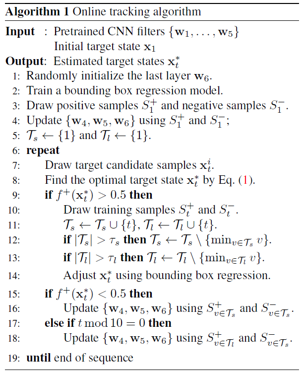

<!--more-->

<!-- toc -->

 

# MDNet

Learning Multi-Domain Convolutional Neural Networks for Visual Tracking

 

## 背景

* 对于跟踪问题来说，CNN应该是由视频跟踪的数据训练得到的更为合理。所有的跟踪目标，虽然类别各不相同，但其实他们应该都存在某种共性，这是需要网络去学的。
* 用跟踪数据来训练很难，因为同一个object，在某个序列中是目标，在另外一个序列中可能就是背景，而且每个序列的目标存在相当大的差异，而且会经历各种挑战，比如遮挡、形变等等。
* 现有的很多训练好的网络主要针对的任务比如目标检测、分类、分割等的网络很大，因为他们要分出很多类别的目标。而在跟踪问题中，一个网络只需要分两类：目标和背景。而且目标一般都相对比较小，那么其实不需要这么大的网络，会增加计算负担。

 

## multi-domain learning/多区域学习

​    训练数据来源于多个domain，domain information被纳入学习过程。是自然语言处理领域一个常见的学习方法（例如用在多个产品的情感分类和多个用户的垃圾邮件过滤等课题中），但很少有人应在计算机视觉领域。

 

## 网络结构

* Input: 网络的输入是107x107的Bounding box，设置为这个尺寸是为了在卷积层conv3能够得到3x3的feature map。
* Convolutional layers: 网络的卷积层conv1-conv3来自于VGG-M [1]网络，只是输入的大小做了改变。
* Fully connected layers: 接下来的两个全连接层fc4,fc5各有512个输出单元，并设计有ReLUs和Dropouts。fc6是一个二分类层**（Domain-specific layers）**，softmax cross-entropy loss，一共有K个，对应K个Branches(即K个不同的视频)，每次训练的时候只有对应该视频的fc6被使用，前面的层都是共享的。**这个二分类层是online的更新。这个二分类层是用来判定一些candidate windows （随机的从上一帧target附近采样出来的） 是否为目标。**

**卷积层是一个相对通用的特征提取器，而fc层更多的是针对task和数据集的不同进行自适应调整**

 

## 小网络在tracking中的适用性：

* tracking旨在区分目标和背景两个类别，这比目前一般的视觉识别问题（如1000类的ImageNet分类）要求的模型复杂程度少得多。
* 深度CNN对于精确目标定位的效果较差，因为随着网络的深入，空间信息往往会被淡化。
* 在跟踪任务中通常目标较小，所以输入大小（input size）也就小，网络结构自然也就更浅。
* 跟踪通常是一个实时任务，一个较小的网络在跟踪问题上明显更有效率，训练和测试都可以在线进行的。 当我们测试更大的网络时，算法不太准确，并且变得更慢。

 

## Domain-specific layers

* 学习共性：算法的目标是训练一个 multi-domain CNN 以在任何 domain 辨别 target 和 background。这并非很直观，因为来源不同 domain的 train data 拥有不同的 target 和 background 的定义。但是，这其中仍然存在着一些共同的属性，如：对光照变化，运动模糊，尺寸变化的鲁棒性等等。为了提取出满足上述属性的特征，作者通过 multi-domain learning framework，从 domain-specific 的信息中分离出 domain-independent 的信息。
* 训练方式：为了学到不同视频中目标的共性，采用Domain-specific的训练方式：假设用K个视频来做训练，一共做N次循环。在每一次循环中，会做K次迭代，依次用K个视频的mini-batch来做训练。每一个mini-batch的构成是从某一视频中随机采8帧图片，在这8帧图片上随机采32个正样本和96个负样本，即每个mini-batch由某一个视频的128个框来构成。用SGD进行训练，**每个视频会对应自己的fc6层**。通过这样的训练来学得各个视频中目标的共性。
* 在第k次迭代中，mini-batch中只包含来自第（k mod K）个video的样本，K个domain-specific layers也只激活第（k mod K）个分支。
* 通过这个学习过程，跟特定domain无关的信息就被学习到并保存在共享层中，这些信息是非常有用的泛化特征表示。
* **test的时候，会新建一个fc6层，在线fine-tune fc4-fc6层，卷积层保持不变。**

 

## 网络在线更新策略

采用long-term和short-term两种更新方式。对应robustness 和 adaptiveness。

* long-term update：按照常规间隔后使用较长时间内的正样本进行更新。
* short-term updates：当出现潜在的跟踪失败（预测目标的positive score 小于 0.5）的时候使用短期内收集到的正样本进行更新。
* 这两种更新的执行依赖于物体外观变化的速度。
* long-term对应历史的100个样本（超过100个抛弃最早的），固定时间间隔做一次网络的更新（程序中设置为每8帧更新一次）。
* short-term对应20个（超过20个抛弃最早的），在目标得分低于0.5进行更新。
* 负样本都是用short-term的方式收集的，因为旧的负样本往往是冗余的或与当前帧无关。
* 另外在训练中负样本的生成用到了**hard negative mining**，就是让负样本越来越难分，从而使得网络的判别能力越来越强。作者把hard negative mining 的过程融入到minibatch选择阶段：在训练阶段的每一次迭代中，一个mini-batch包含n个正样本和p个困难负样本。如何选择困难负样本？ 用模型测试 M（M >> p）个负样本，sort之后取top p个最困难负样本。

 

## 目标跟踪过程

* 每次新来一帧图片，以上一帧的目标位置为中心，用多维高斯分布（宽，高，尺度三个维度）的形式进行采样256个candidates，将他们大小统一为107x107后，分别作为网络的输入进行计算。
* 网络的输出是一个二维的向量，分别表示输入的bounding box对应目标和背景的概率。目标最终是确定为目标得分概率最高的那个bounding box：
* 最后得到的candidate其实不是直接作为目标，还要做一步**bounding box regression**（矫正）。作者说bounding box regression涉及到的细节与R-CNN一样。

