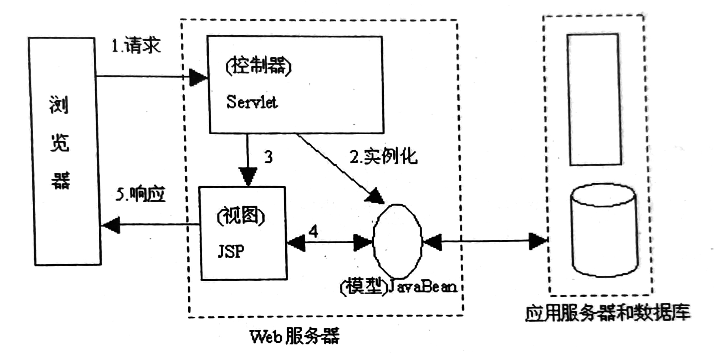
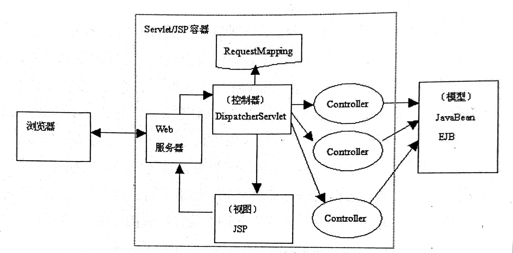
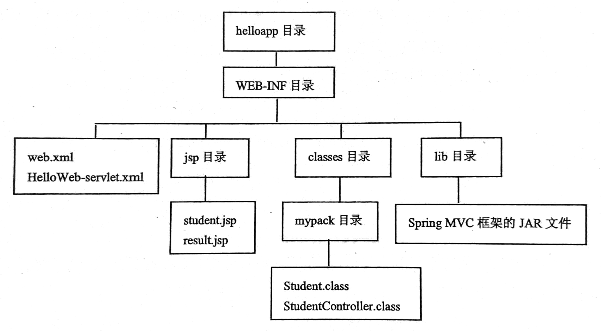
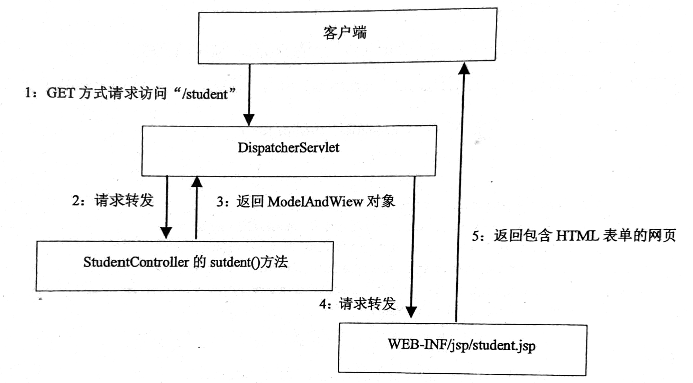
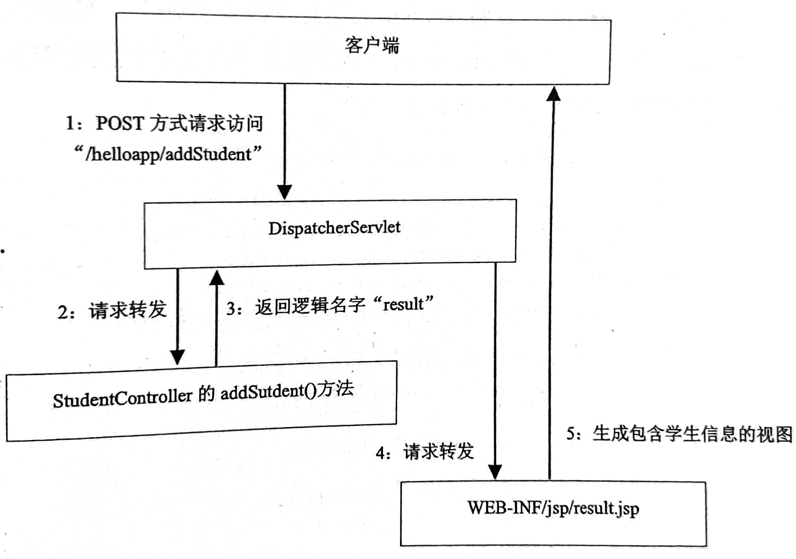

&nbsp;

<!-- more -->

<!-- toc -->

&nbsp;

[toc]

&nbsp;

# MVC设计模式

Model-View-Controller，模型-视图-控制器。

JavaWeb开发领域的两种设计模式：JSP Model1 和 JSP Model2.

Sring是轻量级开源JavaEE框架，Spring MVC是Spring框架的扩展功能。


## 1. MVC简介

1. 设计模式，强制把应用程序的数据展示、数据处理与流程控制分开。MVC把应用程序分为三个核心模块：模型、视图和控制器：
	1. 视图：用户看到并交互的界面，显示数据并接受输入，但不进行任何实际的业务处理。视图可以向模型查询业务状态，但不能改变模型；视图还能接受模型发出的数据更新事件，从而对用户界面进行同步更新（Web应用暂无法模型主动向视图发送更新事件，使用户界面自动刷新）
	2. 模型：应用程序的主体，表示业务数据和业务逻辑；能为多个视图提供数据，因此提高了重用性
	3. 控制器：负责应用的控制流程，即接收用户输入，调用相应的模型处理请求，调用视图显示模型返回的数据
2. MVC处理过程：控制器接收客户请求，决定调用哪个模型；模型根据请求进行业务逻辑处理，返回数据；控制器调用视图来格式化模型返回的数据，并通过视图呈现
3. MVC优点；分离代码，多个视图共享一个模型，提高重用性；模型自包含，可以方便地更改业务数据和业务规则，且三模块相互独立，低耦合；控制器提高了应用的灵活性和可配置性
4. MVC适用范围：使用需要精心设计，复杂性较高，不适用于小型应用，但提高健壮性和可重用性，提高后期开发效率

&nbsp;

## 2. JSP Model1和2

早起Web应用由于JSP中HTML与Java代码混杂，存在一系列问题，如HTML与Java强耦合、JSP中内嵌流程控制逻辑、调试困难、可维护性和可读性差等。

为解决这些问题，Java Web中先后出现了JSP Model1 和 JSP Model2。1虽努力实现MVC，但JSP同时充当视图和控制器，效果并不理想；基于JavaEE的2代则得以改良，其中用JSP实现MVC中的视图功能，用Servlet实现控制器功能，用JavaBean实现模型功能。

具体来说，Servlet充当控制器，负责处理客户请求，创建JSP页面需要使用的JavaBean对象，根据请求选择合适的JSP页面返回给客户。在JSP中没有流程控制逻辑，仅负责检索由Servlet创建的JavaBean对象，把它包含的数据作为动态内容插入到静态模板。

JSP Model 2：



&nbsp;

## 3. Spring MVC

基于MVC的Web应用框架

### 3.1 Spring MVC框架结构

Spring MVC是基于JSP Model2的MVC框架。其中：

1. 视图由一组JSP文件构成，负责生成客户界面；这些JSP中没有业务逻辑，也没有流程控制逻辑，只有HTML标记和标签
2. 模型由代表业务数据和实现业务逻辑的JavaBean或EJB组件构成
3. 控制器由Spring MVC自带的DispatcherServlet类和用户自定义的一系列Controller组件实现；
	1. org.springframework.web.servlet.DispathcerServlet类是Spring MVC框架中的核心组件，DispatcherServlet实现了HttpServlet接口，扮演中央控制器的角色；主要负责接收HTTP请求信息，根据RequestMapping（请求映射，用户请求的URL与实际的Controller的对应关系），把请求转发给适当的Controller组件；若该组件尚不存在则创建
	2. Controller组件负责调用模型方法，更新模型状态，帮助控制流程；小型应用中Controller也可完成一些实际的业务逻辑；大型应用中，Controller充当客户请求和业务逻辑处理之间的适配器，将数据展示与业务逻辑分离，即根据请求调用相关业务逻辑组件；Controller侧重于控制应用的流程，而非实现应用的业务逻辑，通常业务逻辑放在模型中
	3. `@RequestMapping`：本标注用于设定请求映射对应关系；
		1. 若在类前标注，则表示DispatcherServlet控制器对于此URL调用本组件，即为本组件配置映射的URL，如`@RequestMapping("/hello")`
		2. 若在方法前标注，则表示DispatcherServlet控制器调用此方法，如`@RequestMapping(method = RequestMethod.GET)`表示请求是GET时调用此方法
		3. 以上两种标注可合一，放在方法前`@RequestMapping(value = "/hello", method = RequestMethod.GET)`
	4. `@Controller`：类加上本标注，就成为一个Controller组件



&nbsp;

### 3.2 Spring MVC工作流程

对采用Spring MVC的Web应用，在**Web应用启动时就会加载并初始化DispatcherServlet**。当DispatcherServlet接收到一个扼要访问特定Controller的请求时，就如下流程：

1. 检索和客户请求匹配的Controller组件，若不存在，就先创建再调用
2. Controller组件相关方法调用模型层的相关组件来处理业务逻辑，再指定下一步负责处理请求的目标组件的逻辑名字
3. DispatcherServlet参考Spring MVC配置文件，获取与Controller指定的逻辑名字对应的目标组件的实际URL，把请求转发给目标组件。若目标组件是JSP（视图），则直接将响应结果返回给客户

&nbsp;

## 4. 创建采用Spring MVC的Web应用

### 4.1 基础准备

[下载](https://repo.spring.io/libs-release-local/org/springframework/spring/)与OS对应的Spring软件包（关键是dist.zip文件）。

解压，把libs下的JAR复制到Web应用的WEB-INF/lib下，如下是基于Spring MVC的Web应用的目录结构



### 4.2 创建视图

Spring MVC的视图是一组包含了Spring标签的JSP文件。

student.jsp，用于收集学生信息

```jsp
<%@page contentType = "text/html;charset = UTF-8" language = "java" %>
<%@taglib uri = "http://www.springframework.org/tags/form" prefix = "form"%>
<html>
  <head>
    <title>Spring MVC Sample</title>
  </head>

  <body>
    <h2>Student Information</h2>
    <form:form method = "POST" action = "/helloapp/addStudent">
      <table>
        <tr>
          <td><form:label path = "name">Name</form:label></td>
          <td><form:input path = "name" /></td>
        </tr>
        <tr>
          <td><form:label path = "age">Age</form:label></td>
          <td><form:input path = "age" /></td>
        </tr>
        <tr>
          <td><form:label path = "id">ID</form:label></td>
          <td><form:input path = "id" /></td>
        </tr>
        <tr>
          <td colspan = "2">
            <input type = "submit" value = "Submit"/>
          </td>
        </tr>
      </table>  
    </form:form>
  </body>
</html>
```

这里的`<form:**>`就是Spring标签，用于生成表单。

result.jsp显示获取到的信息：

```jsp
<%@page contentType = "text/html;charset = UTF-8" language = "java" %>
<%@page isELIgnored = "false" %>
<%@taglib uri = "http://www.springframework.org/tags/form" prefix = "form"%>
<html>
  <head>
   <title>Spring MVC Sample</title>
  </head>

  <body>
    <h2>Submitted Student Information</h2>
    <table>
      <tr>
        <td>Name:</td>
        <td>${name}</td>
      </tr>
      <tr>
        <td>Age:</td>
        <td>${age}</td>
      </tr>
      <tr>
        <td>ID:</td>
        <td>${id}</td>
      </tr>
    </table>  
  </body>
</html>
```

### 4.3 创建模型

模型层，表示业务数据或实现业务逻辑的JavaBean组件。本例Student类是一个JavaBean，表示本例的业务数据。

student

```java
//
// Source code recreated from a .class file by IntelliJ IDEA
// (powered by FernFlower decompiler)
//

package mypack;

public class Student {
    private Integer age;
    private String name;
    private Integer id;

    public Student() {
    }

    // getter setter
}
```

简单应用中，业务逻辑也可直接由控制器完成，不用模型。

### 4.4 创建Controller

本例简单，直接用Controller完成业务逻辑：

1. 有两个方法：

	1. student()：对应URL“/student”，请求方式GET
	2. addStudent()：对应URL“/addStudent”，请求方式POST

2. 当客户端GET请求访问“/student”时，Spring MVC的DispatcherServlet就把请求转发给StudentController的student()方法，返回一个ModelAndView对象，表示把模型数据和视图绑定在一起的对象

3. new ModelAndView(“student”, “command”, new Student())参数：

	1. “student”：视图组件的逻辑名字，对应WEB-INF/jsp/student.jsp
	2. “command”：表示逻辑名为“student”的视图组件中的HTML表单需要与第三个参数绑定
	3. new Student()：提供一个新Student对象，框架会把客户端在HTML表单中输入的数据填充到这个对象中

4. DispatcherServlet接收到StudentController的student()方法返回的ModelAndView对象后，就把请求转发给逻辑名为“student”的视图组件

5. 当客户填写信息POST后，访问“addStudent”URL。框架DispatcherServlet接收到请求后，先把包含学生信息的HTML表单数据填充到表示模型数据的Student对象中，然后DispatcherServlet把请求转发给StudentController的addStudent()方法，本方法中读取Student对象的各个属性，存入ModelMap对象中；本方法返回一个字符串“result”，表示后续Web组件的逻辑名，对应WEB-INF/jsp/result.jsp；DispatcherServlet请求转发给result.jsp；此jsp中的`${name}`等EL表达式是读取ModelMap对象中的属性值

6. 可见，控制层可以通过ModelMap向视图层传递数据

7. 响应“/student”流程图

	

8. 响应“/addStudent”流程图

	

StudentController

```java
@Controller
public class StudentController {
    public StudentController() {
    }

    @RequestMapping(
        value = {"/student"},
        method = {RequestMethod.GET}
    )
    public ModelAndView student() {
        return new ModelAndView("student", "command", new Student());
    }

    @RequestMapping(
        value = {"/addStudent"},
        method = {RequestMethod.POST}
    )
    public String addStudent(@ModelAttribute("SpringWeb") Student student, ModelMap model) {
        model.addAttribute("name", student.getName());
        model.addAttribute("age", student.getAge());
        model.addAttribute("id", student.getId());
        return "result";
    }
}
```

### 4.5 配置

web.xml中，对中央控制枢纽DispatcherServlet配置

``` xml
<servlet>
  <servlet-name>HelloWeb</servlet-name>
  <servlet-class>
    org.springframework.web.servlet.DispatcherServlet
  </servlet-class>
  <load-on-startup>1</load-on-startup>
</servlet>

<servlet-mapping>
  <servlet-name>HelloWeb</servlet-name>
  <url-pattern>/</url-pattern>
</servlet-mapping>
```

此配置中为DispatcherServlet指定了HelloWeb的名字，就要为Spring MVC框架提供一个名为`HelloWeb-servlet.xml`的配置文件，也存放在WEB-INF下，指定负责解析视图组件的逻辑名的类InternalResourceViewResolver，它的prefix和suffix分别设定了视图文件的前缀与后缀。

```xml
<beans xmlns = "http://www.springframework.org/schema/beans"
  xmlns:context = "http://www.springframework.org/schema/context"
  xmlns:xsi = "http://www.w3.org/2001/XMLSchema-instance"
  xsi:schemaLocation = "http://www.springframework.org/schema/beans     
  http://www.springframework.org/schema/beans/spring-beans-3.0.xsd
  http://www.springframework.org/schema/context 
  http://www.springframework.org/schema/context/spring-context-3.0.xsd">

  <context:component-scan base-package = "mypack" />

  <bean class = "org.springframework.web.servlet.view.InternalResourceViewResolver">
    <property name = "prefix" value = "/WEB-INF/jsp/" />
    <property name = "suffix" value = ".jsp" />
  </bean>
 
</beans>
```


