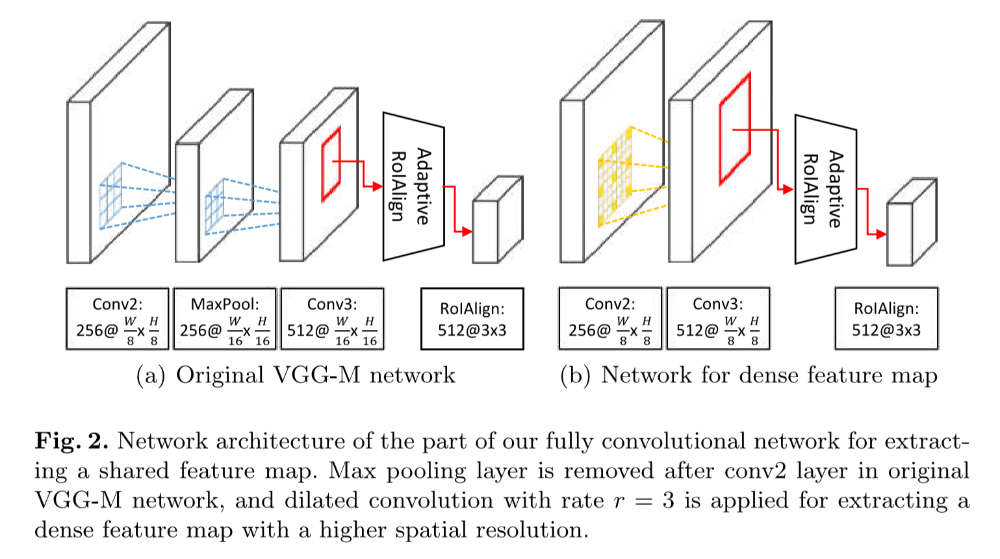
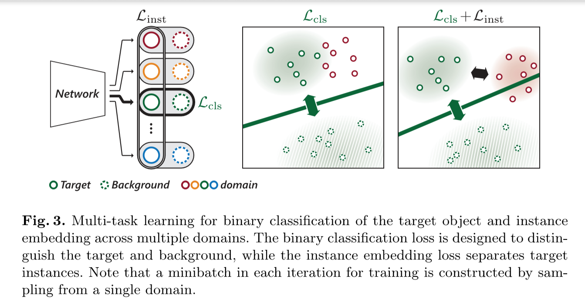

<!--more-->

<!-- toc -->

 

# Real-Time MDNet

## Adaptive RoIAlign

​    对于前面的全卷积特征映射，用RoIAlign层提取对象表示：构建高分辨率特征图，扩大每个激活的感受野。

 

### RoIPooling

​    用于Faster RCNN，使生成的候选框region proposal映射产生固定大小的feature map。

 

1. 800*800的原图经过VGG16，stride=32，得到800/32=25.
2. 原图中一个665*665的候选框，变为655/32=20.78。此处有一次取整（量化），变为20.
3. 此处，对RoI继续池化，变为7*7。即从400格变为49格。20/7=2.86，此处进行第二次量化，为2.
4. 即，最终从RoI的每2*2的部分中取max作为代表组成7 * 7的结果（池化）。

​    两次量化自然会带来很大的偏差，影响后面的回归定位。

 

### RoIAlign

​    Mask RCNN中使用，目的相同。

1. 类似上图，对于20.78*20.78，不取整，保留。
2. 池化时，20.78/7=2.97，得到每2.97*2.97部分，选一个代表。
3. 假定一个超参数——采样点数为4，表示对上述小部分，平分为4份，每份取中心点的像素，max则作为代表被选中。
4. 每份中心点的像素，采用双线性插值法进行计算。

​    因小目标相较大目标对于偏差更敏感，故小目标上效果更好。

 

### Adaptive RoIAlign

​    RT-MDnet提出，以解决原始RoIAlign提取特征粗略，和双线性差值仅使用临近格点计算导致大目标的信息损失的问题。

* 移除MaxPool层，以r=3的空洞卷积得到两倍于原尺寸的conv3。
* 双线性差值的带宽由RoI的siaze决定（自适应），与$\frac{w}{w`}$成比例。
	* $w$：conv3后的RoI宽度
	* $w`$：RoIAlign后的RoI宽度
	* $[·]$：舍入算子
* Adaptive RoIAlign输出7*7的map，后接一最大池化层生成3 * 3map。

​    feature map放大， 提高了特征质量，避免了跟踪过程中的错误累计。

---

 

## 内嵌判别实例的预训练

​    MDNet**无法区分**其具有**相似语义信息**的**前景目标**。本文中在预训练阶段引入嵌入损失，并聚合到原MDNet中二分类损失中。

​    在共享特征空间中，不同域中的目标嵌入时互相远离。将多个视频中的前景对象嵌入进去。即，使得不同域的目标在特征空间的距离相互更远，loss中嵌入了其他视频中的目标来使相互之间更有判别力。

$L = L_{cls} + \alpha·L_{inst}$

* $L_{cls}$：判断前景、背景的二分类得分（原始Loss）
* $L_{inst}$：判别损失
* $\alpha$：权重，0.1

---

 

## 参考博客

[RoIPooling、RoIAlign笔记](https://www.cnblogs.com/wangyong/p/8523814.html "RoIPooling、RoIAlign笔记")

[RT-MDNet深度跟踪网络](https://blog.csdn.net/weixin_39467358/article/details/84990609)

[【小白笔记】目标跟踪 Real-Time MDNet](https://blog.csdn.net/sinat_27318881/article/details/83622344)

[【目标跟踪】Real-Time MDNet](https://blog.csdn.net/qinhuai1994/article/details/82663107)