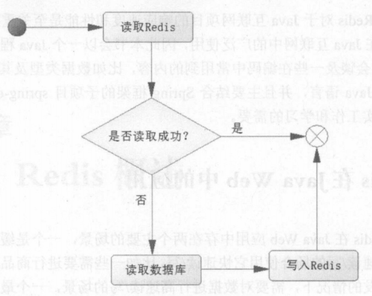
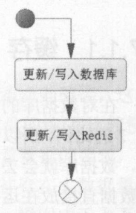
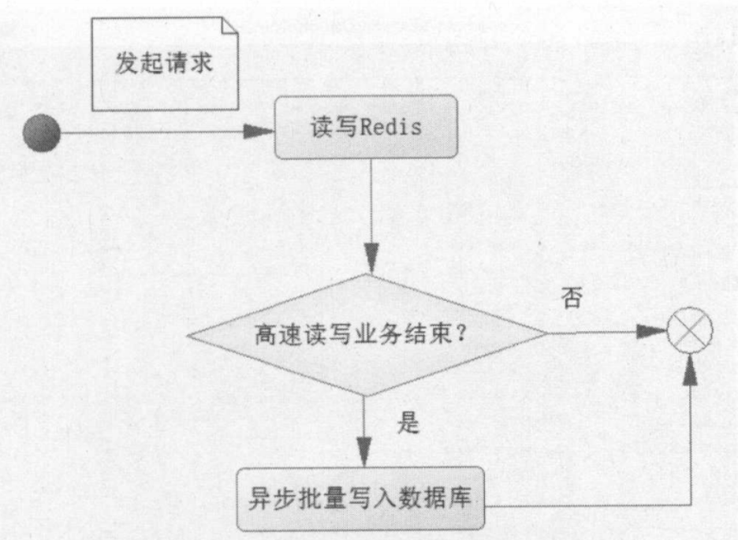

&nbsp;

<!-- more -->

<!-- toc -->

&nbsp;

传统使用数据库存储数据，但由于面向磁盘，读写慢，不适用于高并发场景，故引入NoSQL技术。它也是一种简易的数据库技术，基于内存，提供一定持久化技术，是键值对数据库。Redis和MondoDB是使用最广泛的NoSQL。Redis性能优越，支持每秒十几万次的读写操作，并支持集群、分布式、主从同步等配置，原则上可以无线扩展，而且支持一定的事务能力，能在高并发场景下保证数据安全和一致性。

Redis优势：ANSI C编写，运行快；基于内存的读写；只有6种数据类型，结构简单，规则少，不像普通数据库要考虑范式、完整性、规范性等。所以一般Redis的速度是普通数据库的几倍到几十倍。故可以把命中率高的数据存在Redis中，提高系统性能。

&nbsp;

# 1. 在Java Web中的应用

两个主要应用场景：缓存常用数据、高速读写。

## 1.1 缓存

数据库的访问以读为主，比写操作的频率要高得多。但用内存缓存常用数据，由于内存使用代价高（空间小，价格高），需要对缓存的数据进行筛选：

1. 该业务数据常用吗？命中率高吗？如不高，就不应写入缓存。
2. 该数据是读多还是写多？若写多，也不应使用缓存。
3. 该数据大小如何？对于较大的数据应考虑是否有必要使用缓存。

经考虑后，就可将数据存入缓存。Redis读写逻辑如下图：





&nbsp;

## 1.2 高速读写

如秒杀、抢红包、双十一、春运等场景，一瞬间会有成千上万条请求，数据库无法处理如此场面，易瘫痪崩溃。通常需要异步写入数据库，即先把需要高速读写的数据缓存到Redis，满足条件后，将缓存的数据写入数据库。以下为高速读写时的逻辑：



请求先在Redis读写，但是缓存的持久化功能不足，满足一定条件后批量一次性存入数据库。这里的“条件”，往往是秒杀商品剩余0个、抢红包金额剩余0等，若不成立，就不操作数据库，成立后才操作数据库。

当然，实际操作中还要考虑数据的安全、一致性问题，无效请求问题、事务一致性问题等，后续章节讨论。

&nbsp;

# 2. 安装使用

[Github下载地址](https://github.com/tporadowski/redis/releases)

下载解压后，cmd输入`redis-server.exe redis.windows.conf`表示使用该conf文件中的内容运行exe。`redis-cli.exe`则是自带的客户端程序，可用命令`redis-cli.exe -h 127.0.0.1 -p 6379`开启，使用`set myKey 123`和`get myKey`测试。

Linux安装此处不再记录。[菜鸟教程](https://www.runoob.com/redis/redis-install.html)

&nbsp;

# 3. Java API

Java使用Redis同样支持XML和注解两种方法。本章先使用XML方式。

使用前需要导入Jedis包。

## 3.1 Java中使用Redis

以下是一个简单的测试运行小程序，测试每秒可以写多少次。未优化，一条条发送，效率低下，仅用于测试连接成功。

```java
// 连接redis
Jedis jedis = new Jedis("localhost", 6379);
// 密码
// jedis.auth("pwd");
int i = 0;
try {
    long start = System.currentTimeMillis();
    while (true) {
        long end = System.currentTimeMillis();
        if (end - start >= 1000) {
            // 1s内执行次数
            break;
        }
        i++;
        jedis.set("test" + i, i + "");
    }
} finally {
    jedis.close();
}
System.out.println("redis每秒写了" + i + "次");
```

使用连接池：

```java
JedisPoolConfig config = new JedisPoolConfig();
// 最大空闲
config.setMaxIdle(50);
// 最大连接数
config.setMaxTotal(100);
// 最大等待时长
config.setMaxWaitMillis(20000);
// 创建池并获取连接
JedisPool pool = new JedisPool(config, "localhost");
Jedis jedis = pool.getResource();
// jedis.auth("pwd");
```

&nbsp;

## 3.2 Spring中使用Redis

原生Redis只支持基于字符串的操作，而Java却以类对象为主。自行转换相当复杂，Spring做了封装与支持，提供了序列化的设计框架和一些序列化的类，可以用它完成序列化与反序列化。故可使用Spring提供的RedisTemplate来使用Redis。

在Spring中使用Redis还需要spring-data-redis。（该jar包与Spring版本可能存在不兼容问题）

首先配置一个PoolConfig：

```xml
<bean id="poolConfig" class="redis.clients.jedis.JedisPoolConfig">
    <property name="maxIdle" value="50"/>
    <property name="maxTotal" value="100"/>
    <property name="maxWaitMillis" value="20000"/>                  
</bean>
```

随后需要配置连接工厂，Spring Data Redis中有四种工厂模型：JredisConnectionFactory、JedisConnectionFactory、LettuceConnectionFactory、SrpConnectionFactory。它们都是接口RedisConnectionFactory的实现类，都可以完成任务，但使用时需要测试哪个性能最佳，以下使用JedisConnectionFactory示例：

```xml
<bean id="connectionFactory" class="org.springframework.data.redis.connection.jedis.JedisConnectionFactory">
    <property name="hostName" value="localhost"/>
    <property name="port" value="6379"/>
<!--        <property name="password" value="pwd"/>-->
    <property name="poolConfig" ref="poolConfig"/>
</bean>
```

如此便可使用RedisTemplate了。

至于序列化，Spring提供了RedisSerializer接口和一些实现类，除了使用已有序列化类，也可自己实现接口。以下是几个已有实现类：

* GenericJackson2JsonRedisSerializer：通用的使用Json2.jar完成
* Jackson2JsonRedisSerializer<T>：使用Json2.jar完成
* JdkSerializationRedisSerializer<T>：使用JDK的序列化器完成
* OxmSerializer：使用Spring O/X，Object和XML的转换
* StringRedisSerializer：使用字符串进行福利恶化
* GenericToStringSerializer：使用通用的字符串序列化

另外RedisTemplate还有两个属性：keySerializer和valueSerializer。

配置RedisTemplate：

```xml
<bean id="jdkSerializationRedisSerializer" class="org.springframework.data.redis.serializer.JdkSerializationRedisSerializer"/>
<bean id="stringRedisSerializer" class="org.springframework.data.redis.serializer.StringRedisSerializer"/>
<bean id="redisTemplate" class="org.springframework.data.redis.core.RedisTemplate">
    <property name="connectionFactory" ref="connectionFactory"/>
    <property name="keySerializer" ref="stringRedisSerializer"/>
    <property name="valueSerializer" ref="jdkSerializationRedisSerializer"/>
</bean>
```

以下是序列化例子：

```java
public class Role implements Serializable {
    // 要被序列化的类，需要实现Serializable接口，往往要重写UID
    private static final long serialVersionUID = 6977402643848374753L;
    
    private long id;
    private String name;
    private String note;
    
    // setter getter
}
```

```java
ApplicationContext context = new ClassPathXmlApplicationContext("spring_config.xml");;
RedisTemplate redisTemplate = context.getBean(RedisTemplate.class);
Role role = new Role();
role.setId(1L);
role.setName("靳世阳");
role.setNote("student");
redisTemplate.opsForValue().set("role1", role);
Role role1 = (Role) redisTemplate.opsForValue().get("role1");
System.out.println(role1.getName());
```

set和get操作使用连接池中的连接，这样不能保证使用同一个连接。可以用SessionCallback或RedisCallback两个接口，后者比较底层，不友好，更多使用前者：

```java
SessionCallback callback = new SessionCallback<Role>() {
    @Override
    public  Role execute(RedisOperations redisOperations) throws DataAccessException {
        redisOperations.boundValueOps("role_1").set(role);
        return (Role) redisOperations.boundValueOps("role_1").get();
    }
};
Role role1 = (Role) redisTemplate.execute(callback);
```

&nbsp;

# 4. Redis的6种数据类型

这些数据类型除了存储，还能进行一些计算，可以对一些规模不大的数据进行快速计算。

|    数据类型     |                           存储的值                           |                           说明                           |
| :-------------: | :----------------------------------------------------------: | :------------------------------------------------------: |
|  字符串String   |                   保存字符串、整数、浮点数                   |     对字符串操作（增加字符、求子串等）；数字可以计算     |
|    列表List     |                 链表，每个节点包含一个字符串                 | 可以两端增删，可以裁剪，可以读取部分结点，可以条件删除等 |
|     集合set     |            无序，各不相同，每个元素都是一个字符串            |        增删读取单个元素，检测存在；计算交并差集合        |
|  哈希结构hash   |               类似Java的Map，键值对的无序列表                |                         增删改查                         |
|  有序集合zset   | 有序，可以包含字符串、整数、浮点数、分值；排序依据分值的大小决定 |       增删改查；根据分值的范围或成员获取对应的元素       |
| 基数HyperLogLog |                计算重复的值，以确定存储的数量                |             只提供基数的运算，不提供返回功能             |

&nbsp;

