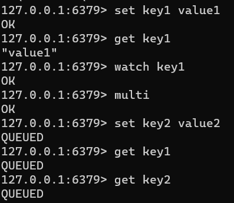
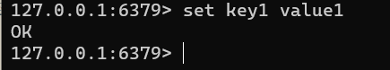
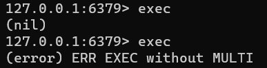
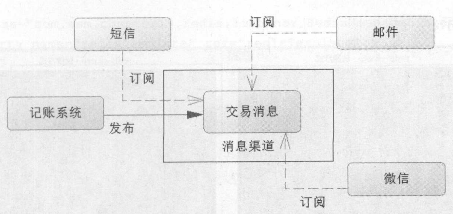
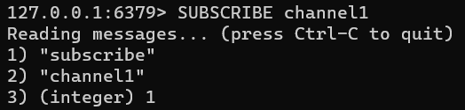
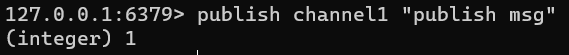
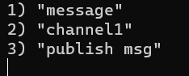

&nbsp;

<!-- more -->

<!-- toc -->

&nbsp;

# 1. 基础事务

不同于其他多数NoSQL，Redis提供事务功能，能够在并发情况下保证数据安全性。Redis的事务使用MULTI-EXEC命令组合，确保了事务隔离性、事务中方法序列化顺序执行、事务原子性。

在一个连接中，Redis使用事务会经过开启事务、命令入队列、执行事务三个阶段，故需要SessionCallback接口确保处于一个连接。

Redis事务命令：

| 命令         | 说明                                                         | 备注                                         |
| ------------ | ------------------------------------------------------------ | -------------------------------------------- |
| multi        | 开启事务，之后命令入队列而不会立即执行                       | 事务生存期间，所有关于数据结构的命令都会入队 |
| watch key1   | 监听某些key（数据结构），当被监听key在事务执行前被修改，事务会回滚 | 使用乐观锁                                   |
| unwatch key1 | 取消监听                                                     |                                              |
| exec         | 执行事务，先检测监听key，若没有被修改，就执行，否则回滚      |                                              |
| discard      | 回滚事务（取消队中事务，撤销当前multi状态）                  | 回滚，不能再用exec提交                       |

multi开启事务-命令入队-exec执行，exec后执行队中命令时，其他客户端就不能再插入任何命令了。

```java
String value = (String) template.execute((RedisOperations ops)->{
    // multi
    ops.multi();
    ops.boundValueOps("key1").set("value1");
    String value1 = (String) ops.boundValueOps("key1").get();
    System.out.println("尚未执行，此时get为null：" + value1);
    // exec
    List results = ops.exec();
    System.out.println(results);
    return (String) template.opsForValue().get("key1");
});
System.out.println(value);
```

multi后，exec前，所有get返回都空。

&nbsp;

# 2. 事务回滚

事务中有命令格式正确而数据类型不符的情况时，如对String进行增加，其命令能正常入队，且执行时会报错，但前后的命令都会正常执行。

若事务中有格式不正确的命令，则在输入（入队前）就会被检测到并报错，后续命令入队虽然显示正常，但exec时报错，事务回滚。

简易的事务功能是为性能的让步。

&nbsp;

# 3. 监控事务

先watch监控某些key，然后multi开启事务；exec时，先检测被监控key，其键值对是否发生了变化（从开始watch，到即将执行事务中命令改变它的值这段时间内，值是否被set），若未改变则正常执行；若被其他线程改变过则回滚事务。不论哪种情况，都会在最后取消监控。

Redis中的这种机制参考了多线程中的CAS（比较与交换），称为乐观锁，不做提前限制，仅运行前检测一下，若已被其他线程改变过就回滚。

但只是“参考”，因为Redis不只是做了值检测，其他线程即使是set为原值，也算作发生了变化，故不会产生CAS造成的ABA问题：线程1令X=A，随后开始复杂运算；线程2趁1复杂运算，修改X=B，处理简单业务后改回X=A；线程1结束运算，检测X，发现是A，通过验证，提交事务。但是中途线程2对X的修改，可能造成线程1的运算错误，但这个错误并未被检测到，且被提交了。

示例：

线程1：`watch key1`，并开启线程



线程2：`set key1 value1` 修改为原值



线程1：`exec` 执行事务失败，回滚



&nbsp;

# 4. 流水线

事务中能批量执行命令，速度快，但创建事务需要额外开销，如检测锁、序列化命令等。流水线pipelined（一种通信协议）专门用于批量执行命令，提高性能。同时，流水线也可解决因网络慢、Redis操作快导致的网络造成性能瓶颈。

用Jedis操作性能最好，Spring中应使用Connection，性能略好于使用ops，但connection属于底层接口，使用Bytes。

```java
// Jedis (Java api)
Jedis jedis = pool.getResource();
Pipeline pipeline = jedis.pipelined();
pipeline.set();
pipeline.get();
pipeline.sync();	// 只同步
List list = pipeline.syncAndReturnAll();	// 同步且返回结果
```

```java
// Spring 
List result = template.executePipelined((RedisConnection connection)->{
    long start = System.currentTimeMillis();
    connection.openPipeline();
    for (int i = 0; i < 100000; i++) {
        int j = i + 1;
        connection.set(("key" + j).getBytes(), ("value" + j).getBytes());
        connection.get(("key" + j).getBytes());
    }
    long end = System.currentTimeMillis();
    System.out.println(end - start);
    return null;
});
//  System.out.println(result);

result = template.executePipelined((RedisOperations ops)->{
    long start = System.currentTimeMillis();
    for (int i = 0; i < 100000; i++) {
        int j = i + 1;
        ops.opsForValue().set("keyOps" + j, "valueOps" + j);
        ops.opsForValue().get("keyOps" + j);
    }
    long end = System.currentTimeMillis();
    System.out.println(end - start);
    return null;
});
//	System.out.println(result);
```

结果若要完整获取，可能数据量过大，占用过多内存，甚至JVM溢出。

&nbsp;

# 5. 发布订阅

系统发布信息，并将信息发送给通过各渠道订阅过的用户。如银行卡付费，会收到短信通知。



Redis中，使用`subscribe`命令，以当前窗口为客户端，订阅指定的消息渠道；使用`publish`命令发布消息。

客户端订阅`channel1`渠道：



客户端2向`channel`渠道发布消息：



客户端1收到来自订阅的渠道的消息：



&nbsp;

在Spring中，订阅者类需要实现`MessageListener`接口，实现`onMessage`方法：

```java
public class RedisMessageListener implements MessageListener {
    private RedisTemplate template;

    public void setTemplate(RedisTemplate template) {
        this.template = template;
    }

    public RedisTemplate getTemplate() {
        return template;
    }

    @Override
    public void onMessage(Message message, byte[] bytes) {
        // 获取消息
        byte[] body = message.getBody();
        // 值序列器转化
        String msgBody = (String) template.getValueSerializer().deserialize(body);
        System.out.println(msgBody);
        // 获取channel
        byte[] channel = message.getChannel();
        // 字符串序列化器转换
        String channelString = (String) template.getStringSerializer().deserialize(channel);
        System.out.println(channelString);
        // 渠道名称转换
        String byteString = new String(bytes);
        System.out.println(byteString);
    }
}
```

```xml
<bean id="redisMsgListener" class="Redis.RedisMessageListener">
    <property name="template" ref="redisTemplate"/>
</bean>
```

消息渠道（容器）类在Spring中已有`RedisMessageListenerContainer`：配置了线程池，会持续生存以等待消息进入；配置了id为RedisMsgListener的Bean对渠道chatChannel监听

```xml
<bean id="topicContainer" class="org.springframework.data.redis.listener.RedisMessageListenerContainer"
      destroy-method="destroy">
<!--        连接工厂-->
    <property name="connectionFactory" ref="connectionFactory"/>
<!--        连接池，线程池生存，才能继续监听-->
    <property name="taskExecutor">
        <bean class="org.springframework.scheduling.concurrent.ThreadPoolTaskScheduler">
            <property name="poolSize" value="3"/>
        </bean>
    </property>
<!--        消息监听map-->
    <property name="messageListeners">
        <map>
            <entry key-ref="redisMsgListener">
<!--                    监听类-->
                <bean class="org.springframework.data.redis.listener.ChannelTopic">
                    <constructor-arg value="chatChannel"/>
                </bean>
            </entry>
        </map>
    </property>
</bean>
```

测试代码：

```java
String channel = "chatChannel";
template.convertAndSend(channel, "msg!");
```

&nbsp;

# 6. 超时命令

Redis也是基于内存运行的数据集合，也存在内存垃圾回收和管理问题与机制。

可以通过del命令手动删除一些数据，内存快满的时候也会自动触发回收机制，但回收会引发系统停顿，故应主动选择适当时机进行回收。

Redis可以给键值对设置超时，以配合垃圾回收（毕竟回收时更需要回收超时的数据）。

| 命令                     | 说明                    | 备注                                           |
| ------------------------ | ----------------------- | ---------------------------------------------- |
| persist key              | 持久化key，取消超时时间 |                                                |
| ttl key                  | 查看key的超时时间       | s，-1表示没有超时时间，-2表示不存在key或已超时 |
| expire key secounds      | 设置超时时间戳          | s                                              |
| expireat key timestamp   | 设置超时时间点          | uninx时间戳确定                                |
| pptl key ms              | 查看key的超时时间戳     | ms                                             |
| pexpire key              | 设置键值超时的时间      | ms                                             |
| pexpireat key stamptimes | 设置超时时间点          | ms，uninx时间戳                                |

```java
template.execute((RedisOperations ops)->{
    ops.boundValueOps("key1").set("value1");
    String keyValue = (String) ops.boundValueOps("key1").get();
    Long expSecond = ops.getExpire("key1");
    System.out.println(expSecond);
    boolean b = false;
    b = ops.expire("key1", 120L, TimeUnit.SECONDS);
    b = ops.persist("key1");
    Long l = 0L;
    l = ops.getExpire("key1");
    Long now = System.currentTimeMillis();
    Date date = new Date();
    date.setTime(now + 120000);
    ops.expireAt("key", date);
    return null;
});
```

&nbsp;

**Redis的key超时后不会被自动回收，只会标识哪些键值对超时了。**好处是巨大数据超时不会立刻回收造成停顿；坏处是浪费空间。

Redis有定时回收和惰性回收两种回收方式：

* 定时回收指在确定的某个时间出发一段代码，回收超时键值对
* 惰性回收则是当一个超时的key，又被get时，将其清除

定时回收能完全回收所有超时键值对，清理彻底，但遇到大数据可能造成停顿，需要设计者在没有业务时触发定时回收。惰性回收能够指定键值对回收，但要一个莫名其妙的get，甚至有时我们也不知道哪些键值对已经超时。

&nbsp;

# 7. 使用Lua

暂不展开。

见《Java EE互联网轻量级框架整合开发 SSM框架和Redis实现》第19章末尾一节。

&nbsp;

