Deeper and Wider Siamese Networks for Real-Time Visual Tracking

<!--more-->

<!-- toc -->

[toc]

[作者讲解视频&PPT](https://www.bilibili.com/video/av52113951)

 

# siam特点

1. 共享权重
2. 做检索，对比相似性。information经过相同网络，在空间中产生表征向量，计算距离代表相似性
3. 以pair对形式进入网络，两两组合，相当于增加数据量

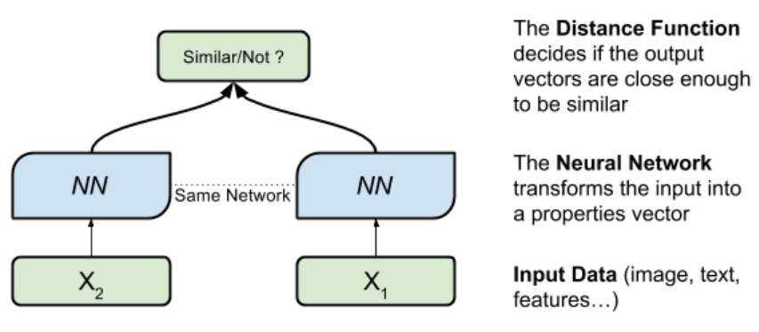

 

# Siam历史

1. SINT：在图像中抽取很多候选目标，经过同一网络，与模板比较，选择距离最小（最相似）

	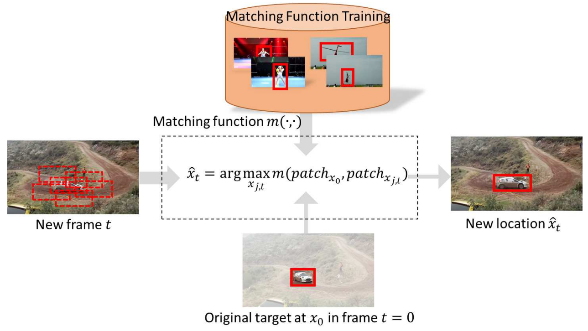

2. SiamFC：Cross-correlation互相关，与卷积类似，滑窗，计算相似性

	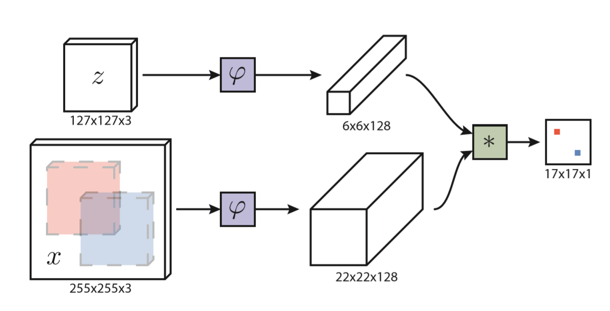

3. SiamRPN：通过RPN，解决了SiamFC中的僵硬的尺度估计：手动设定几个scale

	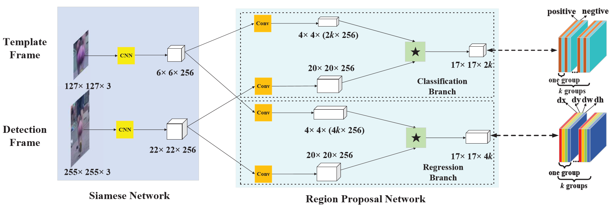

 

# Motivation

原有backbone很浅，改用深层，performance降低及思考：

1. backbone的基本模块：res、inception、卷积
2. stride：分类大，精细任务小
3. padding：SiamFC中padding全部去掉，而深层backbone的padding是必要的
4. 输出尺寸：AlexNet 6×6、而后者为16或32

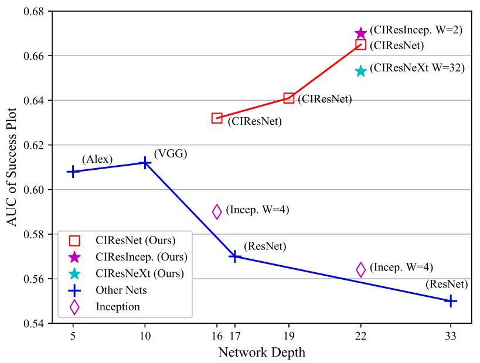

 

# Analysis & Guidelines

通过修改感受野、步长、输出特征尺寸、padding与否、backbone类型，进行实验，发现padding会降点

## padding/PAD

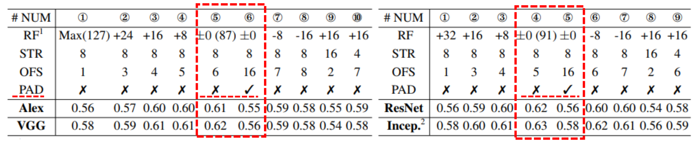

padding导致掉点（但输出尺寸不一致，不能说完全都是padding影响）

1. 无padding：

	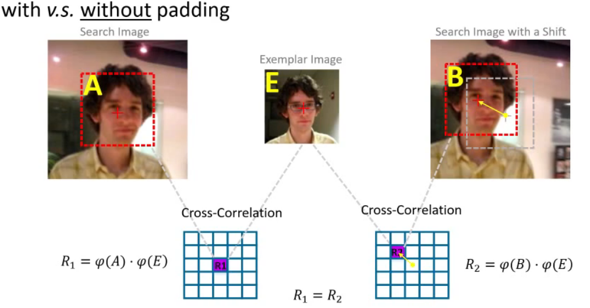
	$$
	R1=\phi(A)·\phi(E) \\
	R2=\phi(B)·\phi(E) \\
	R1 = R2
	$$

	1. $E$：模板
	  2. $A B$：目标位置
	  3. $\phi$：backbone，提取特征向量
	  4. $·$：cross-correlation
	  5. $R$：响应
	  6. 因为E相同、A和B是同一目标提取向量所得，相同，故两响应相同，满足平移不变性

2. 有padding：

	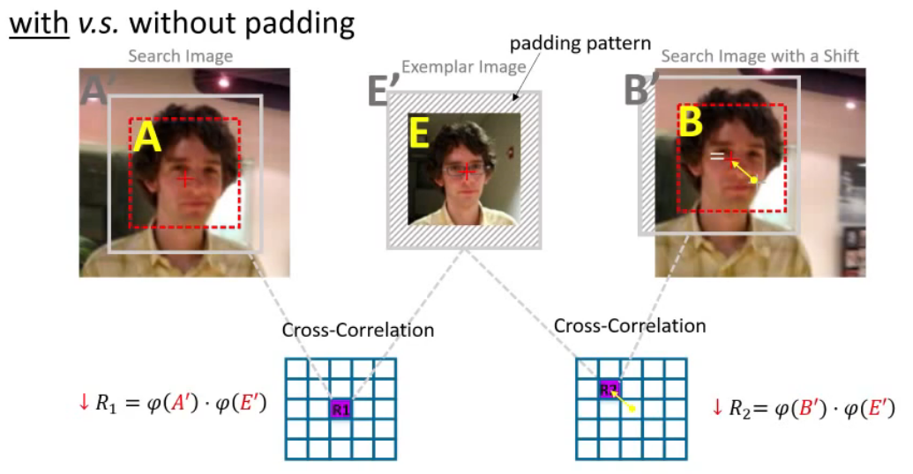
	$$
	R1=\phi(A')·\phi(E') \\
	R2=\phi(B')·\phi(E') \\
	R1 \not= R2
	$$

	1. padding引入外层感受野，目标位置变大，模板变大
	2. 扩大后的目标**仍在**画面中时，没有变化
	3. 扩大后的目标**不在**画面中时，$\phi(A')\not=\phi(B')$，最终导致两响应不同，破坏平移不变性
	4. **而深层网络中，感受野会快速扩大，很容易就会超出画面**

## 步长STR

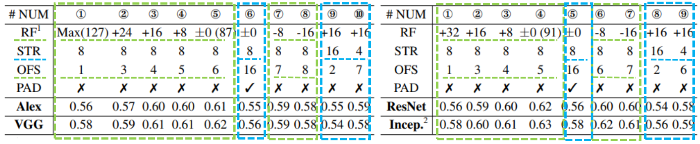

跟踪的位移较小，使用小步长捕捉微小变化（siam跟踪通常为8）

## 感受野RF和输出尺寸OFS

1. 二者具有相关性，互影响，所以一起讨论

2. 在实验中，performance出现“单峰”，表示RF和OFS大小适中为好

3. 后续分析：

	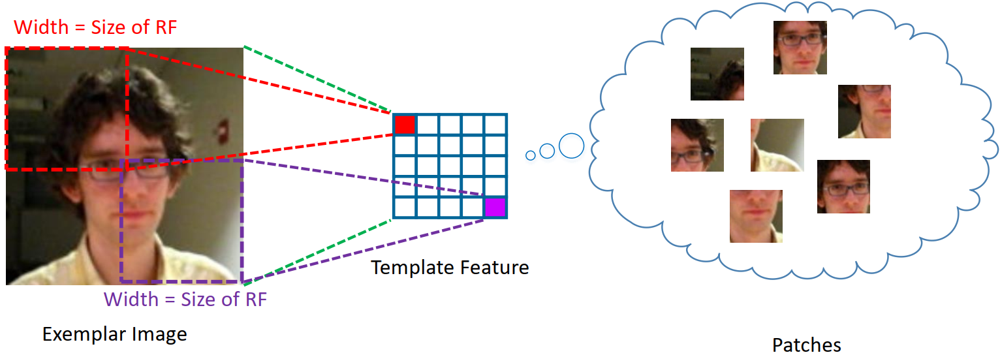

	1. feature map中的element，所对应的RF太小，表示网络太浅，提取特征能力差；而RF太大，不仅捕捉不到细节，而且element之间的重叠率overlap ratio上升，导致特征信息冗余，也会降低feature的判别
	2. 故感受野合适大小才行

## Guidelines

1. 步长：小，4或8，捕捉运动变化（4较慢）
2. 感受野：feature与输入的尺寸比在60%~80%
3. 步长、感受野、输出尺寸，应作为整体考虑，最终performance是每个环节共同决定。实验中不去掉padding，而通过CIR修改输出尺寸，也能获得不错的效果

 

# Method

根据以上guidelines，设计新的网络

1. 1×1卷积：调整维度，减少参数

	[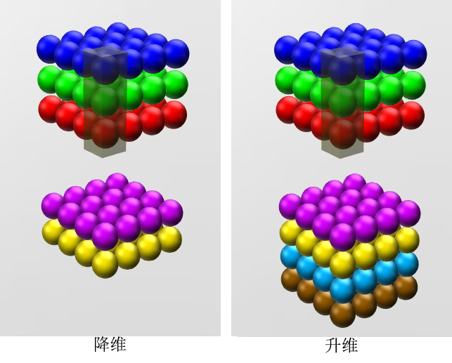](https://zhuanlan.zhihu.com/p/27642620 "源网址")

2. cropping-inside residual unit

	1. CIR Module：原始残差单元中，两个1×1用于维度调整，3×3卷积，因为padding为1、stride为1，输出feature map中仅最外一圈受padding影响，故本文中移去。此法除了消除padding影响，而且因为减小了feature大小，有提速作用。

		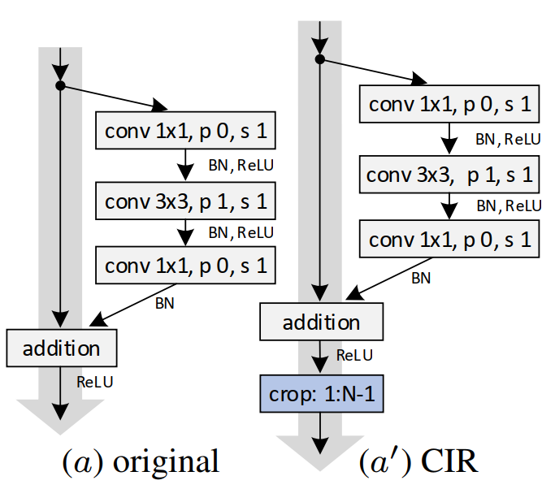

	2. CIR-Downsampling Module：原始残差网络的深层下采样单元，采用conv中增大步长的方式减小feature map大小；本文不同于传统认为的conv+大步长会减轻信息丢失，而是采用了小步长+最大池化的下采样方法。

		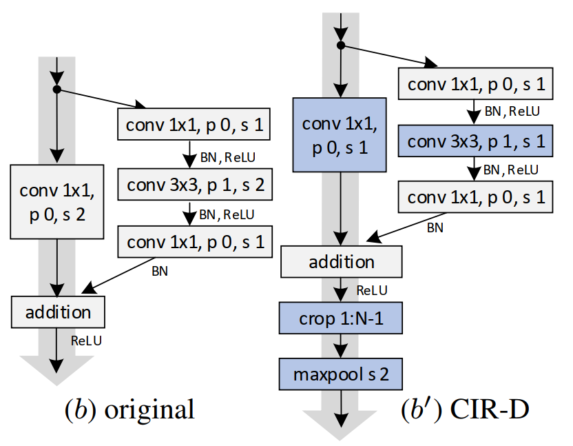

		原因：传统方法结合crop消去最外层feature后，剩余feature map的感受野不足以覆盖完整图片。改为stride1后，紫色映射范围向左上移动一位，覆盖完全。

		以原本的stride2 conv3的方式下采样：

		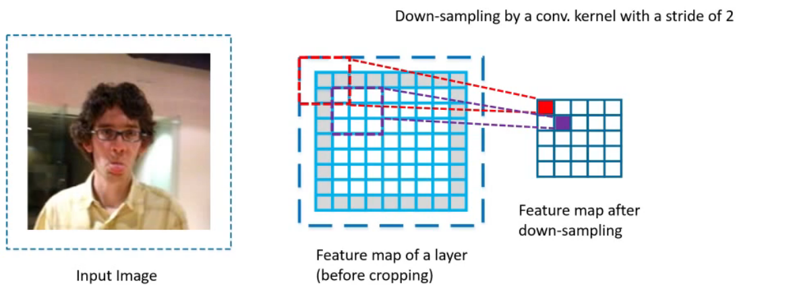

		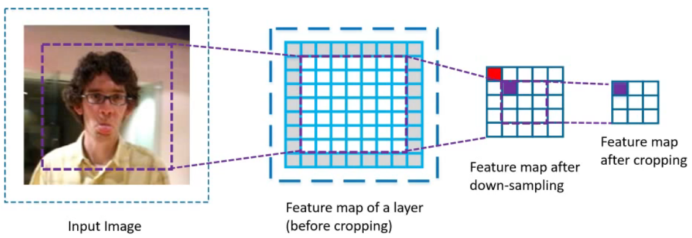

3. 构建新网络

	通过在不同网络、不同深度下的组合测试（实验中注意不能一味追求深度，要注意输出尺寸）

	1. 确定步长：3-stage网络步长为8；2-stage网络步长为4
	2. 堆叠CIR单元：合理控制CIR、CIR-D单元数，确保最终层神经元感受野在原图的60%~80%（并非全部都是CIR单元，具体见论文描述）
	3. 深度增加，感受野超过合理区间时，减半步长至4

	最终确定了深度为22层。

4. 加宽channel

	作者尝试在ResNet的unit的1、 3、 1卷积中加宽通道数以提升性能，结果过高的通道数造成掉点。作者认为过高的通道对cross-correlation并不友好，最终在256或512为宜。