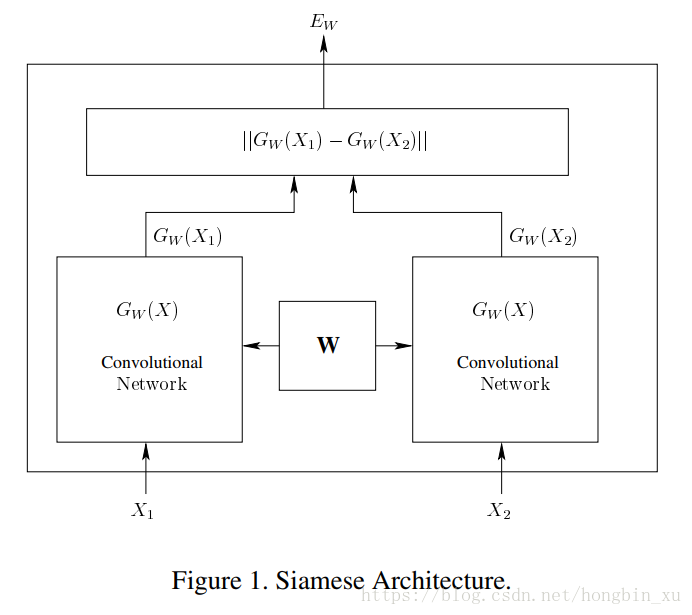
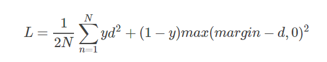
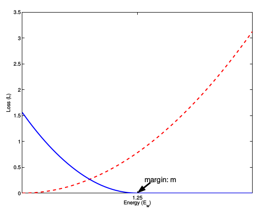
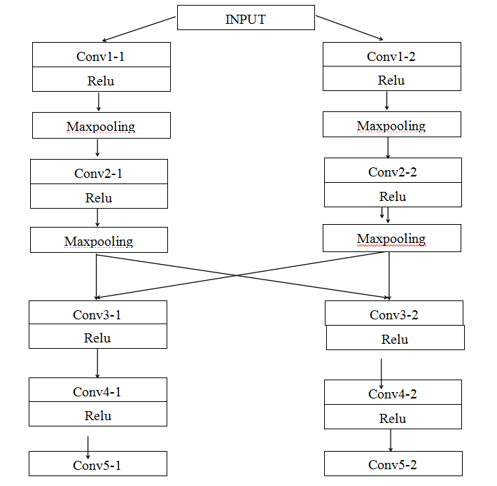
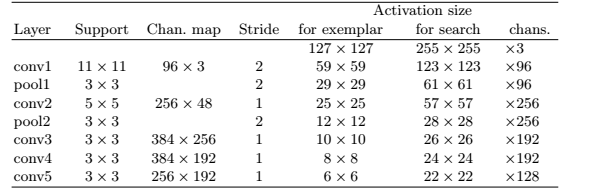
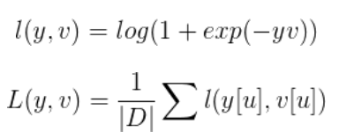
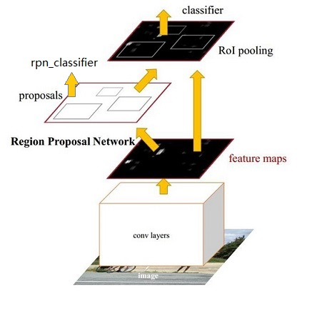
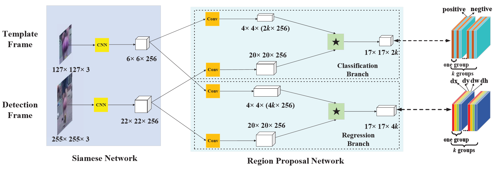

<!-- more -->

<!-- toc -->

 

## Siamese

* Siamese和Chinese有点像。Siam是古时候泰国的称呼，中文译作暹罗。Siamese也就是“暹罗”人或“泰国”人。十九世纪泰国出生了一对连体婴儿，当时的医学技术无法使两人分离出来，于是两人顽强地生活了一生，两人均于63岁离开人间。两人的肝至今仍保存在费城的[马特博物馆](https://link.jianshu.com/?t=https%3A%2F%2Fwww.baidu.com%2Fs%3Fwd%3D%E9%A9%AC%E7%89%B9%E5%8D%9A%E7%89%A9%E9%A6%86%26tn%3D44039180_cpr%26fenlei%3Dmv6quAkxTZn0IZRqIHckPjm4nH00T1dWnAP9uWcvmhcvrADsnvmk0ZwV5Hcvrjm3rH6sPfKWUMw85HfYnjn4nH6sgvPsT6KdThsqpZwYTjCEQLGCpyw9Uz4Bmy-bIi4WUvYETgN-TLwGUv3EnHRYnHDvn163)内。从此之后“[暹罗双胞胎](https://link.jianshu.com/?t=https%3A%2F%2Fwww.baidu.com%2Fs%3Fwd%3D%E6%9A%B9%E7%BD%97%E5%8F%8C%E8%83%9E%E8%83%8E%26tn%3D44039180_cpr%26fenlei%3Dmv6quAkxTZn0IZRqIHckPjm4nH00T1dWnAP9uWcvmhcvrADsnvmk0ZwV5Hcvrjm3rH6sPfKWUMw85HfYnjn4nH6sgvPsT6KdThsqpZwYTjCEQLGCpyw9Uz4Bmy-bIi4WUvYETgN-TLwGUv3EnHRYnHDvn163)”（Siamese twins）就成了连体人的代名词

 

## Siamese Network

* 判断两个输入相似性，核心思想是，两个子体网络通过权重共享来实现连体，寻找一个映射函数，能够将输入图像转换到一个特征空间，每幅图像对应一个特征向量，通过一些简单的“距离度量”（比如欧式距离）来表示向量之间的差异，最后通过这个距离来拟合输入图像的相似度差异（语义差异）
* 对比损失Contrastive Loss：
	*  $d=||a_n-b_n||_2$，代表两个样本特征的欧氏距离，
	*  d也可使用cosine距离，d=cos=x*y/|x||y|
	*  y为两个样本是否匹配的标签，y=1代表两个样本相似或者匹配，y=0则代表不匹配，
	*  margin为设定的阈值
	*  这种损失函数可以很好的表达成对样本的匹配程度，也能够很好用于训练提取特征的模型。当y=1（即样本相似）时，损失函数只剩下∑d2，即原本相似的样本，如果在特征空间的欧式距离较大，则说明当前的模型不好，因此加大损失。而当y=0时（即样本不相似）时，损失函数为∑max(margin−d,0)2，即当样本不相似时，其特征空间的欧式距离反而小的话（d小，margin-d大），损失值会变大，这也正好符合我们的要求。
	*  图3表示的就是损失函数值与样本特征的欧式距离之间的关系，其中红色虚线表示的是相似样本的损失值，蓝色实线表示的不相似样本的损失值。

---

 

## SiamFC

https://blog.csdn.net/nightmare_dimple/article/details/74210147

* 全卷积孪生网络 fully-convolutional siamese networks for object tracking
* AlexNet
* 以往：相关滤波之网络一层作为特征，深度学习之梯度下降，在线学习，存在问题；本法离线学习，tracking时只需进行相似性判断，计算量很小
* 细节：在初始离线阶段把深度卷积网络看成一个更通用的**相似性学习**问题，然后在跟踪时对这个问题进行在线的简单估计。训练了一个孪生网络在一个较大的搜索区域搜索样本图片。本文另一个贡献在于，新的孪生网络结构是一个关于搜索区域的**全卷积网络**：密集高效的滑动窗口估计可通过计算两个输入的互相关性并插值得到。
* 相似性学习：学习一个函数$f(x,z)$来比较样本图像（目标）z和搜索图像（画面）x的相似性
* 用深度神经网络模拟$f$，深度卷积网络中**相似性学习最典型的就是孪生结构**。孪生网络对两个输入z和x进行相同的变换$\varphi$，然后将得到的输出送入函数g，最后得到相似性度量函数为：*f*(*z*,*x*)=*g*(*φ*(*z*),*φ*(*x*))
	* 1.函数g是一个简单的距离或相似性度量
	* 2.φ相当于特征提取器
* 全卷积网络的优点是待搜索图像不需要与样本图像具有相同尺寸，可以为网络提供更大的搜索图像作为输入，然后在密集网格上计算所有平移窗口的相似度。

* 搜索图像的确定：跟踪时以上一帧目标位置为中心的搜索图像来计算响应得分图
* 正负样本的确定：和目标距离不超过阈值
* 在经过卷积神经层提取特征后，SiameseFC使用cross-correlation（交叉相关）作为相似度的度量，计算两个feature map各个位置（区域）上的相似度，得到一个score map（或者说heat map）。最后对这个score map进行插值（这里使用的是双三线性插值），获得和原图像一样的空间分辨率，根据该score map，即可定位到跟踪目标在新一帧（检测图像）中的精确位置。
* **训练数据：**从视频的两个帧中提取图像，这两个帧都包含对象并且最多相隔T帧。训练时忽略目标的类别。在不破坏图像的纵横比的情况下对每个图像内的对象的比例进行归一化 。如果得分图中的元素距离中心半径在（根据网络步长决定）以内，就认为是正样本。

* 余弦惩罚：在获得score map之后，SiameseFC会在上面应用一个余弦窗，以对那些不正常的较大位移进行惩罚（余弦窗具有边缘抑制的作用，如果目标是一个正常的位移，那么检测热点应该是在heatmap的中心区域附近，如果检测热点跑到heatmap的边缘，则说明目标发生了瞬时的长位移，这很大可能是由检测错误导致的，因此该检测结果需要被抑制和惩罚）。

* 多尺度检测：通常是将目标先进行不同尺度的采样（如生成图像金字塔），再对不同尺度的图像分别进行检测。在SiameseFC中，对图像先进行不同尺度的采样、再resize到固定的分辨率，可以合并为一个步骤，因此可以并行地生成多张分辨率相同但尺度不同的目标图像（将尺度不同的目标图像resize到同一分辨率即可），集合成一个mini-batch，送进网络进行多尺度检测，从而实现SiameseFC的尺度适应性。

* 优点是待搜索图像不需要与样本图像具有相同尺寸，可以为网络提供更大的搜索图像作为输入，然后在密集网格上计算所有平移窗口的相似度。

* 本文的相似度函数使用互相关，公式如下*f*(*z*,*x*)=*φ*(*z*)∗*φ*(*x*)+*b*1
	* *b*1 表示在得分图中每个位置的取值
	* 上式可将φ(z)看成卷积核，在φ(x)上进行卷积

* 跟踪时以上一帧目标位置为中心的搜索图像来计算响应得分图f，将得分最大的位置乘以步长即可得到当前目标的位置

* phi：五层卷积，提取特征

* 卷积：卷积以实现相似性度量

 

 

* 损失函数：每一个候选子窗口，其实相当于一个样本，而它的得分，输出的就是它是正/负样本的概率。使用逻辑回归来表示的话，这就是一个应用逻辑回归的典型二分类问题，对于得分矩阵中的每一个点u有：其中*v*是实际输出,*y*是真实标签{+1，-1}

* 定位目标区域/tracking：相似性矩阵，经双三次插值，变为255²矩阵，定位。

* 目标图像在线不更新，提取高层语义特征

* 5尺度搜索 1.025（-2，-1,0,1,2）。尺度检测是扩大或缩小检测区域，但检测图像都要缩放到255*255*3，也就是说尺度检测是天然可以并行的，SiamFC通过设置mini-batch的方式实现，一次性完成3或5个尺度样本检测。多尺度检测通常是将目标先进行不同尺度的采样（如生成图像金字塔），再对不同尺度的图像分别进行检测。在SiameseFC中，对图像先进行不同尺度的采样、再resize到固定的分辨率，可以合并为一个步骤，因此可以并行地生成多张分辨率相同但尺度不同的目标图像（将尺度不同的目标图像resize到同一分辨率即可），集合成一个mini-batch，送进网络进行多尺度检测，从而实现SiameseFC的尺度适应性。

* long term与short term：SiameseFC在预测的时候，不在线更新模板图像。这使得SiameseFC的计算速度很快，但同时也要求SiameseFC中使用的特征需要具有足够的鲁棒性（通常是高层特征，分辨率较低，计算复杂度较大），以便在后续帧中能够应对各种变换。而在另一方面，不在线更新模板图像的策略，可以确保跟踪目标的不变性和纯净性，在long-term跟踪算法上具有天然的优势。

	还有一类visual tracker，在预测时，使用的是在线更新模板图像的策略。这种策略的优点是对特征的鲁棒性要求较低（通常是低层特征，分辨率较高，计算复杂度较小），能适时地学习到目标和背景的变化，但也带来了其他的缺点：在目标跟踪的过程中，如果中间跟丢或跟错了目标（由于遮挡或失败等原因，会导致学习到背景，而不是目标），就无法再恢复到正确的跟踪目标上了；而如果在目标跟踪的过程中，学习到了错误的特征（如来自外界的噪声），则会导致跟踪目标被污染，在后续帧中，跟踪能力降低，甚至逐渐丧失（跟踪目标的累积污染增加）。因此这种更新策略更多地用于short-term跟踪算法上。

* 双三次差值 https://blog.csdn.net/datase/article/details/80576054

---

 

## RPN

Region Proposal Network 区域推荐网络

* 本质是 “ 基于滑窗的无类别obejct检测器 ”

* 用于目标检测。把一个任意尺度的图片作为输入，输出一系列的矩形object proposals，每个object proposals都带一个objectness score。分为两个支路，一个用于分类前景和背景，一个用于边界框回归。通俗来讲，就是用RPN来选择感兴趣区域的，即proposal extraction。例如，如果一个区域的p>0.5，则认为这个区域中可能是我们想要的类别中的某一类，具体是哪一类现在还不清楚。到此为止，网络只需要把这些可能含有物体的区域选取出来就可以了，这些被选取出来的区域又叫做ROI （Region of Interests），即感兴趣的区域。当然了，RPN同时也会在feature map上框定这些ROI感兴趣区域的大致位置，即输出Bounding Box。
* 一种更加简单的方法来预测 objects 的边界框，即，学习相对于**参考GT的偏移量**

* anchor的一种理解（anchor的特征图与原始图像的联系）：应该是特征图的某一个像素与对应在原始图像的某一个像素，即**本质上指的是特征图上当前滑窗的中心在原像素空间的映射点称为anchor**，即anchor是在原始图像上的
* 在特征的每个位置，考虑多个可能的候选窗口：窗口数=面积数×比例数，称为anchors。下图中3种面积×3种比例，每个位置9个anchors

* 计算每个像素（256-d）的k个尺度下的值，得到k个anchor，我们给每个anchor分配一个二进制的标签（前景背景），由其与GT重叠度决定。则标记后输出2×k纬度，表示每个位置有2k个cls（classification）分数；同时每个anchor又与GT对应四个偏移量[x, y, w, h]，代表中心点的坐标、框的宽高，则回归组reg（regression）为4k纬度
* anchor会很多，选取部分正、负anchor训练

---

 

## SiamRPN

https://blog.csdn.net/fzp95/article/details/80982201

https://www.jianshu.com/p/a3786b61031c

https://blog.csdn.net/leviopku/article/details/81068487

https://blog.csdn.net/leviopku/article/details/80875368

* 孪生候选区域生成网络 High Performance Visual Tracking with Siamese Region Proposal Network
* Siamese部分基于预训练的AlexNet
* SiamFC缺点：只能得到目标的中心位置，但是得不到目标的尺寸，所以只能采取简单的多尺度加回归，这即增加了计算量，同时也不够精确。
* 改进：输出两个分支，分别用于分类和回归（SiamFC没有回归，而是用多尺度测试，增加了计算量且不够精确），帧率160fps（不需要在线微调）
* 摘要：这个结构包含用于特征提取的孪生子网络（Siamese subnetwork）和候选区域生成网络（region proposal subnetwork），其中候选区域生成网络包含分类和回归两条支路。在跟踪阶段，作者提出的方法被构造成为单样本检测任务（one-shot detection task）。作者预先计算孪生子网络中的模板支路，也就是第一帧，并且将它构造成一个检测支路中区域提取网络里面的一个卷积层，用于在线跟踪。传统的多尺度测试和在线微调可以被舍弃，这样做也大大提高了速度。
* 此方法不更新模型，是离线训练好的基于深度学习跟踪器，在相关特征图谱上提取候选区域，然后作者将模板分支上的目标外观信息编码到RPN特征中来判别前景和背景。在跟踪阶段，作者将此任务视为单目标检测任务（one-shot detection），什么意思呢，就是把第一帧的BB视为检测的样例，在其余帧里面检测与它相似的目标。
* anchor box：具有不同规格（大小，长宽比，本文有一种大小，五种长宽比[0.33,0.5,1,2,3]），锚点由卷积过程中卷积核中心确定，每个锚点对应数个锚点框（不同规格）。则检测问题由“哪里有物体”变为“锚点框是否框住物体，框住多少，离得多远”。
* 如下图：RPN网络主要用于生成region proposals，首先生成一堆Anchor box，对其进行裁剪过滤后通过softmax判断anchors属于前景(foreground)或者后景(background)，即是物体or不是物体，所以这是一个二分类；同时，另一分支bounding box regression修正anchor box，形成较精确的proposal

* 分类组：在RPN的分类分支中，模板图像和检测图像的feature map，都将首先通过一个卷积层，该卷积层主要是对模板图像的feature map进行channel上的升维，令其维度变为检测图像的feature map的维度的2k倍（k为RPN中设定的anchor数）。此后，将模板图像的feature map在channel上按序等分为2k份，作为2k个卷积核，在检测图像的feature map完成卷积操作，得到一个维度为2k的score map。该score map同样在channel上按序等分为k份，得到对应k个anchor的k个维度为2的score map，两个维度分别对应anchor中前景（目标）和后景（背景）的分类分数，是关于目标的置信度。
* 回归组： 在RPN的回归分支中，模板图像和检测图像的feature map，都将首先通过一个卷积层，该卷积层主要是对模板图像的feature map进行channel上的升维，令其维度变为检测图像的feature map的维度的4k倍（k为RPN中设定的anchor数）。此后，将模板图像的feature map在channel上按序等分为4k份，作为4k个卷积核，在检测图像的feature map完成卷积操作，得到一个维度为4k的score map。该score map同样在channel上按序等分为k份，得到对应k个anchor的k个维度为4的score map，四个维度分别对应anchor的（x,y,w,h），是关于目标的坐标及尺寸。
* RPN的引入，使得Siamese网络自然拥有了多尺度检测的能力（通过anchor机制cover各种size），并且可以准确地回归出目标的位置及大小
* k：anchor box 锚点框数量；
	* 本文为5，不同长宽比[0.33, 0.5, 1, 2, 3]
	* 模板帧：因要分为目标、背景两类，故2k
	* 检测帧：[x, y, w, h]，故4k

* 不同于SiamFC，可对多个多个anchor box判断。
* RPN部分卷积：3×3进一步集中特征，然后多个/一个1×1提高通道数
* 分类组：每个点表示正负得分，softmax分类（anchor box和真实目标重叠且IOU大于阈值）
* 回归组：每个点表示anchor和ground truth之间的dx,dy,dw,dh（anchor相比于groundtruth的偏移量），通过smooth L1 loss:

* tracking as one shot detection：对于一个类别，如果只提供一个或者少量训练样本的情况下，如何检测？解决方法就是：让模型学习，得到一个相似性函数，这样的模型输出的值不是类别，而是两幅图像的相似度。
* 始终用第一帧当做模板帧，只需进行detection分支，提速。从分类组的奇数层（目标）中，选取最大的K的建议候选框，**后经距离、余弦窗和尺度变化惩罚因子对proposal进行取舍和重新排序，NMS**得到最佳位置。
* 若无回归组，则与FC类似，得分图的叠加。

---

 

## DaSiamRPN

Distractor-aware Siamese Networks for Visual Object Tracking 添加干扰的

https://zhuanlan.zhihu.com/p/42546692

https://blog.csdn.net/fzp95/article/details/82380261

* SiamRPN的缺点：
	* 响应分数不可靠：跟丢后分类得分仍很高，推测为SiamRPN只能学到（有语义的）物体与非物体的区分，或者理解为区分前景背景，而非学习一个实例级别的表示方法。导致背景有其他物体时易被干扰（csdn提问、feature map）
	* 跟踪阶段不更新模型，精度换速度
	* 长时间跟踪中，遮挡、消失效果差

* 总结来说就是样本不均衡：
	* 正样本种类不够多：添加检测图片数据集，进行数据增益（图片的变换）。增强分辨能力与回归准确性，增强泛化能力
	* 负样本简单（无语义）、同类：从同类别、不同类别中增加负样本对，使得框选更准，减轻漂移
	* 这就是说，训练过程中不再让模板 (Template) 和搜索区域 (Search Region) 是相同目标；是让网络学习判别能力，去搜索区域里找模版更相似的物体，而不是一个简单的有语义的物体。
* 干扰模型，增量学习：17∗17∗5 proposals，选择与模板帧相似度大于某个阈值的错误实例作为干扰项，
* long-term跟踪：丢失时增大搜索区域

---

 

## SiamRPN++

 Evolution of Siamese Visual Tracking with Very Deep Networks

https://blog.csdn.net/baidu_36669549/article/details/85719585

https://zhuanlan.zhihu.com/p/56254712

**https://blog.csdn.net/zjc910997316/article/details/90749967?tdsourcetag=s_pctim_aiomsg**

* 以往问题：
	* 浅层网络：Alexnet（无padding）
	* 精度差
	* 尝试深层网络ResNet效果不佳（有padding）
	* 核心原因：绝对平移不变形的破坏
* 孪生的相关操作（A☆B）要求：

	* $f(z,x)=g(\phi(z), \phi(x))$，即f/g应满足以下
	* 要求1：绝对平移不变性 $f(z, x[\Delta \tau_j]) = f(z, x)[\Delta \tau_j]$ 平移移位子窗口操作器，检测帧的移动，结果也应移动。如果在图像中平移一个目标，那么proposal也会跟着平移，这时，同一个函数需要能够在任何位置都预测到这个proposal。
	* 要求2：基于correlation操作计算相似度的神经网络需要具备对称性。即：将模板图像和检测图像互换，计算出的两者之间的相似度应该是不变的。因为相似度计算本身就是一个对称操作。SiamRPN的监督在于回归的偏移量和分类的分数，而不再是相似度。而对这两个变量的计算都不是对称操作。因此会使神经网络丧失对称性。
* 问题1：平移不变性之padding影响：边缘的patch会由于padding带来黑边，而靠近中心的patch则不会有。所以网络的预测本身是不满足全卷积性质的，也就是在边缘卷出来的和中心卷出来的内容是不一致的。这就可能导致训练过程中，网络倾向于通过padding的pattern来确定目标在哪，即padding少的位置接近中心，更可能是目标。因此如果一个神经网络使用了padding，且在用于训练的图像里，正样本（目标）都位于图像的中心，那么当该神经网络在检测图像上预测目标时，会由于训练样本中目标的分布特性，学习到对图像中心位置的预测偏好。不管目标移动到图像中的哪一处，网络都只会预测中心区域的位置。这也是利用ResNet加深网络后，跟踪性能不升反降的原因。SiamRPN++利用了padding会让网络学习到位置偏好这个特点，用正样本均匀分布在图像中各个位置的数据作为训练集，让网络对各个位置都学习到一定的偏好（相当于没有偏好），从而使网络的跟踪性能不会随着网络的加深而下降（若预测位置一直固定在一个地方，即相当于失去了跟踪能力）。
* 解决1：采样的实现：训练的时候search region会移动，以前是以目标为中心crop 255的图片，现在是以目标周围的某个点为中心，让目标不再是search region的中心。这个只和训练有关，测试还是以上一帧目标位置为中心

### 深度交叉相关

* 问题2：由于在SiamRPN的回归分支和分类分支上，都对模板图像的feature map进行了channel升维，导致模板图像的feature map的channel维度分别是检测图像的feature map的channel维度的2k倍和4k倍，因此，来自模板图像和检测图像的特征维度不对称（参数量不等），即两组特征并不是从相同的特征提取器中提取出来的，所以若将模板图像和检测图像互换再进行相关操作，必然会输出不同的结果，即失去操作的对称性。这种非对称性会给网络的训练优化带来困难，不利于训练的稳定性和网络的整体性能。
* 解决2：depthwise cross-correlation 深度交叉相关。

	* adj：模板图像和检测图像的feature map，在回归分支和分类分支中，都首先分别经过一个卷积神经层（由conv层和bn层构成），得到一样的空间分辨率和channel维度。该卷积神经层不同于SiamRPN中的卷积神经层，其不对feature map进行channel升维，只是对两组feature map都进行了finetune，使其维度对称。
	* DW：在经过卷积神经层之后，模板图像和检测图像的feature map进行depthwise的相关操作，即是逐个channel的两者的分量之间进行相关操作，输出和channel数相等数量的score map。
	* Head：最后，对于不同任务分支输出的相同分辨率和channel维度的score map，再分别使用不同的1*1卷积进行维度调整，以获得不同任务对应的不同维度的输出（分类任务对应channel维度为2k的输出，回归任务对应channel维度为4k的输出）。
* 对于depthwise cross-correlation输出的和channel数相等个数的score map，各个score map分别代表在不同语义上的响应分布。
	* 而在进行了1*1卷积后，对于回归分支，输出的feature map上，每个feature点都对应其在原图中的感受野内的k个anchor，各个channel值即为这k个anchor各自的(x,y,w,h)；对于分类分支，输出的feature map上，每个feature点都对应其在原图中的感受野内的k个anchor，各个channel值即为这k个anchor里面各自的前后景分类分数。

* 第一种交叉相关：SiamFC 模版特征在搜索区域上按照滑窗的方式获取不同位置的响应值，最终获得一个一维的响应映射图。
	* 第二种提升通道交叉相关：用于SiamRPN中，和Cross Correlation操作不同的是在做correlation操作之前多了两个卷积层，通道个数分别为256和256x2k，其中k表示每一个锚点上面的anchor个数。其中一个用来提升通道数，而另一个则保持不变。之后通过卷积的方式，得到最终的输出。通过控制升维的卷积来实现最终输出特征图的通道数。
	* 这里的改进主要源自于up channel的方法中，升维卷积参数量极大， 256x(256*2k)x3x3， 光分类分支就有接近6M的参数，回归分支12M。其次升维操作造成了两支参数量的极度不平衡，模版分支是搜索支参数量的 2k/4k 倍，造成了整个网络训练困难的问题。而改为Depthwise版本以后，参数量能够急剧下降；同时整体训练也更为稳定，整体性能也得到了加强。

