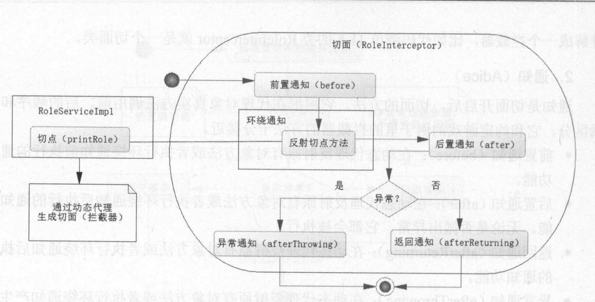

&nbsp;

<!-- more -->

<!-- toc -->

&nbsp;

[toc]

IoC是Spring的核心，那么AOP就是Spring最为重要的功能之一。在数据库事务中，切面编程被广泛使用。

# 1. Spring AOP基本概念

在动态代理基础上，在代理类（实现bind，invoke方法的类）中，加入拦截器作为属性，bind方法中获取拦截器保存在属性中，invoke方法中执行拦截器的方法。

## 1.1 AOP概念和意义

尤其在数据库事务中，OOP不能完全解决问题。如交易系统和财务系统，购物过程中这两个系统应形成统一的事务管理。事务管理就需要用到面向切面的编程，切面环境就是数据库事务。

AOP的一些意义：拦截一些方法、把对象组织成一个整体、约定动态流程完成各阶段的自定义操作等。

减少代码冗余：JDBC或MyBatis中，都需要try-catch-finally，手动获取连接/映射器，进行各种异常判断。而在AOP中，只需加入一个注解，代码就可抛开try-catch-finally，专注于业务逻辑，更简洁，更易维护。

实现原理：正常的SQL步骤是完成连接、执行SQL，若成功则提交、失败则回滚。这个过程可以放在拦截器中，与被代理对象一并执行。即，可以将SQL流程封装，通过动态代理技术，设计为：建立连接放在拦截器的before方法、执行SQL则是被代理对象的方法、回滚与提交则通过是否发生异常来判断决定，同样放在拦截器中、关闭连接等数据库资源同样拦截器中实现。

AOP的封装：上述的拦截器内置在AOP中，建立连接、判断回滚与提交、关闭连接等都由AOP自行完成，用户只需编写SQL完成业务逻辑、标注`@Transactional`表示启用数据库事务即可。当然也提供一些配置能力。

&nbsp;

## 1.2 AOP术语

1. 切面 Aspect：在一个怎么样的环境中工作。如上述的简单数据库事务操作，事务贯穿整个代码层面，故事务就是一个切面，能在被代理对象的方法前后、异常或正常返回后切入自定义代码，甚至代替原本被代理对象的方法。动态代理中可以理解为拦截器。
2. 通知 Adice：切面开启后，切面的方法。类似拦截器的方法。
	1. 前置通知 before：在动态代理反射被代理对象方法前，或执行环绕通知前执行的通知功能
	2. 后置通知 after：在动态代理反射被代理对象方法后，或执行环绕通知后执行的通知功能，且无论是否抛出异常，都会执行
	3. 返回通知 afterReturning：在动态代理反射被代理对象方法后，或执行环绕通知后执行的通知功能
	4. 异常通知 afterThrowing：在动态代理反射被代理对象方法，或执行环绕通知产生异常后执行
	5. 环绕通知 aroundThrowing：在动态代理中，可以取代当前被拦截对象的方法，通过参数或反射调用被拦截对象的方法
3. 引入 Introduction：在现有的类里添加自定义的类和方法
4. 切点 Pointcut：被切面拦截的方法（被代理对象的方法）就是一个切点，切面可以将切点和被拦截方法按照一定逻辑织入约定流程中
5. 连接点 join point：判断条件，由它指定哪些是切点；对于指定的切点，Spring生成代理对象去使用对饮的切面进行拦截
6. 织入 Weaving：生成代理对象的过程。代理分为静态和动态。静态代理是在编译class文件时生成的代码逻辑，或通过ClassLoader在类加载时生成的代码逻辑，在应用程序代码运行前就生成了对应的逻辑；Spring使用动态代理，在运行期动态生成代码，使用JDK或CGLIB动态代理技术



&nbsp;

## 1.3 Spring对AOP的支持

AOP并非Spring独有，Spring只是支持AOP而已。Spring只支持方法拦截的AOP。

Spring有4中方式实现AOP：

1. ProxyFactoryBean和对应接口
2. XML配置
3. @AspectJ
4. AspectJ注入

常用@AspectJ注解实现，有时附以XML配置。其余方式很少用。

&nbsp;

# 2. @AspectJ注解实现AOP

## 2.1 选择切点

Spring是方法级别的AOP框架，以某个方法作为切点。即动态代理中拦截哪个方法。

首先创建一个接口：

```java
public interface RoleService {
    public void printRole(Role role);
}
```

接口的实现类：

```java
@Component
public class RoleServiceImpl implements RoleService {
	@Override
    public void printRole(Role role) {
        System.out.println("id:" + role.getId() + ", name: " + role.getName());
    }
}
```

如果将这个接口类的printRole方法作为切点，则动态代理时就是要为RoleServiceImpl生成代理对象，拦截printRole方法，产生各种通知。

&nbsp;

## 2.2 创建切面

选好切点后就可以创建切面。对于动态代理，切面如同拦截器。Spring中只要注解@Aspect，IoC容器就认为该类是一个切面。

@Aspect注解需要aspectj/aspectjweaver的jar包。

```java
@Aspect
public class RoleAspect {
    @Before("execution(* AOP.RoleServiceImpl.printRole(..))")
    public void before() {
        System.out.println("before...");
    }

    @After("execution(* AOP.RoleServiceImpl.printRole(..))")
    public void after() {
        System.out.println("after...");
    }

    @AfterReturning("execution(* AOP.RoleServiceImpl.printRole(..))")
    public void afterReturning() {
        System.out.println("afterReturning...");
    }

    @AfterThrowing("execution(* AOP.RoleServiceImpl.printRole(..))")
    public void afterThrowing() {
        System.out.println("afterThrowing...");
    }
}
```

另有`@Around`环绕通知，和`@Pointcut()`未用到。

@Pointcut：可简化注解

```java
@Pointcut("...")
public void func(){}

Before("func()")
public void before(){...}
```

&nbsp;

## 2.3 连接点

判断是否需要拦截某一方法。

切面中的注解 `execution(* AOP.RoleServiceImpl(..))`

execution：执行该方法时候触发拦截器

\*：任意返回类型的方法

AOP.RoleServiceImpl：类的全限定名

printRole：被拦截方法名

(..)：任意参数

如此，就确定了要拦截的方法，会按AOP通知的规则将其织入流程。

还有其他诸多指示器：

| AspectJ指示器 | 描述                                  |
| ------------- | ------------------------------------- |
| arg()         | 限制方法的参数类型                    |
| @args()       | 限制方法参数为指定注解标注            |
| execution     | 用正则匹配                            |
| this()        | 匹配AOP代理的Bean，引用为指定类型的类 |
| target        | 被代理对象为指定类型                  |
| @target()     | 被代理对象符合指定的注解类型          |
| within()      | 匹配指定包                            |
| @within()     | 匹配指定类型                          |
| @annotation   | 匹配带有指定注解的连接点              |

指示器可以组合使用，如`execution(* xxx.*.*.func(..)) && within(xxx.aop.*)`表示只将xxx.aop下的类的func方法作为切点。

XML配置时，&& || ! 用and or not替代。

&nbsp;

## 2.4 测试

配置Bean，开启AspectJ的自动代理，Spring生成动态代理对象

```java
@Configuration
@EnableAspectJAutoProxy
@ComponentScan("AOP")
public class AOPConfig {
    @Bean
    public RoleAspect getRoleAspect() {
        return new RoleAspect();
    }
}
```

或使用XML配置：

```xml
<?xml version='1.0' encoding='UTF-8' ?>
<beans xmlns="http://www.springframework.org/schema/beans"
	xmlns:xsi="http://www.w3.org/2001/XMLSchema-instance" xmlns:context="http://www.springframework.org/schema/context"
	xmlns:aop="http://www.springframework.org/schema/aop"
	xsi:schemaLocation="http://www.springframework.org/schema/beans http://www.springframework.org/schema/beans/spring-beans-4.0.xsd
        http://www.springframework.org/schema/context http://www.springframework.org/schema/context/spring-context-4.0.xsd        
        http://www.springframework.org/schema/aop 
        http://www.springframework.org/schema/aop/spring-aop-4.0.xsd">
	<aop:aspectj-autoproxy />
	<bean id="roleAspect" class="com.ssm.chapter11.aop.aspect.RoleAspect" />
	<bean id="roleService" class="com.ssm.chapter11.aop.service.impl.RoleServiceImpl" />
</beans>
```

测试：

```java
public class Test {
    public static void main(String[] args) {
        ApplicationContext context = new AnnotationConfigApplicationContext(AOPConfig.class);
//        RoleService roleService = (RoleService) context.getBean(RoleService.class);
        RoleService roleService = (RoleService) context.getBean("roleServiceImpl");
        System.out.println(roleService.getClass());
        Role role = new Role(1, "jsy");
        roleService.printRole(role);
        System.out.println("___________");
        role = null;
        roleService.printRole(role);
    }
}
```

```
class com.sun.proxy.$Proxy22
before...
id:1, name: jsy
afterReturning...
after...
___________
before...
afterThrowing...
after...
Exception in thread "main" java.lang.NullPointerException
```

&nbsp;

## 2.5 环绕通知

同时实现前置和后置通知，保留了调度被代理对象原有方法的功能。可控性不强，仅用于大量改变业务逻辑时。

在切面中加入：

```java
@Around("execution(* AOP.RoleServiceImpl.printRole(..))")
public void around(ProceedingJoinPoint jp) {
    System.out.println("around before...");
    try {
        jp.proceed();
    } catch (Throwable throwable) {
        throwable.printStackTrace();
    }
    System.out.println("around after...");
}
```

ProceedingJoinPoint，Spring提供，用于反射切点方法。

此时测试：具体顺序或与Spring版本或配置方式有关

```
class com.sun.proxy.$Proxy23
around before...
before...
id:1, name: jsy
afterReturning...
after...
around after...
```

&nbsp;

## 2.6 织入

是生成代理对象的过程（内含被代理对象、拦截器的代理对象，运行结果就像是将通知方法织入被代理对象）。上述代码中，切点方法所在类都是拥有接口的类；若没有接口也可使用CGLIB完成动态代理。故Spring规定：类存在接口使用JDK动态代理，织入各个通知；没有接口就是用CGLIB完成动态代理。

动态代理对象是由IoC容器生成的，一般不需修改。Spring建议使用接口+实现类的编程方式，使定义和实现分离，有利于实现变化和替换。

&nbsp;

## 2.7 给通知传递参数

如切点是：

```java
public void printRole(Role role, int age) {
    System.out.println("id:" + role.getId() + ", name: " + role.getName() + "age: " + age);
}
```

通知：

```java
@Before("execution(* AOP.RoleServiceImpl.printRole(..)) && args(role, age)")
public void before(Role role, int age) {
    System.out.println("before...");
}
```

即在连接点中加入args属性，并在通知中加入同名参数。

&nbsp;

## 2.8 引入

有时希望引入一些其他类的方法，加入通知流程中。

原理是给代理对象增加可挂载接口，即可通过强转在不同类之间转换，执行不同方法。

本例中，加入一个verify方法判断Role不为null时才输出信息：

先创建RoleVerify接口和实例化对象：

```java
public interface RoleVerify {
    public boolean verify (Role role);
}
public class RoleVerifyImpl implements RoleVerify{
    @Override
    public boolean verify(Role role) {
        return role != null;
    }
}
```

并在Aspect中加入Verify属性：

```java
@DeclareParents(value = "AOP.RoleServiceImpl+", defaultImpl = RoleVerifyImpl.class)
public RoleVerify roleVerify;
```

`@DeclareParents`注解：

1. value：XXX+，表示对某个类增强，为其引入一个新接口
2. defaultImpl：XXX.class，新接口的默认实现类


测试使用：

```java
ApplicationContext context = new AnnotationConfigApplicationContext(AOPConfig.class);
//        RoleService roleService = (RoleService) context.getBean(RoleService.class);
//        RoleService roleService = (RoleService) context.getBean("roleServiceImpl");
RoleService roleService = context.getBean(RoleService.class);
RoleVerify roleVerify = (RoleVerify) roleService; 
//        System.out.println(roleService.getClass());
Role role = new Role(1, "jsy");
if (roleVerify.verify(role)) {
    roleService.printRole(role, 23);
}
```

这里将roleService强转为RoleVerify类型，进而使用verify方法，且是通过RoleVerifyImpl实现的。

原理：

生成代理对象的代码：

```java
return Proxy.newProxyInstance(
    obj.getClass().getClassLoader(), 
    obj.getClass().getInterfaces(), 
    this);
```

`obj.getClass().getInterfaces()` 表示代理对象挂在多个接口下，只要AOP让代理对象挂在两接口下，就可以强转Bean，增强了Bean的功能。

若没有接口，使用CGLIB，使用Enhancer雷猴的interfaces属性，代表挂载代理对象接口。

&nbsp;

# 3. XML配置Spring AOP

| AOP配置元素         | 用途                       |
| ------------------- | -------------------------- |
| aop:config          | 顶层元素                   |
| aop:advisor         | 定义AOP的通知器，古老方式  |
| aop:aspect          | 定义切面                   |
| aop:before          | 定义前置通知               |
| aop:after           | 定义后置通知               |
| aop:around          | 定义环绕方式               |
| aop:after-returning | 定义返回通知               |
| aop:after-throwing  | 定义异常通知               |
| aop:declare-parents | 给通知引入新接口，增强功能 |
| aop:pointcut        | 定义切点                   |

本例中仍使用上例的RoleService接口和RoleServiceImpl类，但不需@Component注解。

随后定义切面类：同样无需注解，稍后统一XML配置

```java
public class XmlAspect {
    public void before() {
        System.out.println("before...");
    }
    public void after() {
        System.out.println("after...");
    }
    public void afterThrowing() {
        System.out.println("afterThrowing...");
    }
    public void afterReturning() {
        System.out.println("afterReturning...");
    }
}
```

使用XML配置AOP时需要在顶层beans中引入XML定义AOP的命名空间

`http://www.springframework.org/schema/aop http://www.springframework.org/schema/aop/spring-aop-4.0.xsd`


## 3.1 定义通知

```xml
<bean id="xmlAspect" class="AOP.XmlAspect"/>
<bean id="roleService" class="AOP.RoleServiceImpl1"/>
<aop:config>
    <!-- 引用xmlAspect作为切面 -->
    <aop:aspect ref="xmlAspect">
        <!-- 切面内定义通知 -->
        <aop:before method="before" pointcut="execution(* AOP.RoleServiceImpl.printRole(..))"/>
        <aop:after method="after" pointcut="execution(* AOP.RoleServiceImpl.printRole(..))"/>
        <aop:after-throwing method="afterThrowing" pointcut="execution(* AOP.RoleServiceImpl.printRole(..))"/>
        <aop:after-returning method="afterReturning" pointcut="execution(* AOP.RoleServiceImpl.printRole(..))"/>
        <aop:around method="around" pointcut-ref="printRole"/>
    </aop:aspect>
</aop:config>
```

或定义切点减少冗余：

```xml
<!-- 定义切点方法减少冗余 -->
<aop:pointcut id="printRole" expression="execution(* AOP.RoleServiceImpl.printRole(..))"/>
<aop:before method="before" pointcut-ref="printRole"/>
```

测试时使用`Application ctx = new ClassPathXmlApplicationContext("xxx.xml")`获取IoC容器。

&nbsp;

## 3.2 给通知传递参数

通知方法加入形参，随后在XML中的连接点中加入`args()`属性，**此处用and连接**，因为&在XML中有特殊含义。

```xml
<aop:pointcut id="printRole" expression="execution(* AOP.RoleServiceImpl.printRole(..)) and args(role, age)"/>
```

&nbsp;

## 3.3 引入

在RoleServiceImpl（被代理类 ？，注解引用时是加入切面类中）中加入RoleVerify属性 `public RoleVerify roleVerify = null;`

随后XML配置：aop:aspect下

```xml
<aop:declare-parents
         types-matching="xxx.RoleServiceImpl+"
         implement-interface="xxx.RoleVerify"
         default-impl="xxx.RoleVerifierImpl" />
```

&nbsp;

# 4. 早期Spring AOP实现

暂不展开，《JavaEE互联网轻量级框架整合开发 SSM框架和Redis实现》11.5

&nbsp;

# 5. 多个切面

多个切面时，默认随机执行，可通过以下操作指定顺序。

新建接口与实现类（切点）：

```java
public interface MultiBean {
    public void testMulti();
}

@Component
public class MultiBeanImpl implements MultiBean{
    @Override
    public void testMulti() {
        System.out.println("test multi aspects.");
    }
}
```

新建多个切面：此处仅写出一个

```java
public class Aspect1 {
    @Pointcut("execution(* AOP.MultiBeanImpl.testMulti(..))")
    public void print(){};

    @Before("print()")
    public void before() {
        System.out.println("before 1...");
    }

    @After("print()")
    public void after() {
        System.out.println("after 1...");
    }

    @AfterThrowing("print()")
    public void afterThrowing() {
        System.out.println("afterThrowing 1...");
    }

    @AfterReturning("print()")
    public void afterReturning() {
        System.out.println("afterReturning 1...");
    }
}
```

Config类设置与Test类测试：

```java
@Configuration
@EnableAspectJAutoProxy
@ComponentScan("AOP")
public class MultiConfig {
    @Bean
    public Aspect1 getAspect1() {
        return new Aspect1();
    }

    @Bean
    public Aspect2 getAspect2() {
        return new Aspect2();
    }
}

ApplicationContext context = new AnnotationConfigApplicationContext(MultiConfig.class);
MultiBean multiBean = (MultiBean) context.getBean("multiBeanImpl");
multiBean.testMulti();
```

~~但是结果一直是同一个顺序啊 迷幻~~ 

如要指定顺序，在注解AOP中，可以使用`@Order`：在Aspect1中加入`@Order(1)`，在Aspect2中加入`@Order(2)`…

还有其他方法：如Aspect实现Ordered接口，实现getOrder方法，返回自己的次序；XML中则`<aop:aspect ref="aspect1" order="1">`

指定顺序后，则按照以下顺序执行：

```
before 1...
before 2...
test multi aspects.
afterReturning 2...
after 2...
afterReturning 1...
after 1...
```

类似设计模式中的责任链模式。即Spring底层通过责任链模式处理多个切面。

&nbsp;


