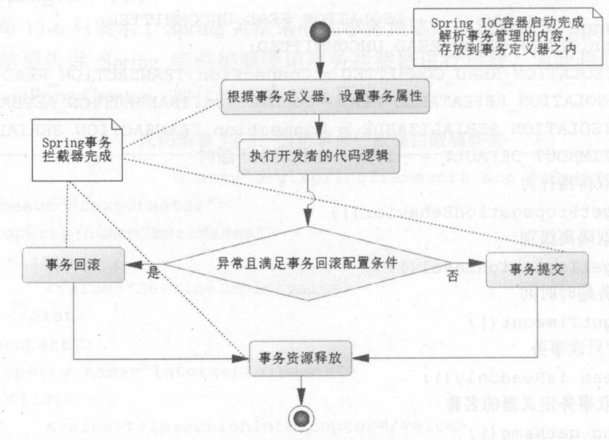

&nbsp;

<!-- more -->

<!-- toc -->

&nbsp;

[toc]

&nbsp;

# 1. Spring数据库事务管理器

Spring中数据库事务通过PlatformTransactionManager管理。

jdbcTemplate是Spring中数据库功能的重要模板类，而TransactionTemplate是完成事务管理的重要模板类。

在TransactionTemplate中：

* 事务的创建、回滚、提交是通过PlatformTransactionManager事务管理器接口完成的
* 回滚时默认所有异常都回滚，可配置修改为仅部分异常回滚或不回滚
* 无异常时提交

而PlatformTransactionManager接口及其继承、实现族：常用DataSourceTransactionManager，继承自AbstractPlatformTransactionManager，实现自PlatformTransactionManager。

PlatformTransactionManager接口具有三个方法：

1. `TransactionStatus getTransaction(TransactionDefinition) throws TransactionException;` 获取事务状态
2. `void commit(TransactionStatus) throws TransactionException;` 提交
3. `void rollback(TransactionStatus) throws TransactionException;` 回滚

&nbsp;

## 1.1 配置事务管理器

MyBatis最常用DataSourceTransactionManager事务管理器，Hibernate中常用spring-orm包中的HibernateTransactionManager。

XML配置时加入事务命名空间：

`http://www.springframework.org/schema/tx`

`http://www.springframework.org/schema/tx/spring-tx-4.0.xsd`

```xml
<bean id="transactionManager" class="org.springframework.jdbc.datasource.DataSourceTransactionManager">
    <property name="dataSource" ref="dataSource"/>
</bean>
```

此时，Spring就知道已将数据库事务委托给事务管理器transactionManager管理了。且jdbcTemplate中，若数据库资源的产生和释放没有委托管理器就由jdbcTemplate自己管理；此时委托给事务管理器，所以数据库资源和事务就由事务管理器处理。

Spring中可以使用声明式事务和编程式事务，后者因为冗余，几乎废弃；前者又可通过XML和注解配置，但XML也已不常用，主流使用@Transactional注解标识。即，**主流使用注解配置的声明式事务**。

&nbsp;

## 1.2 Java配置实现Spring数据库事务

用Java配置的方式实现Spring数据库事务，需要在配置类中实现接口TransactionManagerConfigurer的annotationDrivenTransactionManager方法。Spring把此方法返回的事务管理器作为程序中的事务管理器。

？

&nbsp;

# ~~2. 编程式事务~~

逐渐弃用。

用代码实现事务管理。需要事务定义类接口TransactionDefinition，具有默认实现类DefaultTransactionDefinition。使用如下：

```java
TransactionDefinition def = new DefaultTransactionDefinition();
PlatformTransactionManager transactionManager = ctx.getBean(PlatformTransactionManager.class);
TransactionStatus status = transactionManager.getTransaction(def);
try {
    jdbcTemplate.update(sql);
    transactionManager.commit(status);
} catch(Exception) {
    transactionManager.rollback(status);
}
```

事务已交给管理器控制，故jdbcTemplate完成SQL后不会提交，等待管理器的commit或rollback。

&nbsp;

# 3. 声明式事务

## 3.1 @Transactional配置项

| 配置项                 | 含义                                                         |
| ---------------------- | ------------------------------------------------------------ |
| value                  | 定义事务管理器，是IoC的一个Bean id，需要实现PlatformTransactionManager |
| transactionManager     | 同上                                                         |
| isolation              | 隔离级别                                                     |
| propagation            | 传播行为，默认REQUIRED                                       |
| timeout                | 超时s，引发异常，默认导致回滚                                |
| readOnly               | 是否开启只读事务，默认false                                  |
| rollbackFor            | 回滚的异常类定义，即方法产生了定义的异常时才回滚             |
| rollbackForClassName   | 回滚的异常类名定义                                           |
| noRollbackFor          | 哪些异常不会滚，继续提交                                     |
| noRollbackForClassName | 同上                                                         |

这些属性会被Spring放到TransactionDefinition事务定义器中。且使用声明式事务需要配置注解驱动，在Spring-cfg.xml中加入`<tx:annotation-driven transaction-manager="transactionManager"/> `。

> 此处遇到一个小Bug：xml命名空间处，IDEA自动生成`xmlns:tx="http://www.springframework.org/schema/cache"`，需改为`.../tx`

&nbsp;

## ~~3.2 使用XML配置事务管理器~~

XML配置事务管理器方法很多但不常用，一般采用注解配置。

XML配置需要一个事务拦截器TransactionInterceptor。IoC启动时解析XML中拦截器的属性，放到事务定义类TransactionDefinition中，再运行时根据正则式匹配决定方法策略。显然，声明式事务的底层原理就是Spring AOP技术。

此外还需配置BeanNameAutoProxyCreator，指明Spring要拦截哪些类。

&nbsp;

## 3.3 事务定义器

本接口中，有传播行为常量、隔离级别定义，有获取传播行为方法、获取隔离界别方法、获取事务超时时间方法、是否只读事务方法、获取事务定义器名称方法。事务的大多配置都可在此完成。

&nbsp;

## 3.4 声明式事务的约定流程

@Transaction注解，可以用在类或方法上。在IoC容器初始化时，Spring读入注解（或XML）配置的事务信息，保存到一个事务定义类中（TransactionDefinition接口的子类）。运行时Spring拦截注解标注的方法或类，根据AOP，把自定义的功能织入AOP流程。

首先Spring通过事务管理器（PlatformTransactionManager的子类）创建事务，同时把事务定义中的隔离级别、超时等属性根据配置设置到事务上。根据传播行为配置采取特定策略。运行中，Spring反射调用代码，根据约定决定是回滚还是提交。整个过程中，只需要编写业务代码和对事务属性配置即可，代码量少逻辑清晰。



如插入角色：无需打开数据库，链接资源，提交回滚释放等，只需注解Transactional。

```java
@Autowired
private RoleDao roleDao = null;

@Transactional(propagation=Propagation.REQUIRED, isolation=Isolation.DEFAULT, timeout=3)
public int insertRole(Role role) {
    return roleDao.insert(role);
}
```

&nbsp;

# 4. 数据库相关

## 4.1 隔离级别

SQL标准把隔离级别定义为4层；脏读、读写提交、可重复读、序列化。

1. 脏读：可以读取另一个事务中未提交的数据，会引发脏读
2. 读写提交：只能读取其他事务已提交的数据，克服脏读但不能避免不可重复读
3. 可重复读：针对同一记录的概念，是同一记录的读写操作按照一个序列化进行，不交叉，实现了可重复读，但不能避免幻读
4. 序列化：让SQL按顺序读写，解决幻读

&nbsp;

## 4.2 选择隔离级别

为平衡性能与数据一致性，通常选择读/写提交（二级隔离 Isolation.READ_COMMIT）。之后还有其他方法维护数据一致性。注解Transactional的隔离级别默认Isolation.DEFAULT，代表随数据库默认值而变化。如MySQL中默认可重复读级别，Oracle只支持读写提交和可序列化两个级别，默认读写提交。

&nbsp;

## 4.3 传播行为

指方法之间调用事务策略的问题。通常希望事务能同时成功或同时失败，但也有一些时候希望只回滚部分事务。如还款时，Batch类batch方法记录还款总人数等信息，Service类的repay完成某一张卡的还款，若仅一个事务，则一旦有一个人异常，则所有人回滚；此时可以改用batch方法调用repay，每次调用产生一个新事务，则有人异常只回滚他自己。

这种一个方法调度另一个方法，可以对事务的特性进行传播配置，就成为传播行为。

Spring中的传播特性是枚举类Propagation定义：

| 传播行为      | 含义                                                         |
| ------------- | ------------------------------------------------------------ |
| REQUIRED      | 调用时，若不存在当前事务就创建事务；若前一个方法已有事务就沿用（默认） |
| SUPPORTS      | 调用时，若不存在当前事务就不启用事务；若存在就沿用           |
| MANDATORY     | 方法必须在事务内运行，不存在当前事务就异常                   |
| REQUIRES_NEW  | 无论是否存在事务，方法都在新事务中运行                       |
| NOT_SUPPORTED | 不支持事务，若不存在事务也不创建；存在事务就挂起，至方法结束才恢复，适用于不需事务的SQL |
| NEVER         | 不支持事务，只有不存在事务时才能运行，否则异常               |
| NESTED        | 嵌套事务，调用方法若异常只回滚自己内部的SQL，不回滚主方法SQL；通过保存点技术实现，若库不支持保存点，就REQUIRES_NEW |

常用默认的REQUIRED，也会用到REQUIRES_NEW和NESTED。

&nbsp;

# 5. MS中使用事务

本例中使用两个接口与两个实现类，两类有调用关系，被调用类完成insert，以测试传播与隔离。

首先新建两个接口：

```java
public interface BookService {
    public int insertBook(Book book);
}

public interface BookListService {
    // 会调用BookService的insertBook方法，用于测试传播行为
    public int insertBookList(List<Book> bookList);
}
```

然后实例化；类中包含Mapper实例对象，即MyBatis中所有数据库操作最终是通过Mapper执行，且注意此处两方法都设置了Transactional注解

```java
@Service
public class BookServiceImpl implements BookService{
    @Autowired
    private BookMapper bookMapper = null;

    @Override
    @Transactional(propagation = Propagation.REQUIRES_NEW,
            isolation = Isolation.READ_COMMITTED)
    public int insertBook(Book book) {
        int res = bookMapper.insertBook(book);
        System.out.println("insert a book " + book.getTitle());
        return res;
    }
}

@Service
public class BookListServiceImpl implements BookListService{
    @Autowired
    private BookService bookService = null;

    @Override
    @Transactional(propagation = Propagation.REQUIRED,
            isolation = Isolation.READ_COMMITTED)
    public int insertBookList(List<Book> bookList) {
        int count = 0;
        for (Book book: bookList) {
            try {
                count += bookService.insertBook(book);
            } catch (Exception exception) {
                System.err.println(exception);
            }
        }
        return count;
    }
}
```

XML配置：使用XML配置，开启扫描本包即可

```xml
<context:annotation-config/>
<context:component-scan base-package="Transaction"/>
```

测试：

```java
ApplicationContext context = new ClassPathXmlApplicationContext("spring_config.xml");
BookListService bookListService = context.getBean(BookListService.class);
List<Book> bookList = new ArrayList<>();
var book6 = new Book("006", "title6");
var book7 = new Book(null, "title7");
bookList.add(book6);
bookList.add(book7);
int count = bookListService.insertBookList(bookList);
System.out.println(count);
```

在当前两类的传播设置下（调用方法是REQUIRED，被调用方法是REQUIRES_NEW），即被调用方法中，每次使用mapper的insertBook都会新建事务，故前一本书添加成功，后一本书添加失败。

若改为REQUIRED和REQUIRED，则两本书的添加是同一事务，由于后者添加失败，前者也会被一并回滚。

若改为REQUIRES_NEW和REQUIRED，也会一并回滚。

若改为REQUIRED和NESTED，被调用方法内部单独回滚，程序仍能正常运行。

&nbsp;

# 6. @Transactional的自调用失效问题

注解Transactional的底层实现是AOP技术，使用动态代理，则**对static、非public方法，注解是失效的**。此外，自调用也是容易出现的错误。

自调用：类的一个方法调用本类的其他方法。如上例中，BookServiceImpl类新增insertBookList方法调用自己的insertBook方法，且被调用方法使用REQUIRES_NEW传播行为，但观察日志可发现并没有每次新建事务，只使用了同一事务，即被调用方法的注解失效了。

原因：动态代理过程中，类自己调用自己，不存在代理对象的调用，就不会产生AOP设置注解的参数。

解决：如上例中使用两个服务类；或在调用方法中获取代理对象，然后用代理对象执行被调用方法：

```java
// 方法2
@Transactional(...)
public int insertBookList (List<Book> list) {
    int count = 0;
    // 从容器获取代理对象
    BookService service = ctx.getBean(RoleService.class);
    for (Book book : list) {
        try {
            service.insertBook(book);
            count++;
        } catch (Exception ex) {
			...
        }
    }
    return count;
}
```

&nbsp;

# 7. 典型错误用法

1. 错误使用Service

	Service服务类。在MVC中的Controller中使用服务类很正常，如要在一个Controller中插入两个角色，并且要求两角色在同一事务中处理。但如果服务类的方法，指定了@Transactional的新建事务的传播行为，则简单地先后调用插入方法是无法完成同一事务中处理的要求的。

2. 过长时间占用事务

	使用事务资源后要尽快释放，操作文件、对外连接等耗时且与数据库无关的操作应剥离，即不放在@Transactional标注的方法内。

3. 错误捕捉异常

	在Transactional方法中，可以try-catch自行捕获异常，但如果需要Spring回滚，就要手动在catch中继续throw异常，让容器接收异常，自动回滚；否则try中代码部分完成部分异常执行失败，且没有异常出现，就不会自动回滚。

