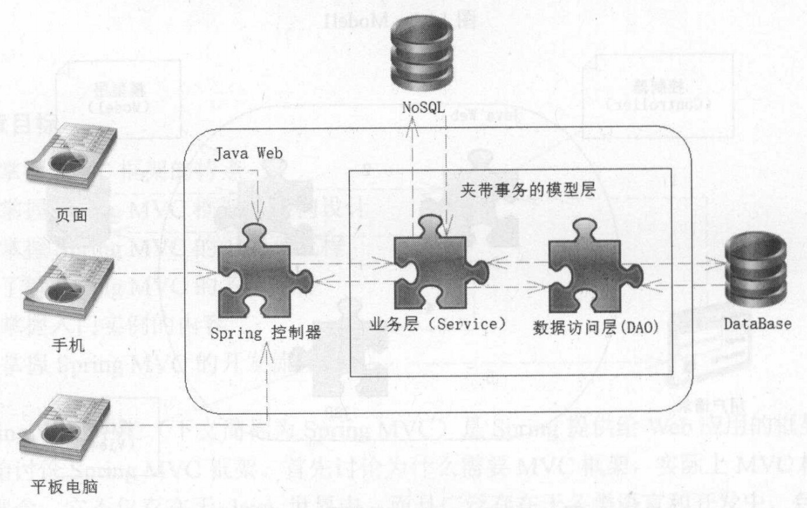
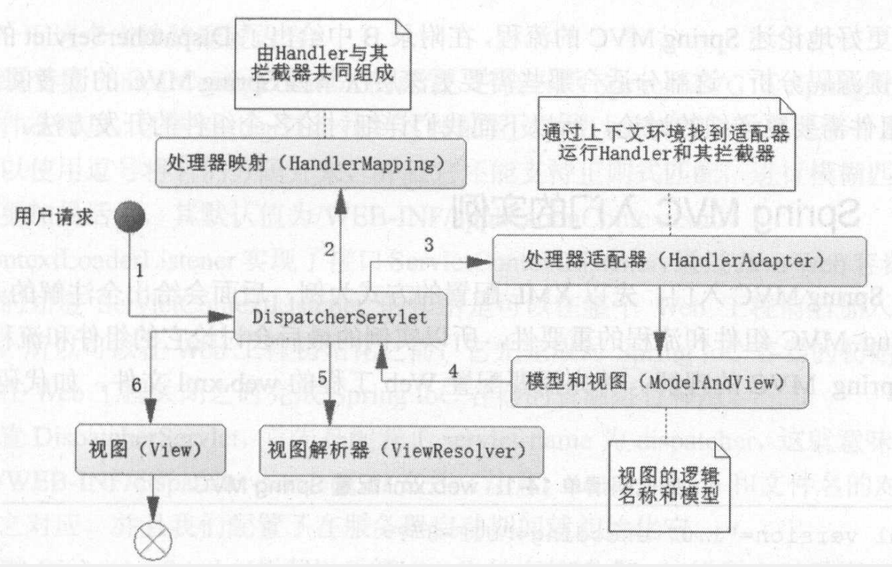
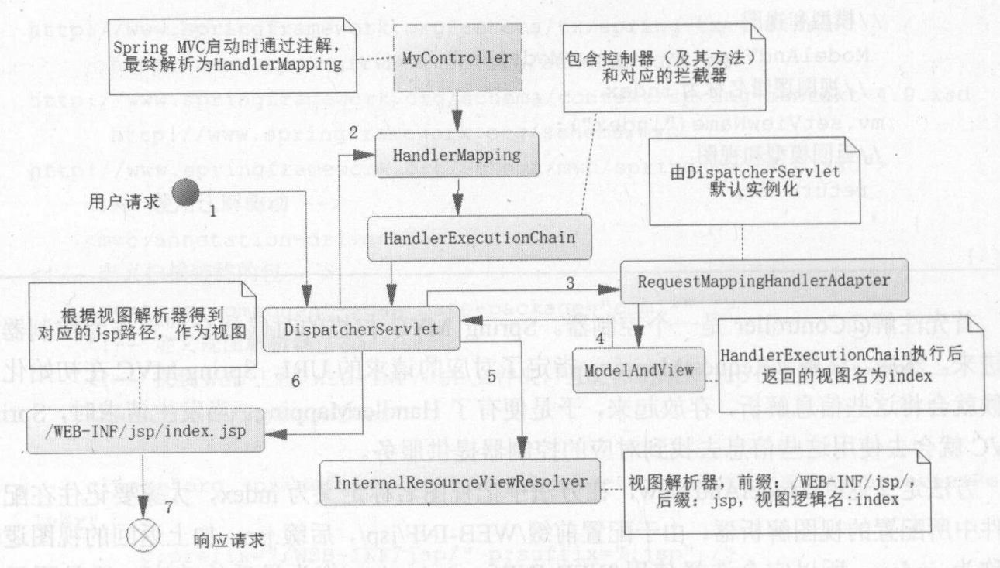

&nbsp;

<!-- more -->

<!-- toc -->

&nbsp;

[toc]

&nbsp;

Spring Web MVC是Spring提供给Web应用的框架设计，是一种设计理念。

&nbsp;

# 1. MVC设计概述

MVC设计不局限与Java，主要目的是解耦模块。

早期Java Web开发，使用JSP+JavaBean，即JSP Model1时期，JSP与JavaBean、Java与HTML耦合严重，JSP又是显示页面又要完成业务逻辑、页面逻辑。Model2引入Servlet，初步呈现MVC模式，JavaBean作为Model、Servlet作为Controller、JSP作为View，请求先到达Servlet，控制器接收后调度JavaBean，读写数据库，将结果放到JSP并展示给用户。

此时出现了一些MVC经典框架，Struts1/2，Hibernate等，但如今手机端兴起，Web页面大多Ajax请求，用JSON交互，以前的框架依赖JSP页面，已不适合。

&nbsp;

## 1.1 Spring MVC架构

出现前的问题：Hibernate的移植数据库功能越来越不需要；Hibernate的性能不足；但Hibernate和MyBatis都没有处理好数据库事务编程；Java Web需要从NoSQL中获取数据，上述持久层框架无法完成。

Spring MVC的解决方案：模型层Model拆分成业务层Service和数据访问层DAO（Data Access Object），业务层Service下通过Spring的声明式事务操作数据访问层DAO，且Service层允许访问NoSQL。Spring MVC另一大特色是结构松散，如视图种类限制小，各类文件均可作为视图，故而能满足各种终端的各类请求。



&nbsp;

## 1.2 Spring MVC组件与流程

流程是其核心与基础。Spring MVC是基于Servlet的技术，提供了核心控制器DispatcherServlet和相关组件，并制定了松散的结构，以适应各种需要。



&nbsp;

## 1.3 入门实例

同样可用XML和注解两种方法配置。此处先给出XML方式。[注解方法](# 2.3 注解配置初始化)

1. 配置web.xml：

	```xml
	<!--    Spring IoC配置文件路径-->
	<context-param>
	    <param-name>contextConfigLocation</param-name>
	    <param-value>/WEB-INF/applicationContext.xml</param-value>
	</context-param>
	
	<!--    ContextLoaderListener以初始化IoC容器-->
	<listener>
	    <listener-class>org.springframework.web.context.ContextLoaderListener</listener-class>
	</listener>
	
	<!--    DispatcherServlet-->
	<servlet>
	    <servlet-name>dispatcher</servlet-name>
	    <servlet-class>org.springframework.web.servlet.DispatcherServlet</servlet-class>
	    <load-on-startup>2</load-on-startup>
	</servlet>
	<servlet-mapping>
	    <servlet-name>dispatcher</servlet-name>
	    <url-pattern>/</url-pattern>
	</servlet-mapping>
	```

	* contextConfigLocation用于告诉MVC其IoC的配置文件在哪里，Spring就能找到配置文件加载，多个文件用逗号分隔，还支持正则匹配、模糊匹配，默认值即为代码所写（实际就是之前学习Spring时的spring-config.xml文件）
	* ContextLoaderListener实现了接口ServletContextListener，用于在Web应用前后加入代码，可以做到先于Web应用的IoC初始化，和Web应用关闭时IoC容器的释放
	* DispatcherServlet，servlet-name为dispatcher，意味着需要/WEB-INF/dispatcher-servlet.xml文件，需要在服务器启动时就初始化
	* 简单入门，暂不配置IoC配置文件WEB-INF/applicationContext.xml

2. dispatcher-servlet.xml

	```xml
	<!--    注解驱动-->
	<mvc:annotation-driven/>
	<!--    扫描装载的包-->
	<context:component-scan base-package="*"/>
	<!--    视图解析器-->
	<bean id="viewResolver" 
	      class="org.springframework.web.servlet.view.InternalResourceViewResolver"
	      p:prefix="/WEB-INF/jsp/" p:suffix=".jsp"/>
	<!--    若配置了数据库事务，需要开启注解事务时使用以下配置-->
	<!--    <tx:annotation-driven transaction-manager="transactionManager"/>-->
	```

	* `<mvc:annotation-driven/>`表示使用注解驱动Spring MVC
	* 扫描包用以加载对应的控制器和其他组件
	* 定义视图解析器，视图就能根据定义的前后缀去Web工程中找到对应JSP文件作为视图

3. 以上XML、JSP包都在WEB-INF下，而普通class文件开发中先放在外部，最终编译后文件放在WEB-INF下

4. 一个简单控制器：

	```java
	@Controller("myController")
	@RequestMapping("/my")
	public class MyController {
	    @RequestMapping("/index")
	    public ModelAndView index() {
	        ModelAndView mv = new ModelAndView();
	        mv.setViewName("index");
	        return mv;
	    }
	}
	```

	* @Controller：表名此类是控制器，MVC扫描时把它作为控制器加载
	* @RequestMapping：指定请求URI，MVC初始化时将这些信息解析存放，就有了HandlerMapping，发生请求时MVC使用这些信息找到对应的控制器提供服务
	* 方法返回ModelAndView，方法中把视图名称定义为index，故就是采用/WEB-INF/jsp/index.jsp作为视图。

5. 编写/WEB-INF/jsp/index.jsp，并访问`http://localhost:8080/webapp_name/my/index `即可访问到该index.jsp页面



流程：MVC启动时解析Controller注解，生成对应的URI和请求的映射关系，并注册对应方法。请求来到时，根据URI找到对应的HandlerMapping，组织为一个执行链，通过请求类型找到RequestMappingHandlerAdapter，该实例是在DispatcherServlet初始化时创建的。通过它执行HandlerExecutionChain的内容，最终在MyController的方法中将index视图返回DispatcherServlet。根据配置的视图解析器的前后缀，确定index.jsp作为视图，响应请求。

&nbsp;

# 2. Spring MVC初始化

以上实例中配置了DispatcherServlet和ContextLoaderListener，它们初始化了IoC容器上下文和映射请求上下文（后者根据前者扩展出来）。

## 2.1 初始化Spring IoC上下文

Web容器为生命周期中提供ServletContextListener接口，可以在容器初始化和结束期中执行一定逻辑，故可以通过实现该接口，使得在DispatcherServlet初始化前完成IoC容器的初始化，也可以在结束期完成IoC容器的销毁。Spring MVC中ContextLoaderListener就是负责这个工作，它实现了该接口，初始化/销毁了Spring IoC容器。

## 2.2 初始化映射请求上下文

本上下文是通过DispatcherServlet初始化的，和普通Servlet一样，可以根据自己的需要，配置为启动时初始化或用户首次请求时初始化。若未注册ContextLoaderListener，DispatcherServlet也会在其初始化时对IoC容器初始化。

DispatcherServlet初始化时机选择：IoC容器初始化比较耗时，不应放在请求时，故应在服务器启动时就完成IoC容器初始化。同时为了照顾到其他需要IoC容器的资源，应尽早完成IoC初始化。故还是推荐使用ContextLoaderListener进行IoC初始化。

服务器提供了HttpServlet类，随后的子类HttpServletBean、FrameworkServlet、DispatcherServlet都是Spring MVC提供。其中的initServletBean方法，功能之一就是初始化IoC容器。若已被初始化就沿用，否则就新建并onRefresh。onRefresh方法初始化了MVC的各组件，包含以下：

* MultipartResolver：文件解析器，用于服务器的文件上传
* LocaleResolver：国际化解析器，提供国际化功能
* ThemeResolver：主题解析器
* HandlerMapping：MVC中重要内容，包装用户提供的一个控制器的方法和对应的拦截器
* handlerAdapter：处理器适配器，因为处理器在不同上下文运行，MVC先找到合适的适配器然后运行处理器服务方法
* HandlerExceptionResolver：处理器异常解析器，用于处理处理器发生的异常
* RequestToViewNameTranslator：视图逻辑名称转换器，通过控制器返回的视图名称找到具体视图文件，若没有返回逻辑视图名，就将URL映射为逻辑视图名
* ViewResolver：视图解析器，控制器返回后，通过此把逻辑视图名词解析，定位实际视图

对于以上MVC的初始化，是DispatcherServlet根据配置文件DispatcherServlet.properties完成的。

&nbsp;

## 2.3 注解配置初始化

Servlet3.0后允许取消web.xml配置，只使用注解即可，故Spring3.1后也提供了注解配置。

首先继承AbstractAnnotationConfigDispatcherServletInitializer类，实现方法：Servlet3.0后允许动态加载Servlet，只要实现ServletContainerInitializer接口即可；MVC也实现了SpringServletContainerInitializer类，实现了上述接口，如此就能通过它加载各个初始化器了。SpringServletContainerInitializer中实现了WebApplicationInitializer的onStartup方法。观察源码可知，只要实现了该方法，MVC就会把类作为初始化器加载，我们自己写的MyWebAppInitializer最高祖先就是WebApplicationInitializer接口，故自己写的类就会被认作初始化器进行加载。且ContextLoader和DispatcherServlet的初始化器都是继承自WebApplicationInitializer接口的抽象类，我们自己写的类继承层次更低，故会一并初始化。

```java
public class MyWebAppInitializer extends AbstractAnnotationConfigDispatcherServletInitializer {

    // Spring IoC容器配置
    @Override
    protected Class<?>[] getRootConfigClasses() {
        // 可以返回Spring的Java配置文件数组
        return new Class<?>[] {};
    }

    // DispatcherServlet的URI映射关系配置
    @Override
    protected Class<?>[] getServletConfigClasses() {
        // 可以返回Spring的Java配置文件数组
        return new Class<?>[] { WebConfig.class };
    }

    // 拦截内容
    @Override
    protected String[] getServletMappings() {
        return new String[] { "/" };
    }
}
```

配置类的3个方法：

* getRootConfigClasses：获取IoC容器的Java配置类，用于装载各类Spring Bean，若返回空，就不加载Bean到IoC
* getServletConfigClasses：获取各类MVC的URI和控制器的配置关系类，用于生成Web请求上下文
* getServletMappings：定义DispatcherServlet拦截的请求

2. WebConfig.class：URI和控制器的映射关系类，生成Web请求上下文

	```java
	@Configuration
	@ComponentScan("*")
	@EnableWebMvc
	public class WebConfig {
	    // 视图解析器
	    @Bean (name = "viewResolver")
	    public ViewResolver initViewResolver() {
	        InternalResourceViewResolver viewResolver = new InternalResourceViewResolver();
	        viewResolver.setPrefix("/WEB-INF/jsp/");
	        viewResolver.setSuffix(".jsp");
	        return viewResolver;
	    }
	}
	```

	&nbsp;

# 3. Spring MVC开发流程

主流采用注解方式。通常是Controller配合RequestMapping注解。RequestMapping配置在类或方法上，指定URI和处理器（被标注的类或方法）。MVC还定义了处理器的拦截器，启动MVC时，会解析Controller中的RequestMapping，再结合拦截器，组成多个拦截器一个控制器的形式，存放到一个HandlerMapping中。请求到来，首先通过请求信息找到对应的HandlerMapping，进而找到对应的拦截器和处理器，运行拦截器和控制器。

&nbsp;

## 3.1 @RequestMapping

配置属性：请求路径value、请求类型method、请求参数params、请求头headers、请求类型为配置类型是匹配处理器consumes、处理器之后的响应用户的结果类型produces。常用请求路径和类型。

eg：`@RequestMapping(value="/index2", method=RequestMethod.GET)`

&nbsp;

## 3.2 控制器的开发

MVC核心，一般分三步：

1. 获取请求参数
2. 处理业务逻辑
3. 绑定模型和视图

### 3.2.1 获取请求参数

Spring MVC中接收参数的方法很多，不推荐使用Servlet容器的API，会造成Controller依赖Servlet容器。

Request：Controller中的方法，如要获取请求中的一个Long型参数id，只需使用@RequestParam指明即可，等价于`Long id = Long.parseLong(request.getParameter("id"))`。

@RequestParam有两个配置项：required：boolean(true)，即不允许参数为空；defaultValue。

```java
@RequestMapping(value = "/index")
public ModelAndView index(@RequestParam("id") Long id) {
    System.out.println("params[id] = " + id);
    ModelAndView mv = new ModelAndView();
    mv.setViewName("index");
    return mv;
}
```

Session：用法同RequestParam，`@SessionAttribute("userName")`。

稍后介绍更详细的参数传递。

### 3.2.2 处理业务逻辑与绑定视图

如XML配置，只需在applicationContext.xml中配置数据库部分即可；若Java配置，在WebConfig的getRootConfigClasses中加入对应的配置类。

applicationContext.xml：实际是之前学习Spring时的spring-config.xml（功能一致，现因使用Web项目，应将resources下的文件/代码，移至WEB-INF下）。

业务逻辑处理：此处示例简单，直接在控制器中完成业务逻辑处理，随后绑定视图

```java
@Controller
@RequestMapping("/book")
public class BookController {
    @Autowired
    private BookService bookService = null;

    @RequestMapping(value = "/getBook")
    public ModelAndView getBook(@RequestParam("id") String id) {
        Book book = bookService.getBook(id);
        ModelAndView mv = new ModelAndView();
        mv.setViewName("bookDetails");
        mv.addObject("book", book);
        return mv;
    }
}
```

&nbsp;

## 3.3 视图渲染

一般配置下，MVC默认使用JSTLView进行渲染，将查询出来的模型绑定到JSTL模型，通过JSTL把数据模型读出展示。MVC中还有大量视图。

由于控制器的代码中，`mv.addObject("book", book);`将book加入到ModelAndView中，故视图中可以直接使用该变量。

```jsp
<%@ page contentType="text/html;charset=UTF-8" language="java" %>
<%@ taglib prefix="c" uri="http://java.sun.com/jsp/jstl/core" %>
<html>
<head>
    <title>book detail</title>
</head>
<body>
    <center>
        <table border="1">
            <tr>
                <td>标签</td>
                <td>值</td>
            </tr>
            <tr>
                <td>书籍编号</td>
                <td><c:out value="${book.id}" /></td>
            </tr>
            <tr>
                <td>书籍标题</td>
                <td><c:out value="${book.title}" /></td>
            </tr>

        </table>
    </center>
</body>
</html>
```


