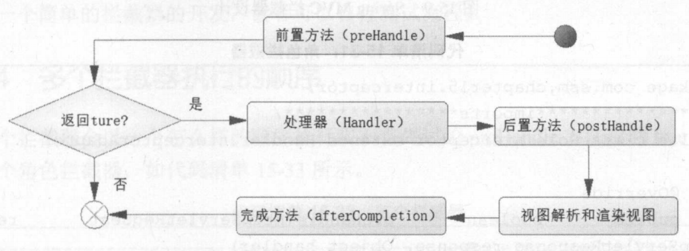
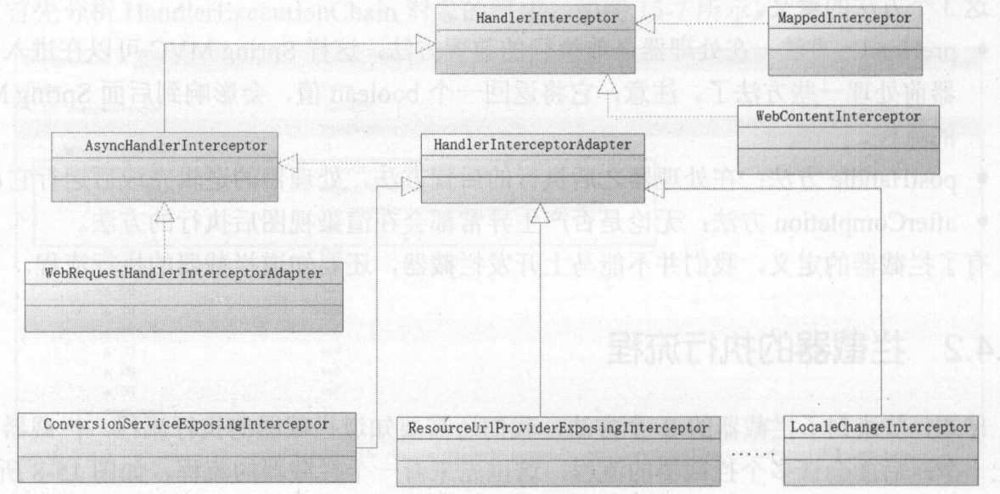
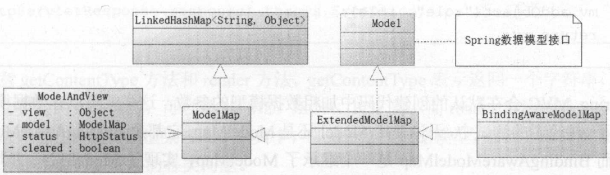
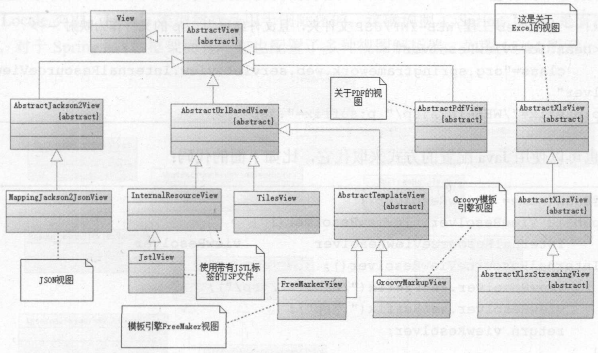
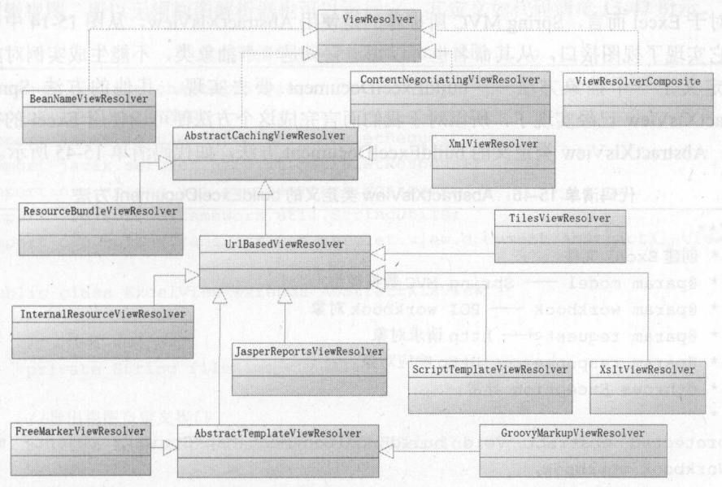

&nbsp;

<!-- more -->

<!-- toc -->

&nbsp;

[toc]

&nbsp;

# 1. 控制器接收请求参数

**Parameter。**

Spring MVC提供诸多注解用于获取参数，以避免繁琐的Servlet API。

建立一个接收各类参数的控制器ParamsController

```java
@Controller
@RequestMapping("params")
public class ParamsController {}
```

随后通过各种方法演示接收各类参数。

另外建立一个页面，内有书籍表单：

```jsp
<%@ page contentType="text/html;charset=UTF-8" language="java" %>
<html>
<head>
    <title>书籍表单</title>
    <script src="https://code.jquery.com/jquery-3.2.0.js"></script>
</head>
<body>
    <form id="form" action="./params/commonParams">
        <table>
            <tr>
                <td>书籍编号</td>
                <td><input id="bookId" name="bookId" value=""></td>
            </tr>
            <tr>
                <td>书籍名称</td>
                <td><input id="bookTitle" name="bookTitle"></td>
            </tr>
            <tr>
                <td></td>
                <td align="right"><input type="submit" value="提交"></td>
            </tr>
        </table>
    </form>
</body>
</html>
```

&nbsp;

## 1.1 接收普通请求参数

若方法参数名称和HTTP的保存一致，那么无需注解也可获取。

在ParamsController中添加方法：

```java
@RequestMapping("/commonParams")
public ModelAndView commonParams (String bookId, String bookTitle) {
    System.out.println("bookId: " + bookId);
    System.out.println("bookTitle: " + bookTitle);
    ModelAndView mv = new ModelAndView("index");
    return mv;
}
```

但若参数过多，则此法不便，改用POJO管理参数。不用注解的情况下MVC也有映射POJO的能力。可新建类BookParams，内含表单具有的各项参数，且POJO属性和HTTP请求的参数一一对应；

```java
public class BookParams {
    private String bookId;
    private String bookTitle;
    // setter getter
}
```

随后在控制器中新增方法：

```java
@RequestMapping("/commonParamsPojo")
public ModelAndView commonParamsPojo (BookParams bookParams) {
    System.out.println("bookId: " + bookParams.getBookId());
    System.out.println("bookTitle: " + bookParams.getBookTitle());
    ModelAndView mv = new ModelAndView("index");
    return mv;
}
```

此时还需更改JSP代码中的action `<form id="form" action="./params/commonParamsPojo">`

&nbsp;

## 1.2 @RequestParam获取参数

以上方法要求前后端对参数命名一致，则不需注解即可获取参数。不一致时可采用@RequestParam解决。

如将JSP页面参数name属性修改 `<td><input id="bookId" name="book_id" value=""></td>`，就无法完成自动对应。此时可使用@RequestParam：

```java
@RequestMapping("/requestParam")
public ModelAndView requestParam (@RequestParam("book_id") String bookId,
                                  @RequestParam("book_title") String bookTitle) {
    System.out.println("requestParam");
    System.out.println("bookId: " + bookId);
    System.out.println("bookTitle: " + bookTitle);
    ModelAndView mv = new ModelAndView("index");
    return mv;
}
```

本注解有两个可配置项：

* value：即参数前端名称
* required：默认true，即被标注参数不能为空

&nbsp;

## 1.3 使用URL传递参数

符合RESTul风格，在业务简单的应用中比较常见。

如`/params/getBook/001`，URL中的001就是参数，代表书籍编号。自然这种方法与GET匹配。

本例中使用到@PathVariable注解，并返回打印出JSON数据。

```java
@Autowired
BookService bookService;
@RequestMapping("/getBook/{id}")
public ModelAndView pathVariable (@PathVariable("id") String id) {
    Book book = bookService.getBook(id);
    ModelAndView mv = new ModelAndView();
    mv.addObject(book);
    mv.setView(new MappingJackson2JsonView());
    return mv;
}
```

@PathVariable允许对应参数为空。

&nbsp;

## 1.4 传递JSON参数

本例中，假设需要分页相关参数（开始行start和限制返回大小limit），则连同书籍两参数共四个参数，分给两个POJO（BookParams和PageParams）。

```java
public class PageParams {
    private int start;
    private int limit;
    // g s
}
```

此时需要在BookParams中新增一个属性PageParams，以实现两个POJO的传递：

`private PageParams pageParams;` （getter setter）

随后向JSP写入一段JS代码模拟发送过程：

```jsp
<script>
    $(document).ready(function() {
       var data = {
           bookTitle: 'title1',
           bookId: 'id1',
           pageParams: {
               start: 1,
               limit: 20
           }
       }
       $.post({
           url: "./params/findRoles",
           contentType: "application/json",
           data: JSON.stringify(data),
           success: function(result){}
       });
    });
</script>
```

此时即可使用@RequestBody接收参数：

```java
@RequestMapping("/findBooks")
public ModelAndView findBooks (@RequestBody BookParams bookParams) {}
```

&nbsp;

## 1.5 接收列表数据的表单序列化

当需要传递集合、数组时：

使用JS模拟：

```js
$(document).ready(function() {
    var idList = [1, 2, 3];
    $.post({
        url: "./params/deleteBooks",
        data: JSON.stringify(idList),
        contentType: "application/json",
        success: function (result) {}
    });
});
```

```java
@RequestMapping("/deleteBooks")
public ModelAndView deleteBooks (@RequestBody List<Integer> idList) {
    ModelAndView mv = new ModelAndView();
    // delete books
    mv.addObject("res", 123);
    mv.setView(new MappingJackson2JsonView());
    return mv;
}
```

如此就接受到了前端的数组，并转化为List集合（当然也可Integer[]数组）。

对于前端复杂的对象数组也可以：

```js
var bookList = {
    {bookId: '001', bookTitle: 'title1'},
    {bookId: '002', bookTitle: 'title2'}
};
$.post({
    url: "./params/deleteBooks",
    data: JSON.stringify(bookList),
    contentType: "application/json",
    success: function (result) {}
});
```

`@RequestBody List<BookParams> bookList`

但需注意，前端JSON数据需要转化为字符串才能传递到后台。

表单序列化方法大致相同：

```js
$(document).ready(function() {
    $("#commit").click(function() {
       var str = $("form").serialize();
        $.post({
            url: "./params/commonParamsPojo2",
            data: $("form").serialize(),
            success: function(result) {}
        });
    });
});
```

将表单序列化后，数据将以`bookId=xxx&&bookTitle=xxx`的形式传递，故此时后台接收参数只需按照最简单的常规方式即可，即不使用注解，参数名和前端属性名一致即可。

&nbsp;

# 2. 重定向

## 2.1 简单数据的传递

如有一个方法showBookJsonInfo内，能将传入的书籍信息，以JSON视图形式返回展示。现需插入书籍后，将信息展示，则可将插入放在一个方法内，使用重定向将信息传个showBookJsonInfo展示。

```java
@RequestMapping("/showBookJsonInfo")
public ModelAndView showBookJsonInfo (String id, String title) {
    ModelAndView mv = new ModelAndView();
    mv.setView(new MappingJackson2JsonView());
    mv.addObject("id", id);
    mv.addObject("title", title);
    return mv;
}

@RequestMapping("/addBook")
// model是重定向数据模型，MVC会自动初始化
public String addBook (Model model, String title) {
    Book book = new Book();
    book.setTitle(title);
    // 主键回填
    bookService.insertBook(book);
    // 绑定重定向数据
    model.addAttribute("bookId", book.getId());
    model.addAttribute("bookTitle", title);
    return "redirect:./showBookJsonInfo";
}
```

Spring MVC约定，字符串带有redirect时就是需要重定向。当然还可以通过返回视图来完成重定向。

```java
@RequestMapping("addBook2")
// ModelAndView会自动初始化
public ModelAndView addBook2 (ModelAndView mv, String bookTitle) {
    var book = new Book();
    // insert
    mv.addObject("bookId", book.getId());
    mv.addObject("bookTitle", bookTitle);
    mv.setViewName("redirect:./showBookJsonInfo");
    return mv;
}
```

以上方法，访问`/params/addBook?bookId=1&bookTitle=2`时，会自动重定向到`/params/showBookJsonInfo?bookId=1&bookTitle=2`，可见在重定向时会将属性以参数形式并入字符串传递。

&nbsp;

## 2.2 POJO传递

功能同上，一方法展示POJO的JSON

```java
@RequestMapping("/showBookJsonInfo2")
public ModelAndView showBookJsonInfo2 (Book book) {
    ModelAndView mv = new ModelAndView();
    mv.setView(new MappingJackson2JsonView());
    mv.addObject("book", book);
    return mv;
}
```

但要通过重定向将POJO传递给它就比较复杂，URL在重定向过程中不能传递对象，HTTP重定向参数是字符串形式。此时要使用MVC提供的flash属性和RedirectAttributes数据模型：

```java
@RequestMapping("/addBook3")
// RedirectAttributes会自动初始化
public String addBook3 (RedirectAttributes ra, Book book) {
    // insert
    ra.addFlashAttribute("book", book);
    return "redirect:./showBookJsonInfo2";
}
```

原理：使用addFlashAttribute后，MVC将数据保存到Session中，重定向后再清除。

&nbsp;

# 3. 保存并获取属性参数

即Java EE的request、session对象的**attribute**。Spring MVC中主要通过以下3个注解代替：

* @RequestAttribute：获取request的属性值，用来传递给控制器的参数
* @SessionAttribute：获取Session的属性值，用来传递给控制器的参数
* @SessionAttributes：设置字符串数组，对应数据模型的键值对，保存在Session中

没有RequestAttributes，在request范围中MVC更希望使用数据模型（数据模型本身就是请求的生命周期）。

## 3.1 @RequestAttribute

从HTTP的request对象中取出请求属性。

默认不能为空，可用required设置。

本例，使用AttributeController完成属性相关控制。

方法reqAttribute接收request中的属性。

```java
@Controller
@RequestMapping("/attribute")
public class AttributeController {
    @Autowired
    private BookService bookService = null;

    @RequestMapping("/requestAttribute")
    public ModelAndView reqAttribute (@RequestAttribute("id") String id) {
        System.out.println("requestAttribute");
        System.out.println(id);
        ModelAndView mv = new ModelAndView();
        Book book = bookService.getBook(id);
        mv.addObject("book", book);
        mv.setView(new MappingJackson2JsonView());
        return mv;
    }
}
```

新建一个JSP，用于测试属性：

```jsp
<%@ page contentType="text/html;charset=UTF-8" language="java" %>
<html>
<head>
    <title>attribute</title>
</head>
<body>
    <%
        request.setAttribute("id", "001");    
        request.getRequestDispatcher("./attribute/requestAttribute")
        .forward(request, response);
    %>
</body>
</html>
```

&nbsp;

## 3.2 @SessionAttribute和@SessionAttributes

1. @SessionAttributes：

	1. 设置Session的属性
	2. 只能注解在类，注解后，MVC执行完控制器逻辑后，将数据模型中对应的属性名或属性类型保存到HTTP的Session对象中
	3. 首先在类上注解`@SessionAttribute(names={"id"}, types={Book.class})`，随后`mv.addObject("id", 123)` 或 `mv.addObject("newbook", book_obj)`，即addObject时，如要加入Session，则要满足类上注解之一，要么前一个参数属于names，要么后一个参数属于types
	4. 在JSP中即可通过Java代码`session.getAttribute("newbook")`以键获取值

2. @SessionAttribute：

	1. 读取Session的属性

	2. 可现在JSP中用Java代码，设置一个属性后跳转到控制器

		```java
		session.setAttribute("id", "002");
		response.sendRedirect("./...");
		```

		控制器方法参数中：`(@SessionAttribute("id") String id)`

	3. 默认不为空，required修改

&nbsp;

## 3.3 @CookieValue和@RequestHeader

从Cookie和HTTP请求头部获取信息，用法相似。

加在控制器方法参数中：

```java
@RequestMapping("/...")
public String testHeaderAndCookie (
	@RequestHeader(value="User-Agent", required=false, defaultValue="attribute") String userAgent,
    @CookieValue(value="JSESSIONID", reqired=true, defaultValue="MyJsessionId") String jsessionId) {
    ...
}
```

&nbsp;

# 4. 拦截器

拦截器可以在进入处理器之前/处理器完成后进行一些操作。如前所说，MVC启动期间通过@RequestMapping解析URI和处理器的对应关系，运行时通过请求找到对应的HandlerMapping，构建HandlerExecutionChain对象，执行的责任链对象。这个责任链对象中的handler只想了控制器对应的方法和拦截器。以下介绍Spring4中的拦截器。

## 4.1 拦截器定义

需实现接口HandlerInterceptor，内含3个方法：

* `boolean preHandle(HttpServletRequest, HttpServletResponse, Object handler) throws Exception`  在处理器之前执行的方法，返回的boolean会影响后面MVC流程
* `void postHandle(HttpServletRequest, HttpServletResponse, Object handler, ModelAndView) throws Exception` 在处理器之后执行的方法
* `void afterCompletion(HttpServletRequest, HttpServletResponse, Object handler, Exception ex) throws Exception` 无论是否产生异常都会在渲染视图后执行的方法

&nbsp;

## 4.2 拦截器执行流程



&nbsp;

## 4.3 拦截器开发

需要实现HandlerInterceptor接口，但Spring已开发了一些自带的拦截器。



当XML加入`<mvc:annotation-driven>`或Java配置加入注解@EnableWebMvc时，系统会初始化拦截器ConversionServiceExposingInterceptor，是一个一开始就被MVC默认加载的拦截器，主要作用是根据配置在控制器上的注解来完成对应的功能。

另有HandlerInterceptorAdapter拦截器，若只想实现拦截器部分方法，只要继承它复写即可。

先Java定义拦截器类，随后在MVC配置文件（如dispatcher-servlet.xml）中加入配置：mapping指定要拦截的请求，class指定使用的拦截器

```xml
<mvc:interceptors>
    <mvc:interceptor>
        <mvc:mapping path="/..."/>
        <bean class="xxx.MyInterceptor"/>                    
    </mvc:interceptor>
</mvc:interceptors>
```

&nbsp;

## 4.4 多个拦截器执行顺序

与责任链模式相同。

pre全部true时：pre方法按配置顺序执行，post和after方法按配置逆序执行，如： pre1 pre2  控制器逻辑 post2 post1 after2 after1

pre有false时：false的pre后的pre不再执行，控制器和所有post不再执行，执行过pre的拦截器的after逆序执行，如：pre1 pre2(false) after1

&nbsp;

# 5. 验证表单

校验数据正确性。录入问题通过注解即可校验，逻辑错误需要Spring提供的验证器Validator。

所有验证都要先注册验证器，验证器MVC自动加载。需要validation–api（注解的定义）、hibernate-validator（通过hibernate检验规则）、classmate、jboss-logging（运行依赖）包。

## 5.1 使用JSR 303注解校验

Spring对Bean的功能检验，@Valid标明。javax.validation.constraints.\*中定义了一系列JSR 303规范的注解，可用于类中属性，实现一些简单的校验：

| 注解                       | 含义                       |
| -------------------------- | -------------------------- |
| @Null                      | 必须为null                 |
| @NotNull                   | 必须不为null               |
| @AssertTrue                | 必须为true                 |
| @AssertFalse               | 必须为false                |
| @Min(value)                | 必须是大于等于指定值的数字 |
| @Max(value)                | 必须是小于等于指定值的数字 |
| @DecimalMin(value)         | 必须是大于等于指定值的数字 |
| @DecimalMax(value)         | 必须是小于等于指定值的数字 |
| @Size(max, min)            | 必须在此区间               |
| @Digits(integer, fraction) | 必须是在可接受范围的数字   |
| @Past                      | 必须是过去的日期           |
| @Future                    | 必须是将来的日期           |
| @Pattern(value)            | 必须符合指定正则           |

可建立表单POJO Transaction，接收表单信息，可对每个属性加入注解，此处补充两点：

1. @DateTimeFormat(pattern=“yyyy-MM-dd”) 转换日期格式，加给Date属性
2. @Pattern(regexp=“…”, message=“…”) 正则与自定义消息提示

在控制器中：

```java
@RequestMapping("/...")
public ModelAndView annotationValidate(@Valid Transaction trans, Errors errors) {
    if (errors.hasErrors()) {
        List<FieldError> errorList = errors.getFieldErrors();
        for (FieldError error : errorList) {
            sout(error.getField() + error.getDefaultMessage());
        }
    }
    ModelAndView mv = new ModelAndView("index");
    return mv;
}
```

@Valid表示Transaction这个Bean将会被校验，Errors是JSR 303规范检验后保存错误信息的对象。通过以上代码可在后台校验表单并得到message，至于如何渲染到原表单，就是渲染视图的内容了。

&nbsp;

## 5.2 使用验证器校验

复杂的业务校验，需要通过实现Validator接口实现，将在进入控制器逻辑之前对参数检验。

接口包含两个方法：

* boolean supports(Class<?> class); 判断当前验证器是否用于检验clazz类型的POJO，若true则启动检验
* void validate(Object target, Errors errors)：检验POJO合法性

验证器被Spring注册到验证器列表，便可提供给各个控制器去定义，通过supports方法判断是否启用，通过validate检验。

使用时，首先创建验证器类，实现Validator接口：

```java
public class TransactionValidator implements Validator {
    @Override
    public boolean supports(Class<?> clazz) {
        return Transaction.class.equals(clazz);
    }
    
    @Override
    public void validate (Object target, Errors errors) {
        Transaction trans = (Transaction) target;
        // 逻辑判断，加入错误信息
        errors.rejectValue("某个属性", null, "message");
    }
}
```

随后需要在Controller中显式地将验证器和控制器绑定起来：

```java
@InitBinder
public void initBinder (DataBinder binder) {
    binder.setValidator(new TransactionValidator());
}

@RequestMapping("/...")
...
```

JSR 303注解和验证器两种方法不能同时使用。

&nbsp;

# 6. 数据模型

## 6.1 数据模型关系

控制器获取数据后，会装载数据到数据模型和视图中，将视图名称转发到视图解析器，得到最终视图，将数据模型渲染到视图中。



前例中一直用ModelAndView定义视图类型，也用来加载数据模型。它由一个名为ModelMap的属性model，继承自LinkedHashMap<String,Object>。Spring还创建了ExtendedModelMap进一步定义数据模型功能，实现了数据模型定义的Model接口，派生了数据绑定类BindingAwareModelMap。

在控制器方法中，可以把ModelAndView、Model、ModelMap作为参数，MVC运行时会自动初始化，故而可以选择ModelMap或Model作为数据模型。实际上这个过程是MVC创建一个BindingAwareModelMap实例，在Model和ModelMap之间强制转换。ModelAndView初始化后，model属性为空，调用它增加数据模型方法后，会自动创建一个ModelMap实例，用以保存数据模型。

&nbsp;

## 6.2 使用

```java
@RequestMapping("/getBookByModelMap")
public ModelAndView getBookByModelMap (@RequestParam("id") String id, ModelMap modelMap) {
    Book book = bookService.getBook(id);
    ModelAndView mv = new ModelAndView("bookDetails");
    modelMap.addAttribute("book", book);
    return mv;
}

@RequestMapping("/getBookByModel")
public ModelAndView getBookByModel (@RequestParam("id") String id, Model model) {
    Book book = bookService.getBook(id);
    ModelAndView mv = new ModelAndView("bookDetails");
    model.addAttribute("book", book);
    return mv;
}

@RequestMapping("/getBookByMv")
public ModelAndView getBookByMv (@RequestParam("id") String id, ModelAndView mv) {
    Book book = bookService.getBook(id);
    mv.setViewName("bookDetails");
    mv.addObject("book", book);
    return mv;
}
```

在getBookByModel和getBookByModelMap中，都没有把数据模型绑定给视图和模型，这一步是MVC在完成控制器逻辑后自动进行的，无需代码显式绑定。

&nbsp;

# 7. 视图和视图解析器

视图是展示给用户的内容。要先通过控制器得到数据模型。若是非逻辑视图，则不经过视图解析器定位视图，而是直接渲染数据模型即可。逻辑视图就需要进一步解析，以定位真实视图。这就是视图解析器的作用。视图则是把从控制器查询回来的数据模型进行渲染与显示。

## 7.1 视图

MVC中定义了多种视图，都满足了视图的要求——实现接口View，有以下字段：

* RESPOSNE_VARIABLES 响应状态属性
* PATH_VARIABLES 数据模型下取出变量路径
* SELECTED_CONTENT_TYPE 选择相应内容类型
* String getContentType() 响应客户端类型
* void render(Map<String, ?> model, HttpServletRequest, HttpServletResponse) throws Exception() 渲染方法，model是数据模型

当控制器返回ModelAndView时，视图解析器解析，将数据模型传递给render方法渲染视图。MVC中视图类很多，JSTL视图JstlView、JSON视图MappingJacksonJsonView、PDF视图AbstractPdfView、甚至还有报表AbstractJasperReportSingleFormatView等等。



视图又分逻辑视图和非逻辑视图：

* 如JSON视图就是非逻辑视图，目的就是将数据模型转换为JSON视图，无需对视图名字进行解析。`mv.setView(new MappingJackson2JsonView())`

* InternalResourceView是逻辑视图，就需要视图解析器了。

视图解析器配置：

* XML形式：dispatcher-servlet.xml中，以下代码表示要在/WEB-INF/JSP文件夹下寻找.jsp格式文件作为映射

	```xml
	<!--    视图解析器-->
	<bean id="viewResolver" 
	      class="org.springframework.web.servlet.view.InternalResourceViewResolver"
	      p:prefix="/WEB-INF/jsp/" p:suffix=".jsp"/>
	```

* Java配置方式：

	```java
	@Bean(name="viewResolver")
	public ViewResolver initViewResolver() {
	    InternalResourceViewResolver viewResolver = new InternalResourceViewResolver();
	    viewResolver.setPrefix("/WEB-INF/jsp/");
	    viewResolver.setSuffix(".jsp");
	    return viewResolver;
	}
	```

不论何种方式配置，都是在创建一个视图解析器，通过前后缀加上视图名称就能找到JSP文件，把数据模型渲染到JSP中。

&nbsp;

## 7.2 视图解析器

对于逻辑视图，需要解析器将视图名称转换为逻辑视图，如上配置的InternalResourceView，配置后就会加载到MVC的视图解析器列表中，当返回ModelAndView时，MVC就会在视图解析器列表中遍历，找到对应解析器解析。

视图解析器接口：ViewResolver，只有一个方法 `View resolveViewName(String viewName, Locale locale)`。

各种视图解析器：



有时控制器返回的并非ModelAndView，而是字符串，也能够渲染视图，因为视图解析器生成了对应的视图，如下：

```java
@RequestMapping("/...")
public String index(@RequestParam("id") String id, ModelMap model) {
    Book book = bookservice.getBook(id);
    model.addAttribute("book", book);
    return "bookDetails";
}
```

&nbsp;

## 7.3 实例：Excel视图的使用

对于导出Excel，MVC推荐使用AbstractXlsView，需要实现buildExcelDocument方法 

`protected abstract void buildExcelDocument (Map<String,Object> model, Workbook workbook, HttpServletRequest, HttpServletResponse)`

方法主要任务是创建一个Workbook，用到POI的API，需要自行下载导入。

实现功能时，本例中先定义一个接口，让开发者自定义生成Excel的规则：

```java
public interface ExcelExportService {
    public void makeWorkBook(Map<String, Object> model, Workbook workbook);
}
```

还需视图类：ExcelView继承AbstractXlsView

```java
public class ExcelView extends AbstractXlsView {
    private String filename = null;	// 导出文件的名称
    private ExcelExportService excelExportService = null;
    public ExcelView(ExcelExportService excelExportService) {
        this.excelExportService = excelExportService;
    }
    public ExcelView(ExcelExportService service, String viewName) {
        this.setBeanName(viewName);
        this.excelExportService = service;
    }

    @Override
    protected void buildExcelDocument(Map<String, Object> map, Workbook workbook, javax.servlet.http.HttpServletRequest httpServletRequest, javax.servlet.http.HttpServletResponse httpServletResponse) throws Exception {
        if (excelExportService == null) {
            throw new RuntimeException("导出服务接口为空");
        }
        if (!StringUtils.isEmptyOrWhitespaceOnly(filename)) {
            String reqCharset = httpServletRequest.getCharacterEncoding();
            reqCharset = reqCharset == null? "UTF-8":reqCharset;
            filename = new String(filename.getBytes(reqCharset), "ISO8859-1");
            httpServletResponse.setHeader("Content-disposition", "attachment;filename="+filename);
            excelExportService.makeWorkBook(map, workbook);
        }
    }
    //getter setter
}
```

使用：

```java
@RequestMapping("/export")
public ModelAndView export() {
    ModelAndView mv = new ModelAndView();
    ExcelView ev = new ExcelView(excelExportService());
    ev.setFilename("所有书籍.xlsx");
    BookParams bookParams = new BookParams();
    List<Book> bookList = bookService.getBooks(bookParams);
    mv.addObject("bookList", bookList);
    mv.setView(ev);
    return mv;
}

@SuppressWarnings({"unchecked"})
private ExcelExportService excelExportService() {
    return (Map<String, Object> model, Workbook workbook) -> {
        List<Book> bookList = (List<Book>) model.get("bookList");
        Sheet sheet = workbook.createSheet("所有书籍");
        Row title = sheet.createRow(0);
        title.createCell(0).setCellValue("编号");
        title.createCell(1).setCellValue("名称");
        for (int i = 0; i < bookList.size(); i++) {
            Book book = bookList.get(i);
            int rowIdx = i+ 1;
            Row row = sheet.createRow(rowIdx);
            row.createCell(0).setCellValue(book.getId());
            row.createCell(1).setCellValue(book.getTitle());
        }
    };
}
```

&nbsp;

# 8. 上传文件

Spring MVC的文件上传通过MultipartResolver接口处理，有两个实现类：

* CommonsMultipartResolver：依赖于Apache的jakarta Common FileUpload项目解析Multipart请求，可以在Spring各版本使用，依赖于第三方包
* StandardServletMultipartResolver：Spring 3.1后出现，依赖于Servlet 3.0或更高版本，不过不依赖于第三方包

不论用哪个方式，都要配置一个MultipartResolver。

## 8.1 StandardServletMultipartResolver

配置同样有两种方式：XML和Java。

Java注解：Bean name是约定好的，不可修改。

```java
@Bean("multipartResolver")
public MultipartResolver initMultipartResolver() {
    return new StandardServletMultipartResolver();
}
```

如需进行一些上传相关设置，就要在MVC初始化器中设置。该初始化器是继承了AbstractAnnotationConfigDispatcherServletInitializer，其中customizeRegistration方法用于初始化DispatcherServlet设置的方法，是在Servlet 3.0及以上版本实现的，通过它配置文件上传的一些属性。

```java
@Override
protected void customizeRegistration(ServletRegistration.Dynamic registration) {
    // 上传路径
    String filepath = "e:/mvc/uploads";
    // 5MB
    Long singleMax = (long) (5 * Math.pow(2, 20));
    // 10MB
    Long totalMax = (long) (10 * Math.pow(2, 20));
    // 配置MultipartResolver
    registration.setMultipartConfig(new MultipartConfigElement(filepath, singleMax, totalMax, 0));
}
```

XML配置：在dweb.xml的DispatcherServlet位置配置，随后生成一个StandardServletMultipartResolver即可

```xml
<servlet>
    <servlet-name>dispatcher</servlet-name>
    <servlet-class>org.springframework.web.servlet.DispatcherServlet</servlet-class>
    <load-on-startup>2</load-on-startup>
    
<!--        MultipartResolver-->
    <multipart-config>
        <location>e:/mvc/uploads</location>
        <max-file-size>5242800</max-file-size>
        <max-request-size>10485760</max-request-size>
        <file-size-threshold>0</file-size-threshold>
    </multipart-config>
</servlet>
```

&nbsp;

## 8.2 CommonsMultipartResolver

Spring或Servlet版本过低时只能使用此法。

bean name约定，不可改变。

```java
@Bean(name="multipartResolver")
public MultipartResolver initCommonsMultipartResolver() {
    String filepath = "e:/mvc/uploads";
    // 5MB
    Long singleMax = (long) (5 * Math.pow(2, 20));
    // 10MB
    Long totalMax = (long) (10 * Math.pow(2, 20));
    CommonsMultipartResolver multipartResolver = new CommonsMultipartResolver();
    multipartResolver.setMaxUploadSizePerFile(singleMax);
    multipartResolver.setMaxUploadSize(totalMax);
    try {
        multipartResolver.setUploadTempDir(new FileSystemResource(filepath));
    } catch (IOException e) {
        e.printStackTrace();
    }
    return multipartResolver;
}
```

XML方式仿照上文，暂不列出。

&nbsp;

## 8.3 MVC中文件上传原理

MVC中，对MultipartResolver解析的调度是通过DispatcherServlet进行的。首先判定请求是否是一种`enctype="multipart/*"`的类型，若是且存在multipartResolver的Bean，那么就把HttpServletRequest请求转换为MultipartHttpServletRequest请求对象。后者是一个Spring MVC自定义的接口，扩展了HttpServletRequest和文件操作接口MultipartRequest。MultipartHttpServletRequest接口有一抽象实现类AbstractMultipartHttpServletRequest，派生两个实现类DefaultMultipartHttpServletRequest和StandardMultipartHttpServletRequest。此外，文件请求还会被转换成MultipartFile对象，进一步增强操作文件能力。

&nbsp;

## 8.4 提交上传文件表单

即上传文件。

```jsp
<form method="post" action="./file/upload" enctype="multipart/form-data">
    <input type="file" name="file" value="选择上传文件"/>
    <input type="submit" value="提交"/>
</form>
```

FileController类，处理文件相关请求：

```java
@Controller
@RequestMapping("/file")
public class FileController {
    @RequestMapping("/upload")
    public ModelAndView upload (HttpServletRequest req) {
        // 进行转换
        MultipartHttpServletRequest mhsr = (MultipartHttpServletRequest)req;
        // 获得请求上传的文件
        MultipartFile file = mhsr.getFile("file");
        // 设置视图
        ModelAndView mv = new ModelAndView();
        mv.setView(new MappingJackson2JsonView());
        // 获取原始文件名
        String name = file.getOriginalFilename();
        // 目标文件
        File dest = new File(name);
        try {
            file.transferTo(dest);
            mv.addObject("success", true);
            mv.addObject("msg", "上传成功");
        } catch (IllegalStateException | IOException e) {
            mv.addObject("success", false);
            mv.addObject("msg", "上传失败");
            e.printStackTrace();
        }
        return mv;
    }
}
```

不过本法使用了HttpServletRequest，用其方法作为参数时造成API入侵，可改为MultipartFile或Part类对象。

MultipartFile是Spring MVC的类，Part是Servlet的类。

```java
// MultipartFile
@RequestMapping("/uploadMultipartFile")
public ModelAndView uploadMultipartFile (MultipartFile file) {
    ModelAndView mv = new ModelAndView();
    mv.setView(new MappingJackson2JsonView());
    String name = file.getOriginalFilename();
    file.getContentType();
    File dest = new File(name);
     try {
         file.transferTo(dest);
         mv.addObject("success", true);
         mv.addObject("msg", "上传成功");
     } catch (IllegalStateException | IOException e) {
         mv.addObject("success", false);
         mv.addObject("msg", "上传失败");
         e.printStackTrace();
     }
    return mv;
}

// Part
@RequestMapping("/uploadPart")
public ModelAndView (Part file) {
    ModelAndView mv = new ModelAndView();
    mv.setView(new MappingJackson2JsonView());
    String name = file.getSubmittedFileName();
    File dest = new File(name);
    try {
        file.write("e:/mvc/uploads/" + name);
        mv.addObject("success", true);
        mv.addObject("msg", "上传成功");
    } catch (IllegalStateException | IOException e) {
        mv.addObject("success", false);
        mv.addObject("msg", "上传失败");
        e.printStackTrace();
    }
    return mv;
}
```

&nbsp;


