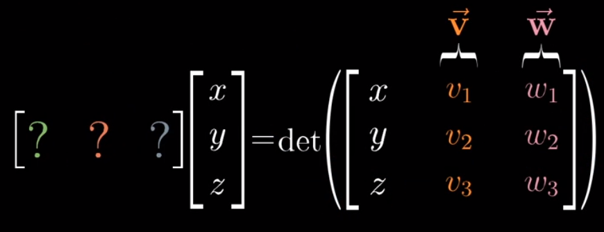
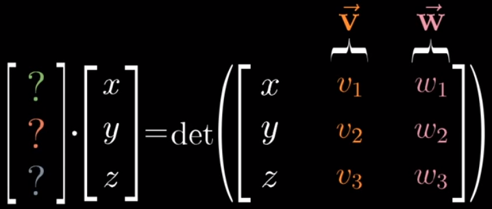
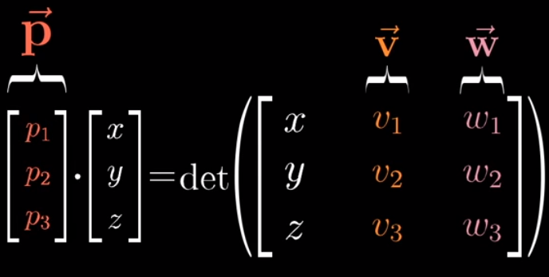
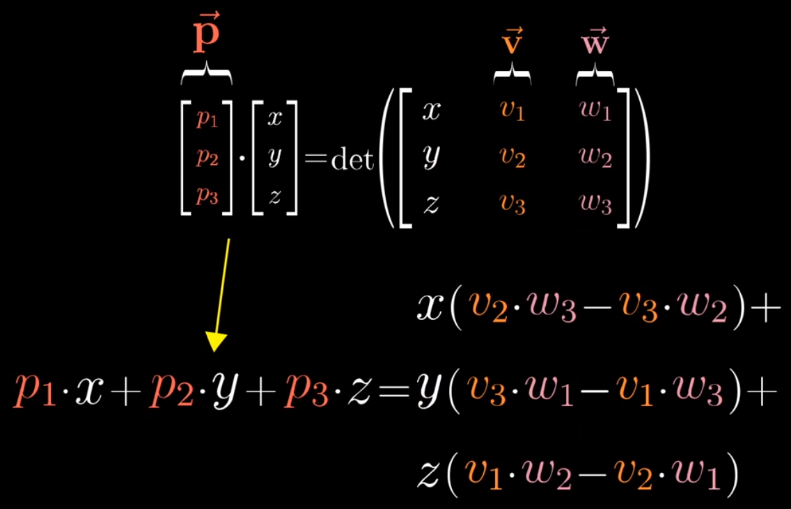
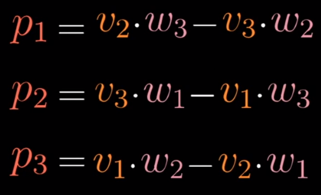
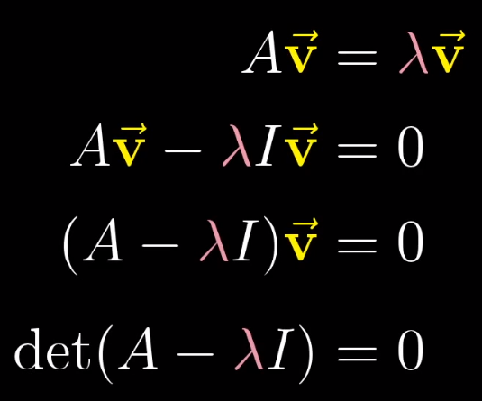

> 计算的目的不在于数字本身，而在于洞察其背后的意义。 ——理查德·哈明

[3B1B视频](https://www.bilibili.com/video/BV1ys411472E)

 

<!--more-->

<!-- toc -->

 

# 向量与基向量

二维空间中，一个向量，例如`[3,4]`，表示$3\hat{x} + 4\hat{y}$，$\hat{x}$表示基向量。即，**一个向量表示对基向量操作的结果。**知道基向量后，通过向量的数字，即可确定向量。 :smile:

同时，数乘向量、向量加法这两个向量最基本的操作，也可由对基向量数乘、相加去理解。
$$
\begin{align}
\left[
	\begin{matrix}
		3\\
		4
	\end{matrix}
\right]
&=
3 *
\left[
	\begin{matrix}
		1\\
		0
	\end{matrix}
\right]
+ 4 *
\left[
	\begin{matrix}
		0\\
		1
	\end{matrix}
\right]
\\
&=
\left[
	\begin{matrix}
		3\\
		0
	\end{matrix}
\right]
+
\left[
	\begin{matrix}
		0\\
		4
	\end{matrix}
\right]
\\
&=
\left[
	\begin{matrix}
		3\\
		4
	\end{matrix}
\right]
\end{align}
$$

 

# 空间与线性相关

* 由基向量的各种组合，即可得到各种向量，这些向量的集合可以理解为空间
* 二维空间内，任意两个不同方向的向量，均可看做基向量，从而得到空间内的所有向量；一旦两个基向量方向相同/相反，即重叠，则其能组合得到的向量集合，将从一个二维平面降维至一条线，可称两条基向量线性相关；一旦两个基向量是零向量，则退化为一点
* 三维空间中，两条基向量可以确定一个过原点平面，若第三条基向量不在这个平面上，即可平移这个平面得到整个三维空间；但如果基向量3在平面上，则无法组合出新的向量，此时称基向量3与1和2线性相关（可由1和2组合得到）
* 但一般称坐标轴上的单位向量为基向量

 

# 线性变换

* 对空间（中所有向量）的变换
* 与函数意义相似，输入向量，进行变换，输出向量
* 线性：任意直线变换后仍为直线，且原点保持固定 或 保持可加性与成比例
* 线性变换后的空间，基向量发生了变化，但是**只要知道变化后的基向量，就能完全掌握新的空间**。对于二维空间，有两个基向量，这两个向量4个数字，就能确定新的空间，这就引出了矩阵。

 

# 矩阵

* 将新的基向量写在一起，即可表示进行的线性变化。下面这个矩阵中，$\hat{x}=[1,3],\hat{y}=[2,4]$，表示进行线性变换后，两个基向量的变换。

$$
\left[
	\begin{matrix}
		1 & 2\\
		3 & 4
	\end{matrix}
\right]
$$

* 又由于一组基向量即可确定一个空间，所以利用这个矩阵，即可求得线性变换后的向量。
* 如下，乘号左边为线性变换矩阵，右边为原向量，结合矩阵是基向量集合，与向量是对基向量的操作，可以列出下式。

$$
\left[
	\begin{matrix}
		1 & 2\\
		3 & 4
	\end{matrix}
\right]
*
\left[
	\begin{matrix}
		2\\
		-1
	\end{matrix}
\right]
=
2
\left[
	\begin{matrix}
		1\\
		3
	\end{matrix}
\right]
+ -1
\left[
	\begin{matrix}
		2\\
		4
	\end{matrix}
\right]
=
\left[
	\begin{matrix}
		0\\
		2
	\end{matrix}
\right]
$$

 

# 矩阵乘法与复合线性变换

* 由上可知，矩阵是与线性变换密切相关的。每一个矩阵都可代表一个线性变换。
* 当出现多次（复合）线性变换时，既可以用一个矩阵直接表示最初到最终的变化结果，也可以用两个矩阵表示对原向量先后进行变换。
* 此处有一点需强调，若用两个矩阵先后表示，每个矩阵中的基向量，也应表示为对原始基向量的变换。
* 如何求出复合矩阵？（矩阵乘法如何计算？）我们知道矩阵可理解为一次线性变换；同时矩阵也表示基向量的集合；复合矩阵中是经过两次线性变换后得到的基向量。整合这三个概念，可知：矩阵乘法$ A*B=C $，可以理解为，**对B中每个基向量，进行A的线性变换操作，从而得到C中的每个基向量**。

$$
\begin{align}
\left[
	\begin{matrix}
		1 & 1\\
		0 & 1
	\end{matrix}
\right]
*
\left[
	\begin{matrix}
		0 & -1\\
		1 & 0
	\end{matrix}
\right]

&=
\left[
	\left[
	\begin{matrix}
		1 & 1\\
		0 & 1
	\end{matrix}
\right]
* 
\left[
	\begin{matrix}
		0\\
		1
	\end{matrix}
\right]

\left[
	\begin{matrix}
		1 & 1\\
		0 & 1
	\end{matrix}
\right]
* 
\left[
	\begin{matrix}
		-1\\
		0
	\end{matrix}
\right]
\right]
\\
&=
\left[
	\begin{matrix}
		1 & -1\\
		1 & 0
	\end{matrix}
\right]
\end{align}
$$

* 先后顺序：在线性变换的矩阵×向量中，看到矩阵在左，向量在有。这与f(x)类似，映射在x左侧。那么复合矩阵中，也应是*第二步线性变换×第一步线性变换×原向量 = 复合矩阵×原向量*。这给我们的启示是**矩阵乘法中顺序不能随意调换**。

 

# 行列式

* 在线性变换中，空间有时被拉伸，有时被挤压，有时被翻转，行列式就是来衡量变换程度，即一个区域在变换前后的面积之比。当然，对于基向量框选的区域，原始面积当然为1，此时只需求出**变换后的面积**即可，这也正是行列式所代表的意义。

$$
det(
\left[
	\begin{matrix}
		3 & 2\\
		0 & 2
	\end{matrix}
\right]
)
= 
6
$$

* 行列式>0：将一个区域扩大n倍/缩小至$\frac{1}{n}$
* 行列式=0：区域面积变为0，表示空间受到降维，面变为线甚至点。这和线性相关的结果相同，所以，**矩阵行列式=0必然推出矩阵列线性相关**
* 行列式<0：空间被翻转，绝对值仍表示面积缩放（二维中的自然理解：基向量1向2靠近，空间被压缩，单位面积从1向0靠近；基向量同方向，降维，单位面积为0；基向量1到了2的另一侧，单位面积降至0以下）

 

# 逆矩阵

​    线代可用于求线性方程组的解。对于一个线性方程组（多元一次），可将其改写为$A\vec{x}=\vec{v}$形式。则$\vec{v}$可看作$\vec{x}$由线性变换A得到，$\vec{x}$通过对$\vec{v}$进行相反的线性变换就可求得。
$$
\begin{align}
2x+5y+3z &= -3\\
4x+0y+8z &= 0\\
1x+3y+0z &= 2\\
\downarrow \\
\left[
	\begin{matrix}
		2 & 5 & 3\\
		4 & 0 & 8\\
		1 & 3 & 0
	\end{matrix}
\right]
\left[
	\begin{matrix}
		x\\
		y\\
		z
	\end{matrix}
\right]
&=
\left[
	\begin{matrix}
		-3\\
		0\\
		2
	\end{matrix}
\right]

\end{align}
$$

>逆矩阵$A^{-1}$：相反的线性变换。$A^{-1}A\vec{x}=\vec{x}=A^{-1}\vec{v}$

此处需先分析原始线性变换A：是否将空间降维，即$det(A)=0?$

* 未降维：此时可以求得逆矩阵$A^{-1}$。
* 降维：无逆矩阵（无法从底维转高维）。但是解仍然可能存在（如降维至直线，但$\vec{v}$恰好在这条直线上）

 

# 列空间、秩、零空间

* 列空间：线性变换后，新的空间由矩阵中的每一列共同决定（新的基向量），所以把新的空间称为列空间
* 秩：列空间的维数（$\leq原空间维数$）
* 满秩：秩与原空间维数相同
* 零向量一定在列空间中
	* 满秩变换：仅有零向量能落在原来位置
	* 非满秩变换：一系列向量会变为零向量 
* 零空间：如上的非满秩变换情况中，变换后落在零点的向量的集合，称为零空间或核
* 当线性方程组的$\vec{v}$在列空间中时，方程组有解（？）
* 当线性方程组的$\vec{v}=[0,0]$时，零空间中的向量是方程组的所有可能解

 

# 非方阵

以上的讨论都是针对方阵，即在相同维数空间中的变换。非方阵表示在不同维度空间中的映射变换。

* 2×3矩阵：3列表示原空间有3个基向量，是三维空间；2行表示新空间中每个基向量用两个数字即可确定，是二维空间；即将3D映射至2D

$$
\left[
	\begin{matrix}
		-3 & 2 & 4\\
		0 & 1 & 5
	\end{matrix}
\right]
$$

* 3*2矩阵：2列表示原空间2个基向量，二维；3行表示新空间三维；即2D映射至3D，但仍为一平面（列空间）

$$
\left[
	\begin{matrix}
		-3 & 2\\
		0 & 1\\
		3 & 4
	\end{matrix}
\right]
$$

 

# 点积

​	对于$\vec{v}·\vec{w}$，书中定义是一方向另一方投影的长度×另一方向量长度，正负号表示两向量是否同向（广义）。那么点积是如何与投影建立起联系的？

​    考虑二维降维至一维，且线性变换是二维向量投影至一维的情况：假设$\hat{u}$是列空间的基向量[1]，显然对于线性变换矩阵$[a, b]$有以下结论：
$$
a=\hat{x}在直线投影=u_x
\\
b=\hat{y}在直线投影=u_y
$$
则变换矩阵为$[u_x, u_y]$，任一向量线性变换后的结果为：
$$
[u_x, u_y]
\left[
	\begin{matrix}
	v_x \\
	v_y
	\end{matrix}
\right]
=
[v_x u_x + v_y u_y]
$$
这与点积的计算方法一致：
$$
\left[
	\begin{matrix}
	u_x \\
	u_y
	\end{matrix}
\right]
·
\left[
	\begin{matrix}
	v_x \\
	v_y
	\end{matrix}
\right]
=
[v_x u_x + v_y u_y]
$$
所以可以通过线性变换的角度理解点积，将某一向量看做矩阵进行计算。

 

# 叉积

1. 结果是一个数（2d）/向量（3d），数值上等于两向量围成的平行四边形面积，方向垂直于此平行四边形（右手定则，食指$\vec{v}$，中指$\vec{w}$，拇指方向）

2. 值有正负，$\vec{v}\times\vec{w}$时，$\vec{v}$在$\vec{w}$右侧时值>0，左侧<0

3. 因为是代表面积，所以可以采用行列式的角度

4. 二维时与线性变换建立联系：二维情况下：输出一个数。原始两个基向量，经线性变换，成为$\vec{v}$和$\vec{w}$，此时变换矩阵就是由$[\vec{v}\ \vec{w}]$组成，矩阵的行列式就是带符号的面积，即叉积的值

5. 三维情况下建立联系：接收两个向量，输出一个向量，这与直接延续二维时的思路：接收三个向量，组成矩阵求行列式有所不同。

	1. 但仍可延续之前想法，建立一个以$\vec{v}$、$\vec{w}$ 为已知量、结合某一未知量[x,y,z]的变换过程：行列式的结果是一个数字，相当于一维，这就建立起三维到一维的变换过程

		

	2. 变换矩阵可以变为向量

		

	3. 将变换矩阵/向量命名为$\vec{p}$

		

	4. 左右拆开，整理，可见$\vec{p}$ 在计算角度来看就是叉积（右为叉积公式）

		

		

	5. 空间角度：上式左侧是点积，即寻找$\vec{p}$ ，与某一向量的点积，等于这一向量与$\vec{v}$ $\vec{w}$ 构成的平行六面体的体积。  

		1. 对于六面体体积，$\vec{v}$ $\vec{w}$ 构成底面，[x,y,z]是其斜边，斜边在垂直于底面方向的投影就是高
		2. 对于左侧点积，点积部分已经说过点积与投影相关。点积=[x,y,z]在$\vec{p}$ 方向投影长度×$\vec{p}$ 的长度
		3. 显然，当$\vec{p}$ 是垂直于底面，且长度为底面积时等式成立。这也解释了叉积的含义。

 

# 基变换

同一个向量，在不同的基向量下，有不同的表示（标量）

* 在每一种基向量的情况下，基向量都是[1, 0] [0, 1]，只是坐标轴的方向、单位长度不同。默认的标准基向量时，垂直坐标系，两轴单位长度相同；特殊基向量时，坐标系可能不垂直，两轴单位长度也可能不同，但基向量仍为[1,0] [0,1]

* 两种基向量的关系：（向量数字均假设）

	* 特殊基向量标准下的一个向量
		$$
		特殊基向量矩阵
		\left[
			\begin{matrix}
			1 & 0\\
			0 & 1
			\end{matrix}
		\right]
		\times
		基于特殊基向量的向量（标量）
		\left[
			\begin{matrix}
			3\\
			5
			\end{matrix}
		\right]
		$$

	* 标准基向量标准下的**同样一个向量**
		$$
		标准基向量矩阵
		\left[
			\begin{matrix}
			1 & 0\\
			0 & 1
			\end{matrix}
		\right]
		\times
		基于标准基向量的向量（标量）
		\left[
			\begin{matrix}
			2\\
			6
			\end{matrix}
		\right]
		$$

	* 即，对于同一个向量，特殊标准下，要3个基向量1,5个基向量2；而默认标准下，要2个基向量1,6个基向量2

	* 此时虽然二者表示的是同一个向量，但因为各自使用不同标准，不能直接划等号；**若要划等号，需要将其中一个的基向量矩阵变换，使用对方的标准来描述自己的基向量（基变换矩阵）。**假设特殊标准中的两个基向量，由默认标准描述是如下，则可划等号
		$$
		特殊基向量矩阵
		\left[
			\begin{matrix}
			1 & 0\\
			0 & 1
			\end{matrix}
		\right]
		\rightarrow
		由默认基向量描述是
		\left[
			\begin{matrix}
			2 & 1\\
			1 & 2
			\end{matrix}
		\right]
		$$
		
		$$
		\left[
				\begin{matrix}
				2 & 1\\
				1 & 2
				\end{matrix}
			\right]
			\times
			\left[
				\begin{matrix}
				3\\
				5
				\end{matrix}
			\right]
			=
			\left[
				\begin{matrix}
				1 & 0\\
				0 & 1
				\end{matrix}
			\right]
			\times
			\left[
				\begin{matrix}
				2\\
				6
				\end{matrix}
			\right]
			=
			\left[
				\begin{matrix}
				2\\
				6
				\end{matrix}
			\right]
		$$
		
		

​	此时的特殊矩阵仅是改变了描述方法，但实际上的基向量并未改变

* 特殊基向量向常规基向量变换：即以上式21、式22

* 常规基向量向特殊基向量变换：按照如上思路，只要把常规矩阵用特殊标准描述即可，或求逆矩阵

* 常规标准下的线性变换：变换矩阵×向量

* 特殊标准下的线性变换：基变换逆矩阵×变换矩阵×基变换矩阵×向量，表示先将特殊标准的向量转化为常规标准，然后进行线性变换，最后再把基换回去

* $A^{-1}MA$：转移作用

 

# 特征值、特征向量

上文的基变换着眼于视角的变化，这与特征基关系密切

* 在线性变换前后，大部分向量都偏离了原来的直线，仅有一些特殊的直线上的向量，在变换后，仍在此直线上，只是向量长度受到拉伸或压缩，并且一条直线上的所有向量的伸缩程度相同。这些特殊直线上的向量，称为特征向量；一条直线上的伸缩因子，称为特征值。

* 特征值<0：变换使得向量反向，但仍在原直线上即可

* 应用：

	* 三维空间的旋转，可以看做绕特征向量的旋转，几何角度更直观
	* 得益于特征值和特征向量，线性变换能够减少对坐标系的依赖，更多地依靠特征来描述

* 计算：

	* $A$：变换矩阵
	* $\vec{v}$：特征向量
	* $\lambda$：特征值

	

* 特征基：基向量也是特征向量，这表示在此线性变换中，只是在坐标的两轴方向进行了拉伸，变换矩阵必然是对角矩阵。

* 应用：矩阵连乘。当一个线性变换有多个特征向量，且其能够组合出整个空间时（特征向量可以作为新的基向量），将原变换换基$A^{-1}MA$ ，新的变换矩阵是对角矩阵，可快速进行连乘（对角的高次幂），再将结果换基回来$AMA^{-1}$ 