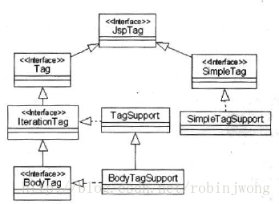

&nbsp;

<!-- more -->

<!-- toc -->

&nbsp;

[toc]


# 自定义JSP标签

1. 为了便于组织和管理，可以把一组功能相同的标签放在同一个标签库中
2. 开发包含自定义标签的标签库步骤：
	1. 创建自定义标签的处理类（Tag Handler Class）
	2. 创建TLD标签库描述文件（Tag Library Description）
3. 操作步骤：
	1. 把标签处理类和相关类的class文件放在WEB-INF/classes下
	2. 把TLD标签库描述文件放在WEB-INF或其自定义子目录下，不能是classes和lib
	3. 在web.xml中声明所引用的标签库
	4. 在JSP中使用标签库的标签
4. jar包：Servlet API的类库文件servlet-api.jar 和 JSP API的类库文件jsp-api.jar添加到classpath中

## 1. JSP Tag API

1. 容器运行JSP文件时，遇到自定义标签就会调用对应处理类的相关方法，处理类可以继承JSP Tag API中的`TagSupport`类或`BodyTagSupport`类

2. JSP Tag API位于javax.servlet.jsp.tagext包中

	

### 1.1 JspTag接口

所有标签处理类都要实现本接口，只是一个标识接口，没有方法。

### 1.2 Tag接口

传统标签Classic Tag

1. 传统标签处理类的基本方法：
	1. setPageContext(PageContext pc)：容器调用，向当前标签处理对象传递当前PageContext对象
	2. setParent(Tag t)：容器调用，向当前Tag对象传递父标签的Tag对象
	3. getParent()：返回Tag类型的父标签的Tag对象
	4. release()：容器需要释放Tag对象所占用资源时调用
	5. doStartTag()：容器遇到标签的起始标志时调用，返回一个整数，决定程序后续流程；Tag.SKIP_BODY表示标签之间的主体内容忽略；Tag.EVAL_BODY_INCLUDE表示主体内容正常执行
	6. doEndTag()：容器遇到标签的结束标志调用，返回整数值决定后续流程；Tag.SKIP_PAGE表示立即停止执行标签后的JSP代码，未处理的静态内容和Java程序片段均忽略，已有输出内容立刻返回客户浏览器；Tag.EVAL_PAGE表示正常执行JSP
2. 标签处理类的具体实例（Tag对象）由容器创建；当容器执行JSP时遇到自定义标签，就会寻找缓存中相关的Tag对象，若不存在就创建Tag对象并放入缓存；得到Tag对象后如下流程调用Tag对象的相关方法：
	1. 容器调用Tag对象的setPageContext()和setParent()，把当前JSP页面的PageContext对象和父标签处理对象传给当前Tag对象，若无父标签则传null
	2. 容器调用Tag对象的一系列set方法，设置Tag对象属性，如无属性则无需
	3. 容器调用Tag对象的doStartTag()方法，并根据返回值决定是否执行标签主体内容
	4. 调用doEndTag()方法，根据返回值判断是否执行标签后续的JSP代码
3. 一个Tag对象创建后就会一直存在，可被容器重复调用；Web应用终止时容器先调用Tag对象的release方法，然后销毁对象

### 1.3 IterationTag接口

继承自Tag接口，增加了重复执行标签主体内容的功能。

1. 定义了doAfterBody()方法：容器执行完标签主体内容后，调用此方法；若未执行主体内容则不调用；本方法也返回一个整数值，决定后续流程；Tag.SKIP_BODY不再执行主体内容，Tag.EVAL_BODY_AGAIN重复执行标签主体内容
2. 容器遇到这种标签，缓冲寻找IterationTag对象，若无则创建并放入缓存；创建后如下流程执行：
	1. 容器调用IterationTag对象的setPageContext、setParent方法，传入当前JSP页面的PageContext对象和父标签处理对象，没有传null
	2. 容器调用IterationTag对象的一系列set方法，设置对象属性，如无属性则无需
	3. 容器调用doStartTag()方法，并根据返回值决定是否执行标签主体内容
	4. 若执行了主体内容，结束后调用doAfterBody()方法，根据返回值判断是否重复执行标签主体内容
	5. 调用doEndTag()方法，根据返回值判断是否执行标签后续的JSP代码

### 1.4 BodyTag接口

1. 继承IterationTag接口，增加了直接访问和操纵标签主体内容的功能
	1. setBodyContext(BodyContent)：容器通过此方法向BodyTag对象传递一个用于缓存标签主体的执行结果的BodyContent对象
	2. doInitBody()：容器调用完setBodyContent()方法后，在第一次执行标签主体前，先调用此方法，为执行标签主体做初始化工作
2. 容器不调用以上两方法：
	1. 标签主体为空
	2. 或 doStartTag()方法返回Tag.SKIP_BODY或Tag.EVAL_BODY_INCLUDE
3. 容器调用以上两方法：标签主体不为空，且 doStartTag()方法返回Tag.EVAL_BODY_BUFFERED（本接口新定义静态常量，作为doStartTag()方法返回值之一，用于指示容器调用两新增方法）
4. 容器处理这种标签时，缓存寻找，若无创建，放入缓存，随后如下流程执行；
	1. 容器调用BodyTag对象的setPageContext、setParent方法，传入当前JSP页面的PageContext对象和父标签处理对象，没有传null
	2. 容器调用BodyTag对象的一系列set方法，设置对象属性，如无属性则无需
	3. 容器调用doStartTag()方法，并根据返回值决定是 不执行、执行、先调用两新方法再执行 标签主体内容
	4. 若执行了主体内容，结束后调用doAfterBody()方法，根据返回值判断是否重复执行标签主体内容
	5. 调用doEndTag()方法，根据返回值判断是否执行标签后续的JSP代码

### 1.5 TagSupport类

标签实现类，TagSupport类实现了IterationTag接口，用户自定义标签时可选继承此类。[如需重复执行标签主体](#4. 重复执行标签主体)

1. 主要方法除接口中已说明的外，还有以下三个：
	1. setValue(String key, Obj)：在标签处理对象中设置key、value
	2. getValue(String key)
	3. removeValue(String key)
2. parent、pageContext成员变量：
	1. parent：private，父标签的处理对象
	2. pageContext：protected，当前JSP页面的PageContext对象
	3. 故子类（用户自定义标签处理类）中，在doStartTag或doEndTag等方法中，可以通过getParent()获得父标签处理对象，直接访问到pageContext变量
3. 处理标签的方法：用户自定义标签类时主要是复写doStartTag、doEndTag、doAfterBody方法
4. 用户自定义的标签属性：若标签包含自定义属性 `<prefix:mytag name="Tom" />`，就要在处理类中将name属性作为private成员变量，并提供set get方法

### 1.6 BodyTagSupport类

标签实现类，BodyTagSupport类继承自TagSupport类，并实现了BodyTag接口，用户自定义标签时可选继承此类，可以操纵标签主体内容。[如需访问标签主体内容](#5. 访问标签主体内容)

1. 有bodyContent成员变量及set get方法，protected，是javax.servlet.jsp.tagext.BodyContent类型，用于缓存标签主体的执行结果
2. 如果doStartTag方法返回Tag.EVAL_BODY_BUFFERED，那么容器执行标签主体前，先创建一个用于缓存标签主体的执行结果的BodyContent对象，然后调用setBodyContent方法，使得成员变量BodyContent引用BodyContent对象，再调用doInitBody方法；两方法结束后、主体执行后，容器把执行结果缓存到BodyContent对象中
3. 子类可以直接访问或get到bodyContent成员变量；BodyContent类的getString方法返回字符串形式的标签主体执行结果

&nbsp;

## 2. 自定义JSP标签实例

1. 编写处理类

	```java
	public class HelloTag extends TagSupport {
	    public int doEndTag() throws JspException {
	        try {
	            pageContext.getOut().print("hello");
	        } catch (Exception e) {
	            throw new JspTagException(e.getMessage());
	        }
	        return EVAL_PAGE;
	    }
	}
	```

2. servlet-api.jar和jsp-api.jar放入classpath

3. 处理类的编译结果.class位于`<CATALINA_HOME>/webapps/web-app/WEB-INF/classes/mypack/`下，放至WEB-INF/classes/mypack/HelloTag.class

4. 创建标签库描述符文件TLD，假定这个hello标签位于mytaglib标签库中，故创建一个mytaglib.tld的TLD文件，存放于WEB-INF/mytaglib.tld（[TLD详细介绍](#3.2 创建标签库描述文件TLD)）

	```xml
	<taglib>
		<tlib-version>1.1</tlib-version>
	    <jsp-version>2.4</jsp-version>
	    <short-name>mytaglib</short-name>
	    <uri>/mytaglib</uri>
	    <tag>
	        <name>hello</name>
	        <tag-class>mypack.HelloTag</tag-class>
	        <body-content>empty</body-content>
	        <description>say hello</description>
	    </tag>
	</taglib>
	```

5. web.xml中配置`<taglib>`元素

	```xml
	<web-app>
		<jsp-config>
	    	<taglib>
	            <taglib-uri>/mytaglib</taglib-uri>
	            <taglib-location>/WEB-INF/mytaglib.tld</taglib-location>
	        </taglib>
	    </jsp-config>
	</web-app>
	```

6. jsp中先引入标签库 `<%@ taglib uri="/mytaglib" prefix="mm" %>`，prefix属性为mytaglib标签库制定一个前缀mm

7. jsp中使用标签 `<mm:hello/>`

8. 容器处理自定义标签：

	1. 标签前缀，mm，则从``<%@ taglib %>`指令中得知本标签来自URI为/mytaglib的标签库
	2. web.xml中，对/mytaglib的配置中匹配uri，得知位于WEB-INF/mytaglib.tld
	3. 在tld中，根据jsp中标签的名字hello，找到对应class类文件，加载

&nbsp;

## 3. 访问标签属性

1. 如静态文本等内容，多次重复，可用标签替代，便于维护
2. 步骤
	1. JSP中引入标签库 `<%@ taglib uri="/mytaglib" prefix="mm" %>`
	2. 使用自定义的message标签替代静态文本 `<mm:message key="hello.hi" />`
3. message标签处理类根据key的属性值，从特定资源文件中找到匹配的字符串
4. 此法甚至能实现一个JSP文件支持多种语言版本

### 3.1 创建标签处理类MessageTag

1. 首先需要资源文件，包含要替代的静态文本等，以key-value形式存放；中文资源文件messagesource_ch.properties，英文资源文件messagesouorce_en.properties，存放在WEB-INF下；约定不同页面的静态文本，用key区分

	```properties
	// messagesource_ch
	hello.title = hello页面
	hello.hi = 你好
	login.title = 登录页面
	login.user = 用户名
	login.password = 密码
	login.submit = 提交
	```

	```properties
	// messagesource_en
	hello.title = helloapp
	hello.hi = nice to meet you
	login.title = helloapp
	login.user = User name
	login.password = Password
	login.submit = Submit
	```

2. Web应用启动时加载静态文本：初始化操作安排在Web应用启动时完成，比交由标签处理类完成，更符合Web编程规范；可编写一个LoadServlet类，专用于Web应用启动时的初始化工作，在其init方法中完成加载静态文本的任务；从上述properties文件中加载资源到各自Properties对象中，然后将两对象作为属性保存到Web应用范围内

	```java
	public class LoadServlet extends HttpServlet [
	    public void inti() throws ServletException {
	        Properties ps_en = new Properties();
	        Properties ps_ch = new Properties();
	        try {
	            ServletContext context = getServletContext();
	            InputStream in_en = context.getResourceAsStream(
	                "/WEB-INF/messageresource_en.properties");
	            ps_en.load(in_en);
	            InputStream in_ch = context.getResourceAsStream(
	                "/WEB-INF/messageresource_ch.properties");
	            ps_ch.load(in_ch);
	            in_en.close();
	            in_ch.close();
	            
	            context.setAttribute("ps_en", ps_en);
	            context.setAttribute("ps_ch", ps_ch);
	        } catch (Exception e) {
	            e.printStackTrace();
	        }        
	    }
	    
	    public void service() {
	        init();	// to reload resource file
	    }
	]
	```

	当然，此Servlet应配置为随着Web应用启动而启动，如web.xml中配置

	```xml
	<servlet>
		<servlet-name>load</servlet-name>
	    <servlet-class>mypack.LoadServlet</servlet-class>
	    <load-on-startup>1</load-on-startup>
	</servlet>
	<servlet-mapping>
		<servlet-name>load</servlet-name>
	    <url-pattern>/load</url-pattern>
	</servlet-mapping>
	```

3. 创建MessageTag类：

	```java
	public class MessageTag extends TagSupport {
	    private String key = null;
	    // get setKey()
	    
	    public int doEndTag() throws JspException  {
	        try {
	            Properties ps_en = (Properties) pageContext.getAttribute("ps_en", pageContext.APPLICATION_SCOPE);
	            // get ps_ch
	            HttpSession session = pageContext.getSession();
	            // get current language
	            String language = (String)session.getAttribute("language");
	            // decide message
	            String message = null;
	            if (language != null && language.equals("Chinese")) {
	                message = (String)ps_ch.get(key);
	                message = new String(message.getBytes("ISO-8859-1"), "GB2312");
	            } else {
	                message = (String)ps_en.get(key);
	            }
	            
	            // print
	            pageContext.getOut().print(message);            
	        } catch (Exception e) {
	            throw new JspTagException(e);
	        }
	        return EVAL_PAGE;
	    }
	}
	```

	包含一个成员变量key，与`<message>`标签的属性key对应。

	Properties对象通过InputStream流装载文件时，是按照ISO-8859-1编码，故需转换。

### 3.2 创建标签库描述文件TLD

TLD中元素有三类：`<taglib>`标签库元素，`<tag>`标签元素，`<attribute>`标签属性元素

1. 标签库元素`<taglib>`，设定标签库的相关信息，其子元素：
	1. tlib-version：标签库版本
	2. jsp-version：JSP版本
	3. short-name：标签库默认前缀名prefix
	4. uri：标签库的唯一访问标识符
	5. info：说明信息
2. 标签元素`<tag>`，定义一个标签，其子元素：
	1. Name：标签名字
	2. tag-class：Tag的处理类
	3. body-content：标签主体的类型，可选值：empty、scriptless（主体不空，包含EL表达式和动作元素，即jsp前缀的JSP内置标签，不包含脚本元素，即<%开头的JSP标记）、jsp（包含JSP代码，可有EL、动作元素、脚本元素）、tagdependant（主体内容由处理类解析处理，主体的所有代码原样传给处理类，而非传递处理结果，如何传递SQL语句给处理类执行）
	4. Info：标签说明信息
3. 标签属性元素`<attribute>`，描述标签的属性，子元素：
	1. name：属性名
	2. required：是否必需，默认false
	3. rtexprvalue：run time expression，运行时表达式，属性值是否可为基于`<% %>`的Java表达式或EL表达式


创建名为mytaglib.tld的TLD文件

```xml
<taglib>
	<tlib-version>1.1</tlib-version>
    <jsp-version>2.4</jsp-version>
    <short-name>mytaglib</short-name>
    <uri>/mytaglib</uri>
    
    <tag>
        <name>message</name>
        <tag-class>mypack.MessageTag</tag-class>
        <body-content>empty</body-content>
        <info>produce message by key</info>
        <attribute>
        	<name>key</name>
            <required>true</required>
        </attribute>
    </tag>
</taglib>
```

### 3.3 Web应用中使用标签

1. web.xml中加入`<taglib>`以引入自定义标签库

	```xml
	<web-app>
		<jsp-config>
	    	<taglib>
	            <taglib-uri>/mytaglib</taglib-uri>
	            <taglib-location>/WEB-INF/mytaglib.tld</taglib-location>
	        </taglib>
	    </jsp-config>
	</web-app>
	```

2. JSP中指令声明引用 `<%@ taglib uri="/mytaglib" prefix="mm" %>`

	然后使用标签 `<mm:message key="hello.title" />`

&nbsp;

## 4. 重复执行标签主体

如需重复执行操作时，原生方法需要JSP与Java 的for混用，可自定义一个iterate标签来重复执行主体。

1. 此类标签有两个属性：

	1. var：指定存放页面范围内的元素的属性名，表示本标签的处理类每次从集合中读取一个元素，把元素放在页面范围内，var指定这个属性名
	2. items：待遍历访问的集合

2. 标签处理类IterateTag

	```java
	public class IterateTag extends TagSupport {
	    private Iterator items;	// 待遍历集合
	    private String var;		// 存放在page中的集合中元素的属性名
	    private Object item;	// 集合中的一个元素
	    
	    public void setItems(Collection items) {
	        if (items.size() > 0)
	            this.items = items.iterator();
	    }
	    
	    // setVar();
	    
	    public int doStartTag() throws JspException {
	        if (items.hasNext()) {
	            item = items.next();
	            saveItem();	// 存入page
	            return EVAL_BODY_INCLUDE;
	        } else {
	            return SKIP_BODY;
	        }
	    }
	    
	    public int doAfterBody() throws JspException {
	        if (items.hasNext()) {
	            item = items.next();
	            saveItem();	// 存入page
	            return EVAL_BODY_AGAIN;	// 继续执行主体
	        } else {
	            return SKIP_BODY;
	        }
	    }
	    
	    // 若当前的元素不为null，就存入page
	    private void saveItem() {
	        if (item == null) 
	            pageContext.removeAttribute(var, PageContext.PAGE_SCOPE);
	        else 
	            pageContext.setAttribute(var, item);            
	    }
	}
	```

3. 容器处理这个自定义的iterate标签时，运行处理类的流程：

	1. setPageContext()、setParent()、setVar()、setItems()
	2. doStartTag()，取出集合第一个元素存入page
	3. 执行标签主体
	4. doAfterBody()，集合不空，取出一个元素，存入page
	5. 重复执行主体和doAfterBody()方法，至集合为空

4. TLD中的配置

	```xml
	<tag>
		<name>iterate</name>
	    <tag-class>mypack.IterateTag</tag-class>
	    <body-content>jsp</body-content>
	    <attribute>
	        <name>var</name>
	        <required>true</required>
	        <rtexprvalue>false</rtexprvalue>
	    </attribute>
	    <attribute>
	        <name>items</name>
	        <required>true</required>
	        <rtexprvalue>true</rtexprvalue>
	    </attribute>
	</tag>
	```

5. 使用：如将books中的每本书都输出到页面

	```jsp
	<table border="1">
	    <caption>书籍信息</caption>
	    <tr>
	        <th>作者</th> <th>书名</th>
	        <th>价格</th> <th>评价</th>
	    </tr>
	    <mm:iterate var="book" items="<%= books %>" >
	        <tr>
	            <td>${book.name}</td>
	            <td>${book.title}</td>
	            <td>${book.price}</td>
	            <td>${book.description}</td>
	        </tr>
	    </mm:iterate>
	</table>
	```

	&nbsp;

## 5. 访问标签主体内容

操纵标签主体内容，继承BodyTagSupport类，具有重复执行主体内容，访问存放在BodyContent对象中的标签主体的执行结果 的功能。

以自定义名为greet的标签为例，其功能是判断请求参数username，若是Monster，则输出"Go away, Monster!"，否则就先缓存count次主体的值，然后输出。

处理类

```java
public class GreetTag extends BodyTagSupport {
	private int count; // 循环次数
    private String username;	// 本例中的功能，表示请求参数
    // setCount()
    
    public int doStartTag() throws JspException {
        if (count > 0) 
            return EVAL_BODY_BUFFERED;
        else 
            return SKIP_BODY;
    }
    
    public void setBodyContent(BodyContent bc) {
        super.setBodyContent(bc);
    }
    
    public void doInitBody() throws JspException {
        username = pageContext.getRequest().getParameter("username");
    }
    
    public int doAfterBody() throws JspException {
        if (count > 1) {
            count--;
            return EVAL_BODY_AGAIN;
        } else {
            return SKIP_BODY;
        }
    }
    
    public int doEndTag() throws JspException {
        JspWriter out = bodyContent.getEnclosingWriter();
        try {
            String content = bodyContent.getString();	//得到主体执行结果
            // 修改执行结果
            if (username != null && username.equals("Monster")) {
                content = "Go away, Monster!";
            }
            out.println(content);	// 向客户端打印结果
        } catch (IOException e) {e.printStackTrace();}
        
        return EVAL_PAGE;
    }
}
```

TLD

```xml
<tag>
    <name>greet</name>
    <tag-class>mypack.GreetTag</tag-class>
    <body-content>jsp</body-content>
    <attribute>
        <name>count</name>
        <required>true</required>
        <rtexprvalue>false</rtexprvalue>
    </attribute>

</tag>
```

JSP中使用

```jsp
<% int size = 3; %>
<mm:greet count="3">
    <font size="<%=size++ %>">
        Hi,${param.username} <br>
    </font>
</mm:greet>
```


处理类运行流程：

1. setPageContext()、setParent()、setCount()
2. doStartTag()，count大于0，返回EVAL_BODY_BUFFERED
3. setBodyContent()、doInitBody()
4. 执行主体，执行结果缓存在BodyContent对象中
5. doAfterBody()，count大于1，返回EVAL_BODY_AGAIN
6. 重复执行主体和doAfterBody()，直至count不大于1
7. doEndTag()，读取username请求参数，判断是否为Monster，以决定输出go away还是BodyContent中缓存的数据