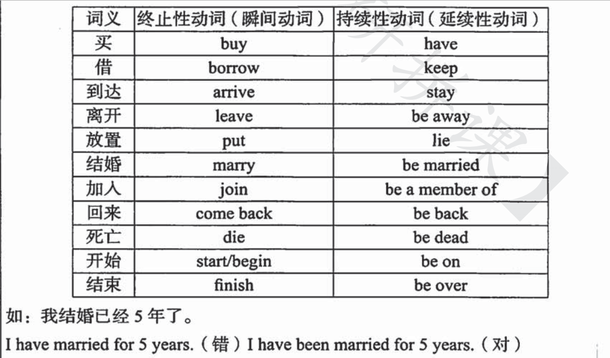

《刘晓艳语法长难句》第一章笔记

<!--more-->

 

<!-- toc -->

[toc]

 

# 1. 英语句子特点

1. 有主谓

2. 主语是谓语的发出者

3. 宾语是谓语的承受者

4. 一个句子只能有一个主语、一个谓语，否则需要连词

5. :exclamation: 写作避免出现主语、谓语、宾语不匹配的情况

6. eg：我的英语说得很好

	:o: I speak English well.

	:x: My English speaks well. 

 

---

 

# 2. 基本结构

1. 主谓
2. 主谓宾
3. 主谓表
4. 主谓双宾
5. 主谓宾宾补

## 2.1 主谓

一个主语、一个**带有时态的**谓语构成

## 2.2 主谓宾 & 主谓表

1. 主谓宾的谓语是**实义动词/行为动词**，能够表达实际动作

2. 主谓表的谓语是**系动词/连系动词**，分为六类：

	1. 状态：be
	2. 感官：look, sound, taste, smell, feel + adj.
	3. 变化：get, become, turn, grow, fall
	4. 保持：keep, stay, remain, stand
	5. 表象：seem, appear
	6. 终止：prove

3. 部分系动词也可作实义动词

	eg：grow

	I grew up in this town. 实义动词

	The coat grew dirty. 系动词

## 2.3 主谓双宾

主语+谓语+间接宾语+直接宾语，两个宾语的区分影响不大

1. 常用双宾语动词：buy, pass, lend, give, tell, teach, show, bring, send, etc.
2. eg: He brought **me a gift**.

## 2.4 主谓宾宾补

宾语+补语 → 复合宾语

1. 宾语补足语：补充说明宾语特点、身份、让宾语完成动作
2. 宾补常见类型：
	1. You should keep room **clean**. 形容词
	2. We made him **our leader**. 名词
	3. He told me **not to play in the street**. 不定式
	4. I like to watch boys **playing football**. 现在分词
	5. Yesterday I had a picture **taken with a cat**. 过去分词
3. ~~双宾和宾宾补，区分不清又有什么关系呢~~

 

---

 

# 3. 句子成分

句子的组成成分，由词或词组构成；从而词性会决定其所担任的成分 ~~（但是怎么可能能把词性也背下来呢，单词都背不会呢）~~

1. 主语
2. 谓语
3. 宾语
4. 表语
5. 定语
6. 状语
7. 补足语
8. 同位语

## 3.1 谓语

具有时态的实义动词（词组）或系动词。

1. 成分：谓语只能是动词（词组），一般的动词（词组）也只能做谓语

2. 谓语要做其他成分时，要变成非谓语结构（非动词结构）：

	1. 动词-ing，表示主动或进行
	2. 动词-ed，表示被动或完成
	3. to-动词，表示目的或将来

3. 非谓语结构可做任何成分：

	1. 主语：-ing，或to do；to do（动词不定式）时常用it做主语，to do后置
	2. 表语：His job is **to look after** the baby.
	3. 宾语：He enjoys **staying with** his family.
	4. 定语：He found a good place **to live in**.
	5. 状语：He work hard **to get** money.
	6. 同位语：His habit, eating snack before sleeping, has not been changed.

4. 多个动词时，**只能有一个做谓语**，其余要用非谓语结构：

	He **pushed** the door, **walking** into the room and **seeing** a girl **sitting** on the bed.

## 3.2 主语

1. 成分：从句、代词、名词、非谓语

2. 主语不能缺失；祈使句中为加强语气而省略，但不能说没有

	1. 下雨了 :arrow_right: It is raining.
	2. 有很多人喜欢我 :arrow_right: There are loads of individuals **having** affection for me.
	3. **多用高级词汇**
	4. 以There be句型为代表，容易出现多个谓语的错误，注意要用非谓语结构

3. 减少以人称代词做主语；变主动为被动：

	1. 必须指出语法在考试中还是很重要的 :arrow_right: Grammar must be pointed out to be quite crucial in the examination.
	2. 我们不应该盲目追星 :arrow_right: Superstart should never be pursued blindly. 
	3. 孝敬父母很重要 :arrow_right: Respecting parents is argued to be of great importance by a sea of private individuals.

4. think :arrow_right: argue, contend, assume, presume, insist, maintain, assert, claim, be of the option that, have been convinced that, cling to the perspective that

5. important :arrow_right: be of great importance, vital, significant, essential, indispensable, play a key role in sth.

6. 实在难以解决时，使用人称代词做主语

7. 被动语态：

	1. 语态：主语谓语之间的关系是主动还是被动；主语无法发出动作，就使用被动语态

	2. 与时态是独立的两个概念，所以被动语态也有时态

	| 时态         | 结构                 |
	| ------------ | -------------------- |
	| 原型（基础） | be done              |
	| 一般现在时   | am/is/are done       |
	| 一般过去时   | was/were done        |
	| 一般将来时   | will be done         |
	| 现在进行时   | am/is/are being done |
	| 过去进行时   | was/were being done  |
	| 现在完成时   | have/has been done   |
	| 过去完成时   | had been done        |
	| 情态动词     | 情态动词 be done     |
	
	3. 部分动词无被动：

	  1. have、own、possess等意为“拥有”的词
	  2. 系动词
	  3. happen、break out等意为“发生”或“爆发”的词
	  4. 不及物动词（主谓） eg：The sun rose.

## 3.3 宾语

1. 成分：代词、名词、非谓语、从句

## 3.4 表语

1. 成分：代词、名词、非谓语、形容词、介词短语

 

---

 

# 4. 动词时态

1. 不同时间内所发生的动作（主谓宾）或存在的状态（主系表）

2. 时态的判断，要**通过谓语判断**；时间短语或副词性标志词仅仅能够描述该动作发生的具体时间

	eg：I always swam at the weekend. 我以前周末经常游泳。

3. 时态种类：

	| 时态     | 一般     | 进行           | 完成            | 完成进行              |
	| -------- | -------- | -------------- | --------------- | --------------------- |
	| 现在     | do       | be doing       | have done       | have been doing       |
	| 过去     | did      | was doing      | had done        | had been doing        |
	| 将来     | will do  | will be doing  | will have done  | will have been doing  |
	| 过去将来 | would do | would be doing | would have done | would have been doing |

4. 助动词：帮助谓语构成肯定句、否定句和疑问句的时态

5. 有be：否定句be not；疑问句be提前

6. 有动词：疑问句用助动词的不同时态形式

## 4.1 一般现在时

1. 定义：现阶段经常发生的事；客观真理及自然现象；人/物永久状态
2. 助动词：do/does
3. 肯定句：
	1. He **loves** me.
	2. I **am** a student.
4. 否定句：do/does not；be not
  5. He **does not like** his work.
  6. He **is not** a child anymore.
7. 疑问句：do/does/be提前、
  8. **Do** you like dogs？
  9. **Are** they friends？

10. 常见标志词：频度、频率副词；其他具体时间段（in the morning、on Sundays）

## 4.2 一般将来时

1. 将来某时间发生的动作/存在的状态
2. 助动词：will（所有人称）、shall（第一人称）
3. 肯定句：
	1. I **will bring** him a present.
	2. I **will be** a teacher soon.

4. 否定句：
	1. He **won`t fulfill** his promise.
	2. He **will not be** there next day.
5. 疑问句：
	1. **Will you travel** to Beijing?
	2. **Will you be** a nurse?
6. 标志词：将来时间、soon、in 段时间
7. 其他结构：be going to, be about to do, be to do

## 4.3 现在进行时

1. **仅表示动作**正在发生，不表示状态
2. 助动词：be
3. 肯定句：
	1. We **are having** classes.
4. 否定句：
	1. We **are not having** classes.
5. 疑问句：
	1. **Are you having** classes?
6. 标志词：right now, at present, at this time, these days, look, listen

## 4.4 一般过去时

1. 过去某段时间的动作/状态
2. 助动词：did
3. 肯定句：
	1. I **saw** him in the library yesterday.
	2. I **was** late for school yesterday.
4. 否定句：
	1. I **didn`t** live there before.
	2. He **was not** a student long ago.
5. 疑问句：
	1. **Did** you study English at 10?
	2. **Were** they in the park just now?
6. 标志词：ago、last、just now、once upon a time

## 4.5 现在完成时

1. 动作持续到现在才完成，强调已经或曾经；但也可能延续下去

2. 助动词：have has

3. 肯定句：过去分词

	1. He **has already obtained** a scholarship.
	2. I **have been** in the city for more than 5 years.

4. 否定句：have not/haven`t + done/been

5. 疑问句：

	1. **Have** you **found** the missing child?
	2. **Have** you ever **been** to the UK?

6. 标志词：already, ever, never, just, yet, still, since + 段时间（since引导时间状语从句用一般过去时，主句现在完成时）

7. 瞬时动词可以完成时，但是不能接时间段，除非转换为延续性动词：

	

8. 与一般过去时区别：

	1. 一般过去时强调以前做过，与现在无关
	2. 现在完成时强调持续到现在/已完成/可能继续持续

## 4.6 不常见时态：

不常用不常见，但可能出现的难点时态

1. 过去进行时：过去某个时间点正在发生的动作：

	I **was watching** TV at 9 last night.

2. 过去将来时：过去视角将要发生的动作：

	She promised that she **would come** to China some day.

3. 过去完成时：过去某一时间之前就已完成：

	My father **had slept** before I came back home.

4. 现在完成进行时：过去持续到现在，并可能一直持续下去，译为一直做：

	I **have been doing** the experience these days.

5. 过去完成进行时：过去时间段持续进行：

	I **had been writing** this paper those days.

6. 将来完成时：将来某段时间内将要完成的动作：

	I **will have finished** my paper by the end of this semester.

7. 将来进行时：将来时间点正在进行：

	I **will be meeting** him this time tomorrow.

8. 过去将来进行时：过去角度，将来时刻正在进行：

	Li told me that he **would be living** in China some day.

9. 过去将来完成时：过去角度，某一时间前将完成：

	David told me that he **would have finished** homework by 9.

10. 将来完成进行时：在将来某时间段内持续进行：

	He **will have been living** here for 5 years by the end of this month.

11. 过去将来完成进行时：从过去某一时间，持续到过去将来某一时间：

	He said that he **would have been living** here for 10 years by the end of last year.

12. 时态区分不出也无关紧要，从动词的意义和过去式、过去分词也能猜出几分

 

---

 

# 5. 动词分类

## 5.1 实义动词

1. 就是表示具体动作的词
2. 分类：及物动词、不及物动词
	1. 及物动词Vt.：+ 宾语
	2. 不及物动词Vi.：+ 介词 + 宾语
	3. V.表示均可

## 5.2 连系动词

即系动词，前面总结过

## 5.3 情态动词

1. 含义：本身有一定词义，表示说话人态度
2. 用法：不单独出现，+实义动词/系动词
3. 分类
	1. can、could 能、会、请求 = be capable of、be competent in
	2. may、might 许可，可能性 = be likely to
	3. must必须、have to不得不 = be bound to、be bound for
	4. should、ought to 应该 = be supposed to、be obliged to
	5. would 将会，想要 = intend to
	6. dare 敢
4. 情态动词的完成时表示推测：
	1. must have done：一定做过
	2. needn`t have done：没必要，但做了
	3. could have done：本能做，但没做，遗憾
	4. should have done：本应做

## 5.4 助动词

1. 含义：帮助谓语动词一起构成否定、疑问、时态、语态的词
2. 分类
	1. be：进行时，被动语态
	2. do：现在时、过去式、否定、疑问，强调，倒装
	3. have：完成时
	4. will：将来时
	5. 每个助动词均可倒装（助动词提前，从句提前前）：Only after things disappear will we cherish them. 人们只有失去才懂得珍惜。

 

---

 

# 6. 写作

1. 难词替换成会的词，正确最重要
2. 写不来的长难句用简单句表示

 

---

 

# 7. 长难句分析

步骤：

1. 找动词/词组，以有无连接词判断并确定主句的谓语（从句也有谓语）
2. 解释谓语
3. 翻译主干

eg： 

​	The coming of age of the postwar baby boom and an entry of women into the male-dominated job market have limited the opportunities of teenagers who are already questioning the heavy personal sacrifices involved in climbing Japan`s rigid social ladder to good schools and jobs.

1. 谓语：have limited
2. 解释：限制
3. 主干——主语：and连接的两个并列成分，宾语：opportunities机会
4. 战后生育潮的到来，和女性进入由男性主导的职场，都限制了…的机会。

