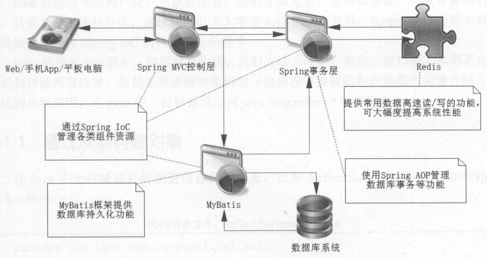

&nbsp;

<!-- more -->

<!-- toc -->

&nbsp;

[toc]


# 认识SSM框架和Redis

## 1. Spring框架

是Java应用最广的框架，其成功来自于IoC（Inversion of Control）控制反转和AOP（Aspect Oriented Programming）面向切片编程理念。

### 1.1 Spring IoC

IoC是一个容器，将一切Java资源看作Bean，容器IoC来管理这些Bean和它们之间的关系。并且IoC对于对象和关系的管理，不采用人为手动创建，而是由IoC自己通过描述创建。

如用户使用插座，有不同规格的插座，用Socket接口定义插座，Socket1、Socket2等表示不同插座类，则寻常Java代码要：

```java
Socket socket = new Socket1();
user.setSocket(socket);
user.useSocket();
```

若出现了其他更适用的插座，如Socket3、Socket4，则要深入代码各处，对源代码进行替换。实际工程中代码量巨大，如此替换，十分繁琐。故而引入Spring IoC 控制反转。只需在xml中配置，让IoC容器自己通过配置找到插座类，实例化给Socket接口后注入User对象即可：

```xml
<bean id="socket" class="Socket3" />
<bean id="user" class="User" >
    <property name="socket" ref="socket" />
</bean>
```

如此，只需改动配置文件即可实现改用不同的插座类。这就是控制反转，从人为创建对象，到IoC通过配置描述自动实现Bean资源的确定、实例化与注入，控制权到了IoC手里。**你不用去找资源，只需要向Spring IoC容器描述所需资源，它会自己找到你所需的资源。**这就实现了Bean资源之间的解耦。除此之外，IoC还提供对Bean的生命周期的管理等多种操作。

### 1.2 Spring AOP

IoC用于管理Bean，Bean都是基于OOP。但有些问题OOP无法处理，如订单、生产部门、财务部门三个对象：订单发出，生产部门经审批后上报财务部门，但财务部门发现价格超支，需要取消订单，但取消订单这一操作除了当前的财务部门，还会影响之前生产部门所做的审批，它们也许取消。我们把预算超支这个条件称为切面，它影响了上述三个OOP对象。实际中，切面条件会影响很多对象，所以需要面向切面编程AOP，通过它来管理切面上一些对象的协作。

Spring AOP常用于数据库事务编程，如上例中，数据库中第一步操作完成后，若第二部操作失败，需要数据库回滚，撤销第一步的更新。Spring AOP的数据库事务管理中，以异常作为消息。默认情况下，只要Spring接收到异常消息，就会将数据库回滚，保持数据一致性。代码中不需要繁琐的try-catch-finally语句，只需判断后`throw new RuntimeException("预算超支！");` 即可通知Spring AOP事务管理对数据库回滚。

&nbsp;

## 2. MyBatis

前身是Apache的开源项目iBatis，是一个基于Java的持久层框架，先后由Apache software foundation、Google code迁至Github。其优势在于灵活，几乎可以替代JDBC，同时提供了接口编程。目前MyBatis的数据访问层DAO（Data Access Objects）不需要实现类，只需一个接口和XML（或注解）。它提供自动映射、动态SQL、级联、缓存、注解、代码和SQL分离等特性，也可对SQL优化。具有封装少，映射多样化、支持存储过程、可对SQL优化等特点，使其取代了Hibernate成为Java互联网中首选的持久框架。

POJO对象对数据库表相互映射的框架称为对象关系映射框架（Object Relational Mapping，ORM）。MyBatis和Hibernate都可算作ORM框架。Hibernate中，通过xml配置映射后，只需对POJO对象操作，即可自动实现对库表的修改，无法手动进行SQL编写。而MyBatis不屏蔽SQL，程序员可以自己制定SQL规则，能更加精确地定义SQL，优化性能，更能解决高并发、大数据、高性能、高响应的要求。

如有一个表，存放角色，t_table，内有编号id和角色名称role_name两个属性。先创建一个POJO类Role：

```java
public lcass Role implements Serializable {
    private Integer id;
    private String roleName;
    // setter and getter
}
```

然后创建映射文件，用于将表和POJO对应：

```xml
<mapper namespace="xxx.RoleMapper" >
    <resultMap id="roleMap" type="xxx.Role">
        <id property="id" column="id"/>
        <result property="roleName" column="role_name"/>		
    </resultMap>
    
    <select id="getRole" resultMap="roleMap">
        select id, role_name from t_role where id = #{id}
    </select>
    
    <delete id="deleteRole" parameterType="int">
        delete from t_role whereid = #{id}
    </delete>
    
    <insert id="insertRole" parameterType="xxx.Role">
        insert into t_role(role_name) values(#{roleName})
    </insert>
    
    <update id="updateRole" parameterType="xxx.Role">
        update t_role set
        role_name = #{roleName}
        where id = #{id}
    </update>
</mapper>
```

resultMap元素用于定义映射规则，MyBatis在一定规则下自动完成映射。而增删改查对应四个元素。mapper的namespace属性，要和一个接口的全限定名一致，各个SQL子元素的id，也要和接口方法一致。以下定义这个接口：

```java
public interface RoleMapper{
    public Role getRole(Integer id);
    public int deleteRole(Integer id);
    public int insertRole(Role role);
    public int update Role(Role role);
}
```

本接口不需要实现类，可直接在代码中使用：

```java
SqlSession sqlSession = null;
try{
    sqlSession = MyBatisUtil.getSqlSession();
    RoleMapeer roleMapper = sqlSession.getMapper(RoleMapper.class);
    Role role = roleMapper.getRole(1);	// select
    role.setRoleName("new_name");
    roleMapper.updateRole(role);	// update
    Role role2 = new Role();
    role2.setRoleName("role2");
    roleMapper.insertRole(role2);	// insert
    roleMapper.deleteRole(2);	// delete
    sqlSession.commit();	// 提交事务    
} catch (Exception ex) {
    ex.printStackTrace();
    if (sqlSession != null) {
        sqlSession.rollback();
    }
} finally {
    // 关闭连接
    if (sqlSession != null) {
        sqlSession.close();
    }
}
```

MyBatis相比Hibernate，还需要接口和SQL，虽然工作量大，但由于能自定义SQL和映射关系，所以更灵活，可优化性更好。

&nbsp;

## 3. Spring MVC

Struts2与Spring的结合一直存在很多问题，如兼容性和类臃肿，并且近年来Struts漏洞问题频发，使用率大减。与此同时，基于Spring的MVC（Model-View-Controller）框架出现，Spring MVC结构层次清晰，类比较简单，并且与Spring的核心IoC和AOP无缝对接，成为互联网时代的主流框架。

MVC把应用程序分为不同元素，提供松耦合：

1. Model模型：封装了应用程序的数据和由它们组成的POJO
2. View视图：负责把模型数据渲染到视图上，将数据展现给客户
3. Controller控制器：负责处理用户请求，并建立适当的模型传给视图渲染

Spring MVC中还可以定义逻辑视图，通过其提供的视图解析器就能很方便地找到对应的视图进行渲染，或使用其消息转换功能，如Controller的方法内加入注解`@ResponseBody`后，Spring MVC就能通过其消息转换系统，将数据转换为JSON提供给前端Ajax请求使用。

&nbsp;

## 4. Redis

是最流行的NoSQL（Not Only SQL）。NoSQL可以提高互联网系统的性能，具备一定持久层的功能，也可以作为一种缓存工具。对于NoSQL数据库，作为持久层，存储的数据是半结构化的，在读入内存时有更少的规则，速度更快，普通数据库是结构化、多范式规则；作为缓存，支持大数据存入内存，只要命中率高，就能快速响应（常用数据从数据库中读出后可放在NoSQL，由于是内存中，速度快很多，并且可先在NoSQL中写入，某一时刻再批量写入数据库）。

NoSQL结构松散，功能有限，要替代数据库很难，但作为缓存工具很有效。

Redis的以下优点使它成为主要的NoSQL工具：

1. 响应快速，每秒约可110000写，或81000读
2. 支持6种数据类型：字符串、哈希结构、列表、集合、可排序集合和基数
3. 操作都是原子的：适合高并发，锁
4. MultiUtility工具：可在缓存、消息传递队列、Web应用等多种场景使用

&nbsp;

## 5. 框架结构



* Spring IoC：承担了资源管理、整合、即插即拔的功能
* Spring AOP：提供切面管理，特别是数据库事务管理的功能
* MyBatis：提供数据库访问的持久层，通过MyBatis-Spring项目，就能和Spring无缝对接
* Redis：缓存工具，提供高速处理数据和缓存数据的功能