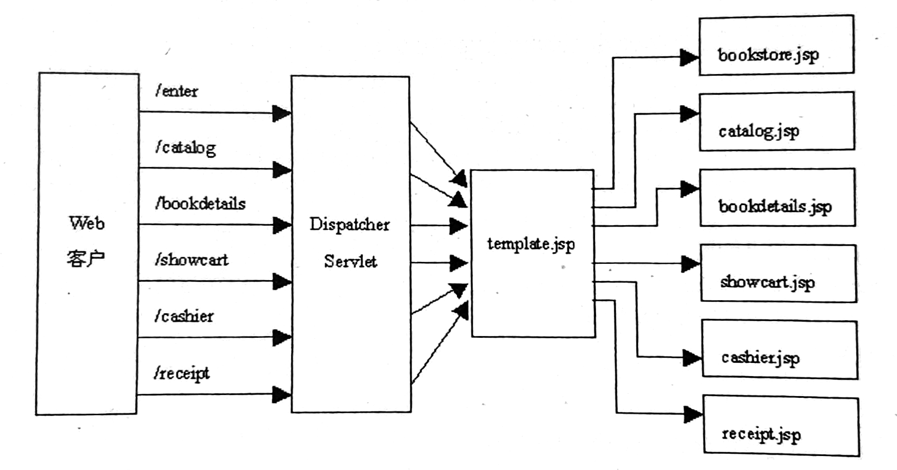
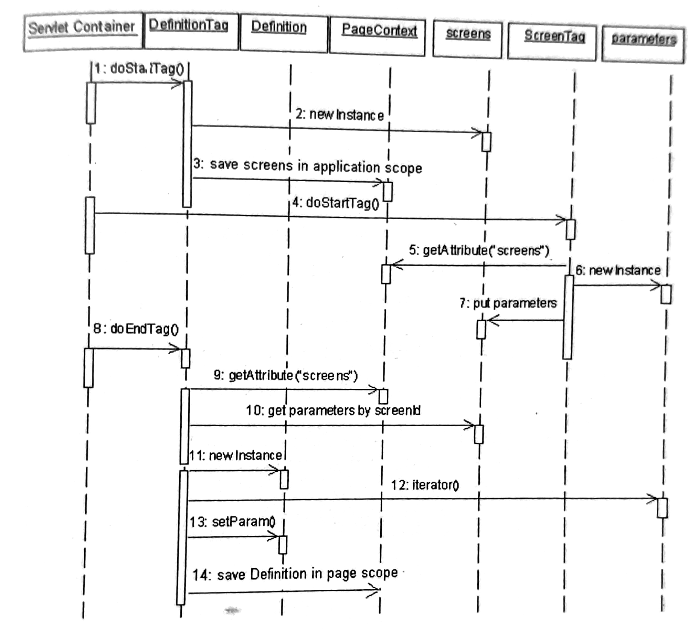
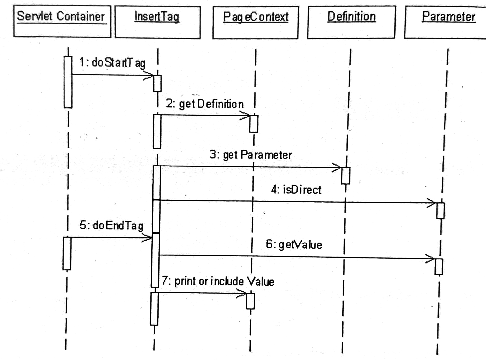
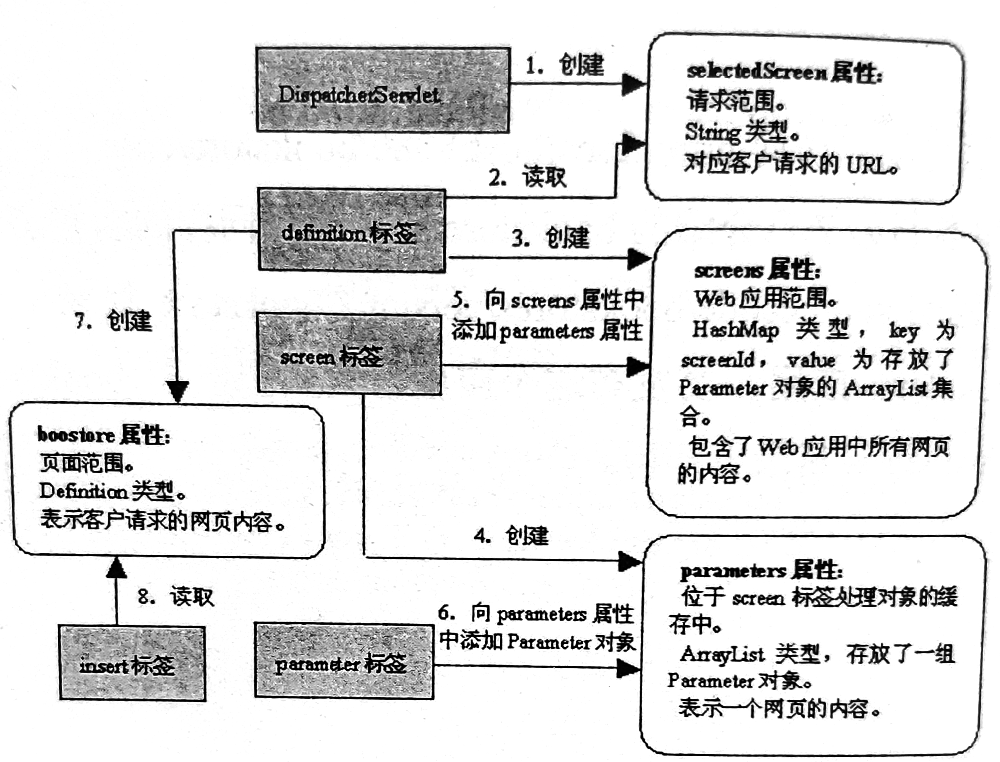

&nbsp;

<!-- more -->

<!-- toc -->

&nbsp;

[toc]


# 设计模板

为使网站页面风格统一，可通过自定义JSP标签为网站设计模板。所有在客户端战士的页面都通过模板生成。由此，提高开发效率，便于维护，修改模板即可实现批量网页修改。

实际运用中，已有现成框架软件，通常不需从头设计模板。

## 1. 如何设计模板

1. 先找出所有网页在结构和内容上的相同之处，把相同之处定义在模板中，模板本身也常是JSP文件。如bookstore中，每个页面都是title+body（banner、body）结构，故可定义template.jsp作为模板。当接收到请求时，template.jsp中的自定义标签可以根据客户的请求，把具体的title、banner、body填充进去，生成所需网页
2. 所有客户请求都由DispatcherServlet类处理，将请求的具体URL保存在请求范围中，再把请求转发给template.jsp。jsp从请求范围读取请求URL，根据请求生成相关网页
3. 综上，设计模板时，包含以下内容：
	1. 创建负责流程控制的Servlet：DispatcherServlet
	2. 创建模板标签和模板JSP文件。本例中创建4个标签：`<definition> <screen> <insert> <parameter>`；`template.jsp`和`screendefinitions.jsp`用来生成所有网页的模板
	3. 修改/创建其他JSP，仅负责生成模板中的body部分内容

&nbsp;

## 2. 负责流程控制的Servlet

所有请求都由DispatcherServlet类处理，把请求的URL作为selectScreen属性存放在请求范围，转发请求给template.jsp。template.jsp中的自定义标签再从请求范围中读取selectScreen属性，把具体的title、body内容填充进去，生成所需网页

1. DispatcherServlet

	```java
	public class DispatcherServlet extends HttpServlet {
	    @Override
	    protected void service(HttpServletRequest req, HttpServletResponse resp) throws ServletException, IOException {
	        // 把请求的URL存入req
	        req.setAttribute("selectedScreen", req.getServletPath().substring(1));
	        req.getRequestDispatcher("/template.jsp").forward(req, resp);
	    }
	}
	```

	客户请求URL：`req.getServletPath().substring(1)`，若请求URL为`/bookdetails`，则此代码返回`bookdetails`

2. 为使得所有请求都首先由DispatcherServlet处理，要在web.xml中为本类配置mapping元素

	```xml
	<servlet>
	    <servlet-name>dispatcher</servlet-name>
	    <servlet-class>utils.DispatcherServlet</servlet-class>
	</servlet>
	<servlet-mapping>
	    <servlet-name>dispatcher</servlet-name>
	    <url-pattern>/enter</url-pattern>
	</servlet-mapping>
	<servlet-mapping>
	    <servlet-name>dispatcher</servlet-name>
	    <url-pattern>/catalog</url-pattern>
	</servlet-mapping>
	<servlet-mapping>
	    <servlet-name>dispatcher</servlet-name>
	    <url-pattern>/bookdetails</url-pattern>
	</servlet-mapping>
	<servlet-mapping>
	    <servlet-name>dispatcher</servlet-name>
	    <url-pattern>/showcart</url-pattern>
	</servlet-mapping>
	<servlet-mapping>
	    <servlet-name>dispatcher</servlet-name>
	    <url-pattern>/cashier</url-pattern>
	</servlet-mapping>
	<servlet-mapping>
	    <servlet-name>dispatcher</servlet-name>
	    <url-pattern>/receipt</url-pattern>
	</servlet-mapping>
	```

	此外，还要修改各JSP中的链接：如

	`<a href="<%request.getContextPath()%>/catalog.jsp">`

	要改成`<a href="<%request.getContextPath()%>/catalog">`（或EL表达式`<a href="${pageContext.request.contextPath}/catalog"`），如此客户点击此链接时，请求就会先被DispatcherServlet接收。

	总之，就是所有链接，都要mapping，且JSP中链接对应。

	

&nbsp;

## 3. 模板标签和模板JSP

1. template.jsp

	```jsp
	<%@ page contentType="text/html;charset=UTF-8" language="java" %>
	<%@ taglib uri="/mytaglib" prefix="mm"%>
	<%@ page errorPage="errorpage.jsp" %>
	<%@ page import="java.util.*" %>
	<%@ include file="screendefinitions.jsp"%>
	
	<html>
	<head>
	    <title><mm:insert definition="bookstore" parameter="title"/></title>
	</head>
	<body>
	    <mm:insert definition="bookstore" parameter="banner"/>
	    <mm:insert definition="bookstore" parameter="body"/>
	</body>
	</html>
	```

	定义了所有网页的基本布局，由title banner body三部分组成。`<mm:insert>`标签能根据请求，填充相应内容

2. template.jsp中根据客户请求决定网页具体内容：模板jsp中include了screendefinitions.jsp，该文件负责根据请求决定网页具体内容

	screendefinitions.jsp：

	```jsp
	<mm:definition name="bookstore" screenId="${requestScope.selectedScreen}" screenNum="6">
	       <mm:screen id="enter">
	                <mm:parameter name="title" value="Bookstore" direct="true"/>
	                <mm:parameter name="banner" value="/banner.jsp" direct="false"/>
	                <mm:parameter name="body" value="/bookstore.jsp" direct="false"/>
	        </mm:screen>
	    
	        <mm:screen id="catalog">
	                <mm:parameter name="title" value="BookCatalog" direct="true"/>
	                <mm:parameter name="banner" value="/banner.jsp" direct="false"/>
	                <mm:parameter name="body" value="/catalog.jsp" direct="false"/>
	        </mm:screen>
	    
	        <mm:screen id="bookdetails">
	                <mm:parameter name="title" value="BookDescription" direct="true"/>
	                <mm:parameter name="banner" value="/banner.jsp" direct="false"/>
	                <mm:parameter name="body" value="/bookdetails.jsp" direct="false"/>
	        </mm:screen>
	    
	        <mm:screen id="showcart">
	                <mm:parameter name="title" value="ShoppingCart" direct="true"/>
	                <mm:parameter name="banner" value="/banner.jsp" direct="false"/>
	                <mm:parameter name="body" value="/showcart.jsp" direct="false"/>
	        </mm:screen>
	    
	        <mm:screen id="cashier">
	                <mm:parameter name="title" value="Cashier" direct="true"/>
	                <mm:parameter name="banner" value="/banner.jsp" direct="false"/>
	                <mm:parameter name="body" value="/cashier.jsp" direct="false"/>
	        </mm:screen>
	    
	        <mm:screen id="receipt">
	                <mm:parameter name="title" value="Receipt" direct="true"/>
	                <mm:parameter name="banner" value="/banner.jsp" direct="false"/>
	                <mm:parameter name="body" value="/receipt.jsp" direct="false"/>
	        </mm:screen>
	</mm:definition>
	```

	包含多个嵌套标签：

	​	`<definition>`定义了客户所请求的某个具体网页的内容。DispatcherServlet把请求URL作为selectedScreen存入请求范围，在screendefinitions.jsp中又从请求范围读取该属性，赋值给`<definition>`标签的screenID属性

	​	`<screen>`用于预定义一个网页的完整具体内容，本例中banner都对应banner.jsp，body对应bookstore、bookdetails、catalog、showcart、cashier和receipt几个JSP

	​	`<paramter>`定义网页中title、banner或body对应的内容

	​	`<insert>`负责把客户请求的网页的各项内容填充到模板中

### 3.1 \<parameter\>标签和处理类

1. 本标签定义了网页中的某一部分的内容，有3个属性：

	1. name：在网页中所处位置，可选值对应本例中模板网页的三部分“title”，“banner”，“body”
	2. value：设定具体内容，对应name，给出所需的字符串或JSP文件
	3. direct：制定此项内容是否可以直接网页输出，如title true，其余部分false；与`<insert>`标签配合，根据此属性决定输出方法，如字符串就直接输出到网页，若是JSP就包含到模板文件中

2. 本标签采用Parameter类保存所有属性

	```java
	public class Parameter {
	    private String name;
	    private boolean isDirect;
	    private String value;
	
	    public Parameter(String name, String value, boolean isDirect) {
	        this.name = name;
	        this.isDirect = isDirect;
	        this.value = value;
	    }
	    
	    public boolean isDirect() {
	        return this.isDirect;
	    }
	    
		// getName getValue
	}
	```

3. 标签处理类ParameterTag：doStartTag中构造一个Parameter对象，将属性值存入，并将其保存到名为parameters的ArrayList中，这个List作为属性保存在父级标签中，本例中是ScreenTag

	```java
	public class ParameterTag extends TagSupport {
	    private String paramName = null;
	    private String paramValue = null;
	    private String isDirectString = null;
	
	    public ParameterTag() {
	    }
	
	    // 3属性set()
	
	    public int doStartTag() {
	        boolean isDirect = false;
	        if (this.isDirectString != null && this.isDirectString.toLowerCase().equals("true")) {
	            isDirect = true;
	        }
	
	        try {
	            if (this.paramName != null) {
	                ArrayList parameters = (ArrayList)((TagSupport)this.getParent()).getValue("parameters");
	                if (parameters != null) {
	                    Parameter param = new Parameter(this.paramName, this.paramValue, isDirect);
	                    parameters.add(param);
	                }
	            }
	        } catch (Exception var4) {
	            var4.printStackTrace();
	        }
	
	        return 0;
	    }
	
	    public void release() {
	        this.paramName = null;
	        this.paramValue = null;
	        this.isDirectString = null;
	        super.release();
	    }
	}
	```

4. 本例中，screendefinitions.jsp中，每个`<screen>`标签包含3个`<parameter>`标签，分别代表了一个网页中title、banner、body，当3个`<parameter>`标签处理结束后，父级ScreenTag对象中的parameters就保存了3个Parameter对象

5. set/getValue()是TagSupport中的方法

&nbsp;

### 3.2 \<screen>标签和处理类

本例中，screendefinitions.jsp中定义了6个`<screen>`标签，分别代表了本例所实现的6个网页。`<screen>`标签是`<definition>`的子标签，又是`<parameter>`的父标签

1. 本标签预定义了某个网页的各部分内容，有一个属性id，用于标识网页名

2. 处理类ScreenTag，在doStartTag中，创建一个ArrayList，并setValue将它作为parameters属性保存起来，随后从Web应用范围内取得HashMap类型的screens对象，将id作为key，parameters作为value保存进去

	```java
	public class ScreenTag extends TagSupport {
	    public ScreenTag() {
	    }
	
	    public int doStartTag() {
	        this.setValue("parameters", new ArrayList());
	        HashMap screens = (HashMap)this.pageContext.getAttribute("screens", pageContext.APPLICATION_SCOPE);
	        if (screens == null) {
	            return 0;
	        } else if (!screens.containsKey(this.getId())) {
	            screens.put(this.getId(), this.getValue("parameters"));
	            return 1;
	        } else {
	            return 0;
	        }
	    }
	
	    public void release() {
	        super.release();
	    }
	}
	```

&nbsp;

### 3.3 \<definition>标签和处理类

1. 本标签根据客户请求，决定输出的网页内容

2. 共有3属性：

	1. name：标识当前Definition对象
	2. screenId：指定网页名字，属性值由客户请求的URL决定，来自DispatcherServlet处理后存入req内的selectedScreen
	3. screenNum：标识Web应用中所有向客户展示的网页的数目，即本标签下`<screen>`子标签的数目

3. 采用Definition类保存网页各部分内容

	```java
	public class Definition {
	    private HashMap<String, Parameter> params = new HashMap();
	
	    public Definition() {
	    }
	
	    public void setParam(Parameter p) {
	        this.params.put(p.getName(), p);
	    }
	
	    public Parameter getParam(String name) {
	        return (Parameter)this.params.get(name);
	    }
	}
	```

	一个Definition对象代表客户请求的一个网页，包含1个params对象，内含3个Parameter对象，分别代表本例中的title、banner、body。

4. 标签处理类DefinitionTag，doStartTag中，先判断Web应用范围中有无screens对象，不存在就创建。screens中保存了应用的所有网页的内容，并且会判断是否已满（放够了页面，本例为6），满后跳过标签主体/子标签；doEndTag中，从Web应用范围去的screens对象，再从中取得与客户请求的screenId对应的parameters对象，在这个parameters中存放了客户所需网页；随后将这个parameters封装到一个Definition对象中，存入page范围

	```java
	public class DefinitionTag extends TagSupport {
	    private String definitionName = null;
	    private String screenId;
	    private int screenNum;
	
	    public DefinitionTag() {
	    }
	
		// 3 set()
	
	    public int doStartTag() {
	        HashMap screens = null;
	        screens = (HashMap)this.pageContext.getAttribute("screens", 4);
	        if (screens == null) {
	            pageContext.setAttribute("screens", var2, pageContext.APPLICATION_SCOPE);
	        } else if (screens.size() == this.screenNum) {
	            return SKIP_BODY;
	        }
	
	        return EVAL_BODY_INCLUDE;
	    }
	
	    public int doEndTag() throws JspTagException {
	        try {
	            Definition definition = new Definition();
	            HashMap screens = null;
	            ArrayList parameters = null;
	            TagSupport screen = null;
	            screens = (HashMap)this.pageContext.getAttribute("screens", pageContext.APPLICATION_SCOPE);
	            if (screens != null) {
	                parameters = (ArrayList)screens.get(this.screenId);
	            }
	
	            Iterator ir = null;
	            if (parameters != null) {
	                ir = parameters.iterator();
	            }
	
	            while(ir != null && ir.hasNext()) {
	                definition.setParam((Parameter)ir.next());
	            }
	
	            this.pageContext.setAttribute(this.definitionName, definition);
	        } catch (Exception var6) {
	            var6.printStackTrace();
	        }
	
	        return EVAL_PAGE;
	    }
	
	    public void release() {
	        this.definitionName = null;
	        this.screenId = null;
	        super.release();
	    }
	}
	```

5. DefinitionTag和Definition对象流程图

	

&nbsp;

### 3.4 \<insert>标签和处理类

本标签在template.jsp中，用于将网页的某部分内容填充到模板中，生成客户所需页面。 如`<mm:insert definition="bookstore" parameter="title" />`

1. 两个属性：

	1. definition：指定存放在page范围内的Definition对象的属性名
	2. parameter：指定具体的Parameter对象名

2. 处理类 InsertTag：

	1. doStartTag中，根据definition属性，从page范围内获取Definition对象，包含了当前客户请求的网页的内容，然后根据parameter属性从Definition对象中取得Parameter对象，包含了网页中某部分的信息，本例中title、banner、body，各自对应一个Parameter对象

	2. doEndTag，把Parameter对象的内容插入到template.jsp中；若Parameter的direct属性为true，则直接输出到网页；若direct是false，则表示对应一个JSP，就要include到模板JSP

	3. InsertTag

		```java
		public class InsertTag extends TagSupport {
		    private boolean directInclude = false;
		    private String parameterName = null;
		    private String definitionName = null;
		    private Definition definition = null;
		    private Parameter parameter = null;
		
		    public InsertTag() {
		    }
		
		    // definition parameter  2 set
		
		    public int doStartTag() {
		        this.definition = (Definition)this.pageContext.getAttribute(this.definitionName);
		        if (this.parameterName != null && this.definition != null) {
		            this.parameter = this.definition.getParam(this.parameterName);
		        }
		
		        if (this.parameter != null) {
		            this.directInclude = this.parameter.isDirect();
		        }
		
		        return 0;
		    }
		
		    public int doEndTag() throws JspTagException {
		        try {
		            if (this.directInclude && this.parameter != null) {
		                this.pageContext.getOut().print(this.parameter.getValue());
		            } else if (this.parameter != null && this.parameter.getValue() != null) {
		                this.pageContext.include(this.parameter.getValue());
		            }
		
		            return EVAL_PAGE;
		        } catch (Exception var2) {
		            throw new JspTagException(var2.getMessage());
		        }
		    }
		
		    public void release() {
		        this.directInclude = false;
		        this.parameterName = null;
		        this.definitionName = null;
		        this.definition = null;
		        this.parameter = null;
		        super.release();
		    }
		}
		```

		

		

&nbsp;

### 3.5 配置

1. mytaglib.tld

	```xml
	<taglib>
	  <tlib-version>1.1</tlib-version>
	  <jsp-version>2.4</jsp-version>
	  <short-name>mytaglib</short-name>
	  <uri>/mytaglib</uri>
	
	<tag>	
	    <name>definition</name>
	    <tag-class>mytaglib.DefinitionTag</tag-class>
	    <body-content>JSP</body-content>
	    <attribute>
	      <name>name</name>
	      <required>true</required>
	      <rtexprvalue>true</rtexprvalue>
	    </attribute>
	     <attribute>
	      <name>screenId</name>
	      <required>true</required>
	      <rtexprvalue>true</rtexprvalue>
	    </attribute>
	    <attribute>
	      <name>screenNum</name>
	      <required>true</required>
	      <rtexprvalue>false</rtexprvalue>
	    </attribute>
	</tag>
	<tag>
	    <name>screen</name>
	    <tag-class>mytaglib.ScreenTag</tag-class>
	    <body-content>JSP</body-content>
	    <attribute>
	      <name>id</name>
	      <required>true</required>
	      <rtexprvalue>true</rtexprvalue>
	    </attribute>
	</tag>
	<tag>
	    <name>parameter</name>
	    <tag-class>mytaglib.ParameterTag</tag-class>
	    <body-content>JSP</body-content>
	    <attribute>
	      <name>name</name>
	      <required>true</required>
	      <rtexprvalue>true</rtexprvalue>
	    </attribute>
	    <attribute>
	      <name>value</name>
	      <required>true</required>
	      <rtexprvalue>true</rtexprvalue>
	    </attribute>
	    <attribute>
	      <name>direct</name>
	      <required>true</required>
	      <rtexprvalue>true</rtexprvalue>
	    </attribute>
	</tag>
	<tag>
	    <name>insert</name>
	    <tag-class>mytaglib.InsertTag</tag-class>
	    <body-content>JSP</body-content>
	    <attribute>
	      <name>definition</name>
	      <required>true</required>
	      <rtexprvalue>true</rtexprvalue>
	    </attribute>
	    <attribute>
	      <name>parameter</name>
	      <required>true</required>
	      <rtexprvalue>true</rtexprvalue>
	    </attribute>
	</tag>
	</taglib>
	```

2. web.xml

	```xml
	<jsp-config>
	  <taglib>
	    <taglib-uri>/mytaglib</taglib-uri>
	    <taglib-location>/WEB-INF/mytaglib.tld</taglib-location>
	  </taglib>
	</jsp-config>
	```

&nbsp;

## 4. 修改/调整其余JSP

当使用模板时，除template.jsp外，其余JSP不能单独构成网页，均是模板中的部分内容。故：

1. title部分是String类型，不需专门JSP
2. 本例中，建立banner.jsp，专门用于各页面banner部分
3. 所以其余JSP，均是作为模板的body部分，故应删去各JSP的title、banner部分
4. 此外，为保证请求的URL都能有DispatcherServlet接收，要修改JSP中的URL链接，将链接标签中的/xxx.jsp改为/xxx

&nbsp;

## 5. 目录

1. DispatcherServlet：webapp/WEB-INF/classes/mypack
2. 标签处理类和相关类：webapp/WEB-INF/classes/mytaglib
3. JSP：webapp/
4. mytaglib.tld：webapp/WEB-INF

&nbsp;

## 6. 流程总结

